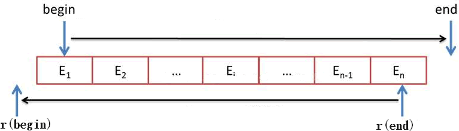

# C++ primer学习笔记


## 异常处理


```c++
//编写一段程序，从标准输入读取两个整数，输出第一个数除以第二个数的结果。当第二个数是0时抛出异常。
//使用try语句块捕获异常。catch子句应该为用户输出一天提示信息，询问其是否输入新数并重新执行try语句块的内容。
#include<iostream>
//#include<stdexcept>

using std::cin;	using std::cout; using std::endl; using std::runtime_error;

int main() {

	cout << "输入两个整数:" << endl;
	int num1 = 0;
	int num2 = 0;

	//异常检测并处理
	while (cin >> num1 >> num2) {
		try {

			if (num2 == 0) {
				throw runtime_error("elem2不能是 0 ");
				//cout << num1;		//测试是不是在throw语句的下一条语句返回异常
			}
		}
		catch (runtime_error) {
			//提醒用户除数不能为0
			cout << "除数不能为0!" << endl;
			cout << "Try Again? Enter y or n" << endl;
			char c = ' ';
			cin >> c;
			if (!cin || c == 'n') {
				break;
			}

		}
	}
	
	cout << num1 / num2;

	return 0;
}
```


## 一些问题


### 迭代器和指针的区别

[C++迭代器和指针区别_黑有用_小白的博客-CSDN博客_c++迭代器和指针](https://blog.csdn.net/weixin_45758146/article/details/107029083)


### 函数返回引用

https://blog.csdn.net/qq_33266987/article/details/53516977

不能返回函数中的局部变量的引用。


### 释放动态数组问题

程序弹出问题：CRT detected that the application wrote to memory after end of heapbuffer.

[CRT detected that the application wrote to memory after end of heap buffer_wu_lai_314的博客-CSDN博客](https://blog.csdn.net/wu_lai_314/article/details/8241697)


### C++的map能实现一对多吗

map本身是一对一的映射，可以借助其他容器实现一对多。如：

```c++
std::map<std::string,std::vector<string>>;
std::map<std::string,std::set::<int>>;
```


### C++中的static关键字

- 如果头文件中定义函数（不建议），可以在函数前添加static关键字也可以加inline，这样在编译过程中，对于每个include这个文件中程序，这个函数相对于这个程序唯一的版本。不会引起链接错误


### 两个类的头文件不能相互引用

[C++ 两个类头文件互相引用_雫和春的故事的博客-CSDN博客_c++两个头文件互相引用](https://blog.csdn.net/qq_22488067/article/details/73195621)

会死循环


###  error C4430,error C2143

F:\C++code_VS\Chapters_15\15_9\Project1\Project1\Query_base.h(14,43): error C4430: 缺少类型说明符 - 假定为 int。注意: C++ 不支持默认 int
1>F:\C++code_VS\Chapters_15\15_9\Project1\Project1\Query_base.h(14,43): error C2143: 语法错误: 缺少“,”(在“&”的前面)

[error C4430: 缺少类型说明符 - 假定为 int。注意: C++ 不支持默认 int_MISAYAONE的博客-CSDN博客_c4430缺少类型说明符](https://blog.csdn.net/misayaaaaa/article/details/79150725)

对于大型工程项目来说，两个类的头文件相互包含会出现上述问题

## 第二章 变量和基本类型


### 常量和字面值常量

https://www.233tw.com/cpp/110115


- 常量是添加了const的量，字面值常量是可以直接写出来的量，形如 42 ‘a’ "Hello World" 
- 用字符串常量来初始化char *会报错，即`char *p = "1234"`错误，因为"hello "是const char * 类型，存储在静态存储区中。

[字符串常量初始化指针_开始淡漠的博客-CSDN博客_初始化字符串指针](https://blog.csdn.net/qq_36955347/article/details/106810225) 


### 变量初始化

如果定义变量时没有指定初值，则变量被默认初始化(default initialized)，此时变量被赋予了“默认值”。默认值到底是什么由变量类型决定，同时定义变量的位置也会对此有影响。
如果是内置类型的变量未被显式初始化，它的值由定义的位置决定。定义于任何函数体之外的变量被初始化为0。一种例外情况是，定义在函数体内部的内置类型变量将不被初始化(uninitialized)。一个未被初始化的内置类型变量的值是未定义的，如果试图拷贝或以其他形式访问此类值将引发错误。
每个类各自决定其初始化对象的方式。而且，是否允许不经初始化就定义对象也由类自己决定。如果类允许这种行为，它将决定对象的初始值到底是什么。

```C++
#include<iostream>

using namespace std;

int over_non_def;		//定义于任何函数体外的变量，会被自动初始化为0

int main() {

	int non_def;
	int def = 0;

	//函数体内未初始化的变量不能被输出
	//cout << non_def << endl;	//WARNING:使用未初始化的内存“non_def”。	

	//函数体内未初始化的变量不能给其他变量赋值
	//def = non_def;
	//cout << def << endl;

	cout << over_non_def << endl;		//输出结果为0


	return 0;
}
```


### 为什么C++内置类型的局部变量不能默认初始化

https://blog.csdn.net/qq_36946274/article/details/80607439

全局变量，存于静态区（全局区），m是局部变量，存于栈区，局部变量不能默认初始化m是因为它在栈上，全局变量区可以统一清零，但是栈上若加了清零操作，会使得函数调用等操作变得更加缓慢，因此编译器取消了此功能。


### 默认初始化和值初始化

https://blog.csdn.net/J_H_C/article/details/83589282

默认初始化：如果定义变量时没有指定初值，则变量被默认初始化。其初始值和变量的类型以及变量定义的位置相关。默认初始化类对象和默认初始化内置类型变量有所不同。


值初始化：就是用数值初始化变量。如果没有给定一个初始值，就会根据变量或[类对象](https://so.csdn.net/so/search?q=类对象&spm=1001.2101.3001.7020)的类型提供一个初始值。对于int类型其值初始化后的值为0。


### const关键字

https://blog.csdn.net/song240948380/article/details/118967350


#### 顶层const和底层const

顶层const可以表示任意的对象是常量。

表示指针本身是个常量，使用时不能改变指针的指向，但可以修改指针所指的对象。

`int i = 0;`

`int *const p1 = &i;		//不能改变p1的值，这是个顶层const`

`const int ci = 42;		//不能改变ci的值，这是个顶层const`


底层const与指针和引用等复合类型的基本类型部分有关。

表示指针所指的对象是一个常量。

当执行对象的拷贝操作时，拷入和拷出的对象必须具有相同的底层const资格 

`const int *p2 = &ci;	//允许改变p2的值，这是个底层const`

对于变量类型的阅读要从右往左阅读。

p2先是一个指针，指向const int 类型，说明这是个底层指针，指向的是个常量对象。


#### 指针和const

第一种：const在'*'的前面，让指针指向一个常量对象，这样可以防止使用**该指针**来修改所指向的值

```c++
int age = 39;
const int * pt = &age;
```

该声明指出，pt**指向的**是一个const int对象，因此不能用pt来修改这个值，但是允许pt指向另一个位置。

**细节**：这个声明只表示对指针pt来说，age是常量，pt不能改变age的值，并不代表age是常量，依旧可以通过变量age来改变age的值。

**扩展：**

- 上述情况是把常规变量赋给了const指针，const指针不能改变变量的值，但变量自身可以改变
- 第二种情况：把const变量赋给const指针，既不能用const指针修改变量的值，变量自身也不能改变
- 第三种情况：把const变量赋给常规指针，**错误**：因为变量本身不能改变，却给指针改变变量的权力，冲突。

第二种：const在'*'的后面，将指针本身声明为常量，这样可以防止改变指针指向的位置。

```c++
int sloth = 3;
const int *ps = &sloth;		//a pointer to const int，
							//不允许通过ps修改sloth的值，但是允许ps指向别的位置
int * const finger = &sloth;//a const pointer to int
							//允许通过finger修改sloth的值，不允许finger指向别的位置
```

​	在最后一个声明中，关键字const的位置与以前不同，这种声明格式使得finger只能指向sloth，但是允许使用finger来修改sloth的值。


第三种：可以声明指向const对象的const指针

```c++
double trouble = 2.0E30;
const double * const stick = &trouble;
```

该声明表示：stick只能指向trouble，而stick不能修改trouble的值。简而言之，stick和*stick都是const

第四种：用指针指向指针，这是两级的间接关系，此时就不能将非const指针指向const指针

```c++
const int **pp2;
//int *p1;		//错误
const int *p1;
const int n = 13;
pp2 = &p1;
*pp2 = &n;
//*p1 = 10;		//错误，
```

尽可能使用const:

将指针参数声明为指向常量数据的指针有两条理由:

- 这样可以避免由于无意间修改数据而导致的编程错误;
- 使用const 使得函数能够处理.const和非const实参，否则将只能接受非const数据。
- 如果条件允许,则应将指针形参声明为指向const的指针。


#### const 参数传递

**const形参和非const形参：**

- 普通形参加不加const限定符对实参没有影响，因为函数是拷贝了一份形参数据在函数内使用。无法修改实参
- 引用形参和指针形参前面没有const限定符时，实参必须是非const的，而前面有const限定符时实参可以是const 也可以是非const。函数是对实参直接操作，没有const的形参时，实参的值是可以改变的。而且非const的形参不能传递常量或const的形参

```c++
#include<iostream>
#include<string>
using namespace std;

void print_str(string &s) {			//string 前加const就没错了
	cout << s << endl;
}

int main() {

	print_str("hello world");			//error：hello world 是常量，不能被非常量类型引用
	
	return 0;

}
```

#### 非常量引用的初始值必须是左值

[C++中“非常量引用的初始值必须是左值”的处理方法_棉猴的博客-CSDN博客_非常量的引用值必须为左值](https://blog.csdn.net/hou09tian/article/details/80565343#:~:text=所以，在对非常量进行初始化时，该初始值必须是左值，而不能是右值。 因此，会显示“非常量引用的初始值必须是左值”的错误信息。 有两种方法可以解决以上问题，一是避免隐式转换；二是避免修改形参。 避免了隐式转换，也就是避免了对非常量引用的初始化。 将increment,()函数的形参类型修改为const double%26，则在进行隐式转换时就可以用常量（右值）对其进行初始化了。 需要注意的时，因为此时形参x的值是常量，所以在increment ()函数内部中不能对其进行修改。 定义了一个Time类，重载cout输出time类时报错，其报错的信息即为“非常量引用的初始值必须是左值”。)

如果是右值，函数内可能会修改  


#### 重载和const形参

- 一个拥有顶层const的形参无法和另一个没有顶层 const的形参区分开来。

```c++
Record lookup(Phone);
Record lookup(const Phone); // 重复声明了 Record lookup(Phone)
Record lookup(Phone*);
Record lookup(Phone* const); // 重复声明了 Record lookup(Phone*)
```


- 如果形参是某种类型的指针或引用，则通过区分其指向的是常量对象还是非常量对象可以实现函数重载，此时的const是底层的。

```c++
//对于接受引用或指针的函数来说，对象 是常量还是非常量对应的形参不同
Record lookup(Account&); // function that takes a reference to Account
Record lookup(const Account&); // new function that takes a const reference

Record lookup(Account*); // new function, takes a pointer to Account
Record lookup(const Account*); // new function, takes a pointer to const
```


#### const map 和const_iterator搭配

```c++
//在显示单词之前，允许用户查询某个单词是否出现在文本文件中
void user_select(const map<string,int> &map_words) {
	//提示用户输入要查找的单词
	string user_word;
	cout << "please return the word that you want to select(q to quit):\n";
	cin >> user_word;
	while (user_word.size() && user_word != "q") {
		map<string, int>::const_iterator map_it = map_words.begin();		//const map 和const_iterator搭配
		if ((map_it = map_words.find(user_word)) != map_words.end()) {
			cout << "Found!\n" << map_it->first
				<< "\tCount: " << map_it->second << endl;
		}
		else {
			cout << "Not Found!\n";
		}
		cout << "Another word?(q to quit):";
		cin >> user_word;
	}
	
	
}
```


#### 运算符重载与const

[运算符重载(超详细)_美女大神的日子的博客-CSDN博客_运算符重载](https://blog.csdn.net/qq_43228427/article/details/100863451)


#### 类相关CONST

https://blog.csdn.net/eric_jo/article/details/4138548

https://blog.csdn.net/piaopiaopiaopiaopiao/article/details/12254277?spm=1001.2101.3001.6650.1&utm_medium=distribute.pc_relevant.none-task-blog-2%7Edefault%7ECTRLIST%7ERate-1.pc_relevant_default&depth_1-utm_source=distribute.pc_relevant.none-task-blog-2%7Edefault%7ECTRLIST%7ERate-1.pc_relevant_default&utm_relevant_index=2


摘要：

- const reference 类对象 做参数传递，不能改变类成员数据，不能调用类中non_const成员函数

成员函数：

- 用const修饰类的成员函数，该函数不能修改类成员数据，不能调用non_const成员函数
- const对象只能访问const成员函数,而const成员函数可以被其他成员函数调用
- const对象的成员是不可修改的,然而const对象通过指针维护的对象却是可以修改的.
- const成员函数不可以修改对象的数据,不管对象是否具有const性质.它在编译时,以是否修改成员数据为依据,进行检查.

数据成员：

- 加上mutable修饰符的数据成员,对于任何情况下通过任何手段都可修改,自然此时的const成员函数是可以修改它的
- 非const成员函数可以访问非const对象的非const数据成员、const数据成员，但不可以访问const对象的任意数据成员
- const成员函数可以访问非const对象的非const数据成员、const数据成员，也可以访问const对象内的所有数据成员


##### const修饰成员变量

const修饰类的成员函数，表示成员常量，不能被修改，同时它只能在初始化列表中赋值。

```c++
    class A
​    {
​        …
​        const int nValue;         //成员常量不能被修改
​        …
​        A(int x): nValue(x) { } ; //只能在初始化列表中赋值
​     }


```

##### const修饰成员函数

const修饰类的成员函数，则该成员函数不能修改类中任何非const成员函数。一般写在函数的最后来修饰。

```c++
  class A
    {
        …
       void function()const; //常成员函数, 它不改变对象的成员变量.                        

							//也不能调用类中任何非const成员函数。
}
```

对于const类对象/指针/引用，只能调用类的const成员函数，因此，const修饰成员函数的最重要作用就是限制对于const对象的使用。

- const成员函数不被允许修改它所在对象的任何一个数据成员。

- const成员函数能够访问对象的const成员，而其他成员函数不可以。

 

```C++
class Person {

public:
	Person(int no = 1,int age = 20,int number = 123)
	:m_no(no),m_age(age),m_number(number){

	}

	//以下是const_member function
	int name() const {return m_no;}
	int age() const { return m_age; }
	int number() const {return m_number;}

	//以下是non_member
	int age_plus (int &m) const{
		m++;
		//m_age += 1;		//ERROR:const修饰的成员函数不能改变成员数据的值
	}

public:
	int m_no;
	int m_age = 20;
	int m_number;
	
	int text_data;
};

int sum(const Person &P1,const Person &p2) {

	//测试通过sum改变const & 参数的值
	//P1.m_age += 2;			//不能通过sum改变类内的变量
	cout << P1.m_age;
	//P1.age_plus();				//不能调用:const reference class参数不能调用公开接收中的non_const成分
	return 0;
}
```

##### const修饰类对象/对象指针/对象引用

- const修饰类对象表示该对象为常量对象，其中的任何成员都不能被修改。对于对象指针和对象引用也是一样。

- const修饰的对象，该对象的任何非const成员函数都不能被调用，因为任何非const成员函数会有修改成员变量的企图。
  例如：

```c++
class AAA
{
    void func1();
void func2() const;
}
const AAA aObj;
aObj.func1(); ×
aObj.func2(); 正确

const AAA* aObj = new AAA();
aObj-> func1(); ×
aObj-> func2(); 正确

```

##### 常量引用可以绑定非常量的对象、字面值和一般表达式

https://blog.csdn.net/Colsum/article/details/79095462

在c++语言中，除两种例外情况，其他引用的类型都要和与之绑定的对象严格匹配，如int型的引用只能绑定int型的对象；并且引用不能直接与字面值常量或表达式结果绑定。

    其中一种例外情况是：初始化常量引用时，允许用任意表达式作为初始值，只要该表达式的结果能转换成引用的类型即可。允许为一个常量引用绑定非常量的对象、字面值，甚至是个一般表达式。例如：


    // 以下例子来自《Primer c++ 第五版》
    int i = 42;
    const int &r1 = i;      // 正确
    const int &r2 = 42;     // 正确
    const int &r3 = r1 * 2; // 正确
    
    接下来看一个更复杂的例子，并通过这个例子来讲解为什么常量引用是个例外。
    
    double dval = 3.14;
    // int &a = dval;    // 编译错误，因为普通引用的类型要与对象类型一致
    const int &b = dval; // 编译正确
    
    c++的自动类型转换机制中，当用一个double去初始化int时，会舍弃掉小数转换为int。在上面的例子中，编译后的代码实际是这样的：
    
    double dval = 3.14;
    const int temp = dval; // 由double生成了一个临时的整形常量
    const int &b = temp;   // 让b绑定这个临时量
    
    代码中的改变当然是由编译器完成的。
    
    在这种情况下，引用绑定的是一个临时量对象而不是dval本身。临时量对象就是：当编译器需要一个空间来暂存表达式的求值结果时，临时创建的一个未命名的对象。
    
    显然，c++认为，常量引用可以绑定这个临时量，而普通引用就不能绑定这个临时量。
    
    因为c++认为，使用普通引用绑定一个对象，就是为了能通过引用对这个对象做改变。如果普通引用绑定的是一个临时量而不是对象本身，那么改变的是临时量而不是希望改变的那个对象，这种改变是无意义的。所以规定普通引用不能绑定到临时量上。
    
    那么为什么常量引用就可以呢，因为常量是不能改变的。也就是说，不能通过常量引用去改变对象，那么绑定的是临时量还是对象都无所谓了，反正都不能做改变也就不存在改变无意义的情况。
    
    所以常量引用可以绑定临时量，也就可以绑定非常量的对象、字面值，甚至是一般表达式，并且不用必须类型一致。

##### 非常量引用不能绑定字面量


### mutable

我们希望能修改类的某个数据成员，即使实在一个const成员函数内。可以通过在变量声明中加入mutable关键字使其称为可变数据成员。一个可变数据成员永远不会是const，即使他是const对象的成员。

```C++
class Screen{
public:
	void some_number() const;
private:
	mutable size_t access_ctr;		//即使在一个const对象内也能被修改
};

void Screen::some_number() const{
    ++ access_ctr;
}
```


### Typedef

https://zhuanlan.zhihu.com/p/413574268

#### Typedef定义成员函数指针

```c++
#include <iostream>
 
class foo
  {
public:
  int g (int x, int y) { return x + y ; }
  } ;
 
typedef int (foo::*memberf_pointer)(int, int);//将memberf_pointer声明为指向foo的成员函数指针
 
int main()
  {
  foo f ;	//声明类
  foo *p;	//声明类指针
  memberf_pointer mp = &foo::g ;		//定义，初始化赋值操作
  std::cout << (f.*mp) (5, 8) << std::endl ;	//调用成员函数， .* 是指向成员选择的指针，针对class object工作
  std::cout << (p->*mp) (5, 8) << std::endl ;	//->*是类指针指向成员选择指针的运算符
  }
```


#### typedef int P();

```c++
#include <iostream>
#include <stdio.h>
#include <string>

typedef int P(); // 简单的,定义一个名为P的函数指针类型，参数为空，返回值为int类型
//P(Q);// 相当于声明Q是一个返回值为int，参数为空的返回类型。主要用于类内函数声明。
typedef void Q(int* p, const std::string& s1, const std::string& s2, size_t size, bool is_true); // 复杂的
class X {
public:
    P(eat_shit); // 等价于声明`int eat_shit();`
    Q(bullshit); // 等价于声明`void bullshit(int *p, const string& s1, const string& s2, size_t size, bool is_true);`
};

int main() {
    X xx;
    printf("shit ret: %d\n", xx.eat_shit());
    int a[] = { 1, 3, 4, 5, 7 };
    xx.bullshit(a, "foo", "bar", sizeof(a) / sizeof(int), true);
}

int X::eat_shit() {
    return 888;
}

void X::bullshit(int* p, const std::string& s1, const std::string& s2, size_t size, bool is_true) {
    std::cout << "s1: " << s1 << ", s2: " << s2 << ", size: " << size << std::endl;
    printf("elems:\n");
    for (unsigned int i = 0; i < size; i++) {
        printf("%d %s", *p++, (i == size - 1) ? "" : ",");
    }
    printf("\n");
}
```


#### 别名声明

https://blog.csdn.net/csxiaoshui/article/details/78038799

新标准规定的方法：

`using SI = Sales_item；	//SI是Sales_item的同义词`

用typedef定义类型别名

https://blog.csdn.net/LaterEqualsNever1024/article/details/74835721?spm=1001.2101.3001.6661.1&utm_medium=distribute.pc_relevant_t0.none-task-blog-2%7Edefault%7ECTRLIST%7Edefault-1.pc_relevant_default&depth_1-utm_source=distribute.pc_relevant_t0.none-task-blog-2%7Edefault%7ECTRLIST%7Edefault-1.pc_relevant_default&utm_relevant_index=1


### 枚举enum

https://www.runoob.com/w3cnote/cpp-enum-intro.html

`enum spectrum{red,orange,yellow,green,blue,violet,indigo,ultraviolet};`

这条语句完成两项工作：

- 让spectrum成为新类型的名称；spectrum被称为枚举（enumeration）,就像struct变成被称为结构一样
- 将red、 orange、 yellow等作为符号常量,它们对应整数值0~7。这些常量叫作枚举量(enumerator)。

在默认情况下，将整数值赋给枚举量，第一个枚举量的值为0，第二个枚举量的值为1，依次类推。可以通过显式地指定整数值来覆盖默认值。

**操作：**

1. 可以用枚举名来声明这种类型的变量：`spectrum band;`
2. 在不进行强制类型转换的情况下，只能将定义枚举时使用的枚举量赋给这种枚举的变量

```c++
band = blue; //合法   
band = 2000; //不合法
band = orange + red;	//合法
++band;					//不合法
```

​	3.枚举量是整型，可被提升为int类型，但int类型不能自动转换为枚举类型:

```c++
int color = red;	//valid
band = 3;		//invalid（无效）
color = 3 + red;
```

**重要提示：**

枚举常量代表该枚举类型的变量可能取的值，编译系统为每个枚举常量指定一个整数值，默认状态下，这个整数就是所列举元素的序号，序号从0开始。 可以在定义枚举类型时为部分或全部枚举常量指定整数值，在指定值之前的枚举常量仍按默认方式取值，而指定值之后的枚举常量按依次加1的原则取值。 各枚举常量的值可以重复。例如：

```c++
enum fruit_set {apple, orange, banana=1, peach, grape}
//枚举常量apple=0,orange=1, banana=1,peach=2,grape=3。
enum week {Sun=7, Mon=1, Tue, Wed, Thu, Fri, Sat};
//枚举常量Sun,Mon,Tue,Wed,Thu,Fri,Sat的值分别为7、1、2、3、4、5、6。
```

枚举常量只能以标识符形式表示，而不能是整型、字符型等文字常量。例如，以下定义非法：

```c++
enum letter_set {'a','d','F','s','T'}; //枚举常量不能是字符常量
enum year_set{2000,2001,2002,2003,2004,2005}; //枚举常量不能是整型常量
```

可改为以下形式则定义合法：

```c++
enum letter_set {a, d, F, s, T};
enum year_set{y2000, y2001, y2002, y2003, y2004, y2005};
```


### Static

#### 静态类成员函数

https://www.runoob.com/w3cnote/cpp-static-usage.html

可以将类成员函数声明为静态，

- 由于静态成员函数不与特定的对象相关联，因此只能使用静态数据成员
- 静态数据成员在使用前必须在类外定义

```c++
//.h文件
#include<string>

using namespace std;

class globalWrapper {
public:
	static string program_name() { return _program_name; }

	static void program_name(const string& npn) {
		_program_name = npn;
	}
    
    //测试非静态成员函数
    void print()  {cout<< "non_static_member"<<endl;}


private:
	static string _program_name ;
};

string globalWrapper::_program_name = " ";			//静态数据成员使用前必须定义，且必须再类外定义

//.cpp文件
#include<iostream>
#include"4_3.h"

int main() {

	
	globalWrapper glo;
	glo.program_name("4_3cpp");					//静态成员函数可以通过对象访问
	
	cout << globalWrapper::program_name() << endl;	//也可以通过类名和作用域运算符调用
    
    //非静态成员函数
	glo.print();
	//globalWrapper::print();			//ERROR:非静态成员引用必须与特定对象相对

	return 0;

}
```


### extern

https://blog.csdn.net/fengbingchun/article/details/78941738?spm=1001.2101.3001.6650.2&utm_medium=distribute.pc_relevant.none-task-blog-2%7Edefault%7ECTRLIST%7ERate-2.pc_relevant_default&depth_1-utm_source=distribute.pc_relevant.none-task-blog-2%7Edefault%7ECTRLIST%7ERate-2.pc_relevant_default&utm_relevant_index=5


### reverse_iterator反向迭代器

http://c.biancheng.net/view/7274.html

#### C++ STL反向迭代器的创建

reverse_iterator 模板类中共提供了 3 种创建反向迭代器的方法，这里以 vector<int> 容器的随机访问迭代器作为基础迭代器为例。

 \1) 调用该类的默认构造方法，即可创建了一个不指向任何对象的反向迭代器，例如：

```
std::reverse_iterator<std::vector<int>::iterator> my_reiter;
```

由此，我们就创建好了一个没有指向任何对象的 my_reiter 反向迭代器。

 \2) 当然，在创建反向迭代器的时候，我们可以直接将一个基础迭代器作为参数传递给新建的反向迭代器。例如：

```
//创建并初始化一个 myvector 容器std::vector<int> myvector{1,2,3,4,5};//创建并初始化 my_reiter 迭代器std::reverse_iterator<std::vector<int>::iterator> my_reiter(myvector.end());
```

我们知道，反向迭代器是通过操纵内部的基础迭代器实现逆向遍历的，但是反向迭代器的指向和底层基础迭代器的指向并不相同。以上面创建的  my_reiter 为例，其内部的基础迭代器指向的是 myvector 容器中元素 5 之后的位置，但是 my_reiter 指向的却是元素  5。

 也就是说，反向迭代器的指向和其底层基础迭代器的指向具有这样的关系，即反向迭代器的指向总是距离基础迭代器偏左 1 个位置；反之，基础迭代器的指向总是距离反向迭代器偏右 1 个位置处。它们的关系如图 1 所示。


 
 图 1 反向迭代器和基础迭代器的关系

> 其中，begin 和 end 表示基础迭代器，r(begin) 和 r(end) 分别表示有 begin 和 end 获得的反向迭代器。


 \3) 除了第 2 种初始化方式之外，reverse_iterator 模板类还提供了一个复制（拷贝）构造函数，可以实现直接将一个反向迭代器复制给新建的反向迭代器。比如：

```
//创建并初始化一个 vector 容器std::vector<int> myvector{1,2,3,4,5};//调用复制构造函数初始化反向迭代器的 2 种方式std::reverse_iterator<std::vector<int>::iterator> my_reiter(myvector.rbegin());//std::reverse_iterator<std::vector<int>::iterator> my_reiter = myvector.rbegin();
```

由此，my_reiter 反向迭代器指向的就是 myvector 容器中最后一个元素（也就是 5）之后的位置。


### size_type

https://blog.csdn.net/u012246313/article/details/44537757

　string::size_type从本质上来说，是一个整型数。关键是由于机器的环境，它的长度有可能不同。 例如：我们在使用  string::find的函数的时候，它返回的类型就是 string::size_type类型。而当find找不到所要找的字符的时候，它返回的是 npos的值，这个值是与size_type相关的。假如，你是用 string s; int rc = s.find(.....);  然后判断，if ( rc == string::npos )  这样在不同的机器平台上表现就不一样了。如果，你的平台的string::size_type的长度正好和int相匹配，那么这个判断会侥幸正确。但换成另外的平台，有可能 string::size_type的类型是64位长度的，那么判断就完全不正确了。 所以，正确的应该是： string::size_type  rc = s.find(.....); 这个时候使用 if ( rc == string::npos )就回正确了。

 我们为什么不适用int变量来保存string的size呢？

  使用int变量的问题是：有些机器上的int变量的表示范围太小，甚至无法存储实际并不长的string对象。如在有16位int型的机器上，int类型变量最大只能表示32767个字符的string对象。而能容纳一个文件内容的string对象轻易就能超过这个数字，因此，为了避免溢出，保存一个string对象的size的最安全的方法就是使用标准库类型string：：size_type().


### decltype自动推导类型

http://c.biancheng.net/view/7151.html


### boolalpha

[C++中boolalpha的用法_MagnumLu的博客-CSDN博客_c++中boolalpha](https://blog.csdn.net/qq_28584889/article/details/83503777)

- 头文件

`#include<iostream>`

- 使用说明

让输入流将bool解析成为true或false


```cpp
void test_boolalpha()
{
	std::cout << "true is " << true << std::endl;
	std::cout << "false is " << false << std::endl;
 
	// 运行下面这个语句, 在输出流中的bool值将发生变化
	std::cout << std::boolalpha;
	std::cout << "true is " << true << std::endl;
	std::cout << "false is " << false << std::endl;
    
    //再次测试，对比差别。
	std::cout << "true is " << true << std::endl;
	std::cout << "false is " << false << std::endl;
 
	// 运行下面这个语句, 在输出流中的bool值将恢复成0, 1值
	std::cout << std::noboolalpha;
	std::cout << "true is " << true << std::endl;
	std::cout << "false is " << false << std::endl;
 
	/* 输出如下:
 	true is 1
	false is 0
	true is true
	false is false
	true is true
	false is false
	true is 1
	false is 0
	*/
} 
```


## 第三章 字符串、向量和数组


### 数组的初始化

```C++
//测试数组的初始化、
	//char a[6] = "asdfgh";		//错误：没有空间可以存放空字符
	char a[6] = "asdfg";		//字符串结尾处默认有一个空字符
	char a2[6] = { 'a','s','d','f','g','h' };	//没有空字符
	//[d]，d是数组的维度，但是数组的下表是从0开始的，d是几，数组中就有几个元素，
	//用字符串初始化数组时要注意字符串结尾有默认的空字符
```

### 用for循环修改数组的值

```C++
//用for循环修改数组的值

	//范围for语句，声明与数组元素相关联的变量时用引用
	for (auto &r :a) {
		r += 2;			//r是char类型，用引用相当于给数组内对阿盈的变量取别名
	}

	//传统for语句本身就是用指针对数组元素进行操作的，指针可以间接的访问他所指的对象，所以通过指针可以修改他所指对象的值
	/*for (int i = 0; i < 7; i++) {
		a[i] += 2;
	}*/

	for (auto beg = begin(a), aend = end(a); beg != aend; beg++) {		//C++标准库函数begin返回指向数组的首元素
																		//end返回指向数组尾元素的下一个元素的指针,
																		// 两个函数定义在iterator头文件中
		//beg += 2;
		//cout << *beg << endl;
		*beg +=2;
		//auto& r = *beg;
		//r += 2;
	}

	for (auto r : a) {
		cout << r;
	}
```


### 数组的值传递、指针传递、引用传递

[C/C++ 数组作为参数传递 指针 引用——VS——普通值传递、指针传递、引用传递_zou_albert的博客-CSDN博客_c++传递数组指针](https://blog.csdn.net/zou_albert/article/details/108223204)


### std::begin()的参数不能是指针

https://www.zhihu.com/question/368331215


## 第四章 表达式


### for循环中++、--

https://www.codenong.com/484462/

这里以++为例，--同理

`for(int i = 0;i < 5;i++)`

内在逻辑，++运算符的前缀和后缀的区别体现在返回值上，而在for语句中并没有用到返回值，在执行i++或++i语句后i都会加1。所以在此处前缀和后缀区别不大，但是提倡用前缀。

当for循环中用到i值时，再根据情况用前缀或后缀


### 作用域运算符::

:是运算符中等级最高的，它分为三种：全局作用域符，类作用域符，命名空间作用域符

##全局作用##

全局作用域符号：当全局变量在局部函数中与其中某个变量重名，那么就可以用::来区分如：
　　char ch; //全局变量
　　void sleep（）
　　{undefined
　　char ch; //局部变量
　　ch(局部变量) = ch(局部变量) *ch(局部变量) ;
　　::ch(全局变量) =::ch(全局变量) *ch(局部变量);
　　}

##类作用域符号##

类作用域符号::的前面一般是类名称，后面一般是该类的成员名称，C++为了避免不同的类有名称相同的成员而采用作用域的方式进行区分。
　　例如A,B表示两个类，在A,B中都有成员member，那么
　　A::member就表示类A中的成员member
　　B::member就表示类B中的成员member
　　
##命名空间##

"::"是作用域限定符或者称作用域运算符或者作用域操作符（scope operator），例如命名空间。
"::"作用：namespace::name
:: 的另一种用法
直接用在全局函数前，表示是全局函数。当类的成员函数跟类外的一个全局函数同名时，在类内定义的时候，用此函数名默认调用的是本身的成员函数；如果要调用同名的全局函数时，就必须打上::以示区别。

### reference to pointer *& 指针的引用

https://zhuanlan.zhihu.com/p/139543762

```c++
int v = 1;
int *p = &v;
int* &rp = p;		//*rp相当于*p的别名，修改*rp相当于修改*p
```

&是引用符号。引用不产生副本，而是给变量起别名。对原变量操作就是对原变量操作。

指针引用的作用：

- 在参数传递时，单用指针传递指针在函数体内局部的修改指针指向的对象，指针的引用能够全局修改指针指向的对象

```C++
#include<iostream>

using namespace std;

int main() {

	int a = 1;
	int* p = &a;

	int b = 2;
	int* p2 = &b;

	cout << "*p的地址为：" << p<< endl
		<< "*p的值为：" << *p << endl;

	cout << "*p2的地址为：" << p2 << endl
		<< "*p2的值为：" << *p2 << endl;

	int* &rp = p;	//
	cout << "*rp的地址为：" << rp << endl
		<< "*rp的值为：" << *rp << endl;				//和*p的数据完全一样

	rp = p2;		//修改rp的指向
	cout << "*rp的地址为：" << rp << endl
		<< "*rp的值为：" << *rp << endl;				//和p2的数据一样

	cout << "修改rp的指向后,p的值\n";
	cout << "*p的地址为：" << p << endl
		<< "*p的值为：" << *p << endl;					//和p2的数据一样，相当于*p指向*p2
	
	return 0;
}
```

```C++
//测试reterence to pointer全局的修改变量

#include <stdio.h>

//void swap(int* p1, int* p2) {			//不用*&，p1和p2的交换仅限于swap中
void swap(int* &p1, int* &p2) {			//可以全局的改变*p1和*p2的数据
    
    int* temp = p1;
    p1 = p2;
    p2 = temp;
    printf("交换中：a=%d,b=%d \n", *p1, *p2);
    printf("交换中(地址)：p1=%d \n", p1);
    printf("交换中(地址)：p2=%d \n", p2);
}

int main() {

    int a = 1, b = 3;
    int* p1 = &a, * p2 = &b;

    // 交换前
    printf("交换前：a=%d,b=%d \n", *p1, *p2);
    printf("交换前(地址)：p1=%d \n", p1);
    printf("交换前(地址)：p2=%d \n", p2);
    // 交换中
    swap(p1, p2);
    // 交换后
    printf("交换后：a=%d,b=%d \n", *p1, *p2);
    printf("交换后(地址)：p1=%d \n", p1);
    printf("交换后(地址)：p2=%d \n", p2);
    return 0;

}

```


### 运算符重载的作用

[运算符](https://so.csdn.net/so/search?q=运算符&spm=1001.2101.3001.7020)重载是为了解决类对象之间的运算的，通常的运算符只用于算术运算，如常量int之间，因为编译器已经定义了；而一个类两个对象之间成员进行运算必须重新定义，让编译器在遇到对象运算时能按我们要求的进行运算，这就是运算符重载的意义，即重定义运算符，因此你可以看到，运算符重载就是为[类对象](https://so.csdn.net/so/search?q=类对象&spm=1001.2101.3001.7020)服务的，那么两个对象的成员进行运算那必须先获得对象本身啦，所以运算符重载参数必须含有类指针或引用，这是主要客户。 

   运算符重载的声明[operator](https://so.csdn.net/so/search?q=operator&spm=1001.2101.3001.7020) 关键字告诉  编译器，它是一个运算符重载，后面是相关运算符的符号，如+。返回类型是在使用这个运算符时获得的类型。对于这个+运算符重载，返回类型与包含类一样，但这种情况并不是必需的。两个参数就是要操作的对象。对于二元运算符（带两个参数），如+和－运算符，第一个参数是放在运算符左边的值，第二个参数是放在运算符右边的值。


## 第五章 语句

### 范围for语句

```cpp
for(declaration:expression)
	statement
```

`expression`表示的必须是一个序列，比如用花括号括起来的初始值列表、数组、vector或string类对象，这些类型的共同特点是拥有能返回迭代器的begin和end成员。

```
//举例说明
vector<int> v = {0,1,2,3,4,5,6,7,8,9};
//范围变量必须是引用类型才能对元素执行写操作
for(auto &num :v){
	num *= 2;			//将v中的元素乘2
}
```


### for_each

[c++中的 for_each 函数 - 黑贝是条狗 - 博客园 (cnblogs.com)](https://www.cnblogs.com/iwana/p/13535736.html)

```cpp
template<typename InputIterator, typename Function>
Function for_each(InputIterator beg, InputIterator end, Function f) {
  while(beg != end) 
    f(*beg++);
}

// Function f 可以用lambda表达式代替
```


## 第六章 函数


### main函数

`int main(int argc,char** argv)`详解

[int main(int argc,char** argv) 详解_mengyandelove的博客-CSDN博客](https://blog.csdn.net/mengyandelove/article/details/82285504)

argc是[命令行](https://so.csdn.net/so/search?q=命令行&spm=1001.2101.3001.7020)总的参数个数，argv[]是argc个参数，其中第0个参数是程序的全名，后面的参数是命令行后面跟的用户输入的参数。

例如：

int argc
用来表示你在命令行下输入命令的时候，一共有多少个参数。比方说你的程序编译后，可执行文件是test.exe
D:\tc2>test
这个时候，argc的值是3，argc[0]的值是”test”，argc[1]的值是”myarg1”，argc[2]的是”myarg2”。

这两个参数一般用来为程序提供非常重要的信息，如：数据文件名，等等。
如：copy a.c b.txt
这个时候，a.c和b.txt就是所谓的“非常重要的信息”。不指定这两个文件，你没法进行拷贝。
当你的程序用到argc和argv这两个参数的时候，可以简单地通过判断argc的值，来看看程序的参数是否符合要求


### begin()和end()函数

[C++ STL begin()和end()函数用法 (biancheng.net)](http://c.biancheng.net/view/7376.html)

将指定数组传给 begin() 函数，其会返回一个指向该数组首个元素的指针；将指定数组传给 end() 函数，其会返回一个指向数组中最后一个元素之后位置的指针。


### inline函数

[C++ 中的 inline 用法 | 菜鸟教程 (runoob.com)](https://www.runoob.com/w3cnote/cpp-inline-usage.html)

多文件时，inline函数只能放在头文件中


## 第七章 类

### 封装

封装是保护类的成员不被随意访问的能力。通过把类的实现细节设置为private,我们就能完成类的封装。封装实现了类的接口和实现的分离。封装有两个重要的有点：一是确保用户代码不会无意间破坏封装对象的状态。二是被封装的类的具体实现细节可以随意改变，而无需调整用户级别的代码。

访问说明符：

定义在public说明符之后的成员在整个程序内可被访问，public成员定义类的接口。

定义在private说明符之后的成员可以被类的成员函数访问，但是不能被使用该类的代码访问，private部分封装了类的实现细节。


### 构造函数

coder为类提供了一个构造函数后，编译器将不会自动生成默认的构造函数，如果我们的类需要默认构造函数，必须显示地把它声明出来。我们使用 ` = default`来告诉编译器为我们合成默认的构造函数。如：`Screen() = default`


### 名字查找与类的作用域

如果某个成员的声明使用 了类中尚未出现的名字， 则编译器将会在定义该类的作用域中继续查找。

成员定义中的普通块作用域的名字查找

成员函数中使用的名字按照如下方式解析：
• 首先， 在成员函数内查找该名字的声明。和前面一样， 只有在函数使用之前出现的声明才被考虑。函数的参数列表也算函数内。
• 如果在成员函数内没有找到，则在类内继续查找，这时类的所有成员都可以被考虑。
• 如果类内也没找到该名字的声明， 在成员函数定义之前的作用域内继续查找。

```c++
int height; ／／定义了一个名宇， 稍后将在Screen中使用
class Screen {
public: 
    typedef std: :string: :size_type pos; 
    void dummy_fcn(pos height) { 
		cursor = width * height;		／/哪个height?是那个参数
	}
private:
	pos cursor = O; 
	pos height = 0, width = O;
};
```

当编译器处理dumrny_fcn中的乘法表达式时， 它首先在函数作用域内查找表达式中用到 的名字。 函数的参数位千函数作用域内， 因此dumrny_fcn函数体内用到的名字height 指的是参数声明。**在成员函数内查找名字的声明时，只有在函数使用之前出现的声明才被考虑，所以在dummy_fun函数内使用的height是类之前定义的height**


## 第八章 `IO`库


### 文件IO

```C++
	ifstream in_file("input_file.txt");			//默认打开模式是"in"，只能打开已存在的文件，文件不存在，打开错误
	ofstream out_file("output_file.txt");		//默认打开模式是"out|trunc",打开文件，接收程序写入时清除原有的文件内容
	cerr << "ERROR:unable to open the necessary file.\n"; //cerr不经过缓冲而直接输出，一般用于迅速输出出错信息，是标准错误，
															//默认情况下被关联到标准输出流，但它不被缓冲，
															//也就说错误消息可以直接发送到显示器，而无需等到缓冲区或者新的换行符时，才被显示。
//直接从文件读，然后放入map中，C++默认读取文件是，遇到空格或换行符就停止读取
	string str_word;
	while (in_file >> str_word) {
		if (except_words.count(str_word)) {
			continue;
		}
		words[str_word]++;
	}

```


### cin 判断输入结束（读取结束）

http://c.biancheng.net/view/277.html

windows 第一个字符是 ctrl+z +enter

UNIX第一个字符是 ctrl+D+enter


### ostream 

https://blog.csdn.net/sinat_36219858/article/details/80380851

把ostream引用放在函数参数中有什么用，为啥不直接用cout?

- 引用，是因为无法直接复制一个ostream对象
- cout是标准输出iostream的一个对象，用ostream这样不仅仅可以标准输出iostream对象，也可以是文件输出类ofstream 或者ostringstream的一个对象！


## 第九章 顺序容器

### assign()

- 主要是将一个容器中元素复制到另一个容器中

```cpp
seq.assign(b,e);	//将seq中的元素替换为迭代器b和e所表示范围的元素。迭代器b和e不能指向seq中的元素
seq.assign(il);		//将seq中的元素替换为初始化列表il中的元素
seq.assign(n,t);	//将seq中的元素替换为n个值为t的元素
```

​     

### STL std::copy()

https://blog.csdn.net/a_ran/article/details/17385911

copy()+iostream iterator


### 容器vector常用接口

https://blog.csdn.net/qq_41071068/article/details/101421847


#### vector::back()

https://blog.csdn.net/cumt951045/article/details/107796082

函数原型：reference back();

​					const_reference back() const;

参数：无

返回值：返回最后一个元素的引用


#### vector::max_size()

参数：无

返回值：size_type返回向量的最大大小，为无符号整数类型


#### vector.size()

返回容器中对象的个数

```cpp
#include<iostream>
#include<string>
#include<vector>


int main()
{
	std::vector<std::string> vs;
	vs.push_back("zhangsan");
	vs.push_back("zhangsan");
	vs.push_back("zhangsan");
	vs.push_back("zhangsan");
	vs.push_back("zhangsan");
	
	std::cout << vs.size() << std::endl;
}

//输出5
```


### string容器


##### stringstream类

该类型主要用于类型转换，字符串拼接操作 

[C++编程语言中stringstream类介绍_liitdar的博客-CSDN博客_stringstream](https://blog.csdn.net/liitdar/article/details/82598039)

```cpp
#include<iostream>
#include<string>
#include<sstream>


int main()
{
	std::string s = "as sd sfa addf adfa czx ewf dfa ggfa";
	std::istringstream temp(s);
	//std::cout << temp.str() << std::endl;		//输出结果为as sd sfa addf adfa czx ewf dfa ggfa，
												//可以使用str()方法，将stringstream类型转换为string类型
	std::string s1;
	temp >> s;			//遇到空格停止读取
	std::cout << s;		//输出结果为as
}
```

[分割字符串以及istringstream提取空格分隔的string类型的单词_一打雪碧的博客-CSDN博客_istringstream 空格](https://blog.csdn.net/weixin_44321570/article/details/112846768)

[关于stringstream中clear()用法的进一步总结_笑着的程序员的博客-CSDN博客](https://blog.csdn.net/weixin_45541762/article/details/108072099)


```cpp
std::istringstream istr;
	for (const auto& buf : vec) {
		istr.str(buf);
		while (istr >> s)
			std::cout << s << std::endl;
		istr.clear();			//重置istr的状态位，
					/*在调用完operator << 和operator >> 后，来到了end - of -file的位置，
					此时stringstream会为其设置一个eofbit的标记位，标记其为已经到达eof。
					查文档得知， 当stringstream设置了eofbit，任何读取eof的操作都会失败，
					同时，会设置failbit的标记位，标记为失败状态。所以后面的操作都失败了*/
	}
```


#### string容器的初始化


#### size_type,difference_type和value_type，reference

[stl中的size_type,difference_type和value_type，reference_大忽悠爱忽悠的博客-CSDN博客](https://blog.csdn.net/m0_53157173/article/details/115755784)


## 第十章 泛型算法

​	由标准库定义的，可以用于不同类型的元素和多种容器类型（泛型）的一些经典算法的公共接口（算法），如排序和搜索。


### back_inserter

[C++ STL插入迭代器适配器（insert_iterator） (biancheng.net)](http://c.biancheng.net/view/7279.html)

在使用该函数时，只需要为其传递一个具体的容器（vector、deque 或者 list）做参数，此函数即可返回一个 back_insert_iterator 类型的插入迭代器。因此，上面程序中的第 9 行代码，可替换成如下语句：

```cpp
std::back_insert_iterator< std::vector<int> > back_it = back_inserter(foo);
```


### stable_sort

[std::stable_sort - C++中文 - API参考文档 (apiref.com)](https://www.apiref.com/cpp-zh/cpp/algorithm/stable_sort.html)


#### 为什么把stable_sort中谓词的参数的const去掉会出现错误？

这是因为stable_sort调用了别的一些函数，这种调用的参数包含了你vector中的元素
而在那些函数中，参数类型都是const的，所以最终predicate调用的时候，必须参数也是const的

举个简单的例子，相当于stable_sort干了以下的事情：
template <typename Input, typename Pred>
void stable_sort(Input begin, Input end, Pred p) {
do_something(*begin, p);
}

template <typename T, typename Pred>
void do_something(const T &val, Pred p) {
p(val, val);
}

注意，在最后的do_something函数中，类型T就是你vector中元素的类型，从sort调用过来的时候，参数已经变成了const类型，所以pred调用的时候参数必须也是const的

以上代码对解释排序过程没有意义，这代码也不和语法，因为我没有告诉你do_something的模板参数T是哪里来的。这牵扯到meta-programming的东西，我不在这里多解释。我要说明的重点是让你看到vector的元素类型T是如何变成const T &的


### 定制操作

标准库在定义泛型算法时，不仅定义了默认版本。还为这些算法定义了额外的版本，允许我们提供自己定义的操作来重载算法的默认行为。


#### 谓词

谓词是一个可调用的表达式，其返回结果是一个能用作条件的值（一般是bool类型）。谓词只有一元谓词（接受单一参数）和二元谓词（接受两个参数）。


```c++
//练习10.11:编写程序，使用stable_sort和isShorter将传递给你的elimDups版本的vector排序。
//打印vector的内容，验证你的程序的正确性。


#include<iostream>
#include<vector>
#include<algorithm>


//stable_sort的谓词的参数一定要是const
bool isShorter(const std::string& s1, const std::string &s2) {		
	return s1.size() < s2.size();
}


int main() {


	std::vector<std::string> v;
	std::string s;


	while (std::cin >> s) {
		v.push_back(s);
	}

	std::sort(v.begin(), v.end());
    //unique算法重排输入序列，将相邻的重复项“消除”，并返回一个指向不重复范围末尾的迭代器。
    //“消除”是将重复元素和相邻的不重复的元素交换，并将重复的元素移到容器末尾。
	std::vector<std::string>::iterator end_unique =std::unique(v.begin(),v.end());
	v.erase(end_unique, v.end());


	std::stable_sort(v.begin(), v.end(), isShorter);

	for (auto& i : v) {
		std::cout << i << std::endl;
	}


	return 0;
}
```


#### 可调用对象

- 函数
- 函数指针
- 重载了函数调用运算符的类
- lambda表达式


#### lambda表达式


- 由于谓词接受的参数数量较少，用lambda接受多个参数代替谓词。
- 可以定义在参数的参数列表或者函数内部
- 一个lambda表达式表示一个可调用的代码单元，可以将其看成未命名的内联函数。
- `[capture list](parameter list) ->return type {function body } `
- capture list(捕获列表）是一个lambda所在函数中定义的局部变量的列表（通常为空);return type、parameter list和 function body与任何普通函数一样，分别表示返回类型、参数列表和函数体。但是，与普通函数不同，lambda必须使用尾置返回。
- 我们可以忽略参数列表和返回类型（返回类型可以根据条件运算符的类型推断出来），但必须永远包含捕获列表和函数体。


```c++
//10.14：编写一个lambda，接受两个int,返回他们的和

#include<iostream>


int main() {

	

	auto add_int = [](int a, int b) {return a + b; };

	std::cout << add_int(1, 2) << std::endl;

	return 0;
}
```

```cpp
//10.15:编写一个lambda,捕获它所在函数的int，并接受一个int参数。lambda应返回捕获的int和int参数的和。

#include<iostream>


int main()
{
	int x = 1;
	auto add_int = [x](int y) {return x + y; };

	std::cout << add_int(2) << std::endl;

	return 0;
}

```


```cpp
//10.17重写练习10.12的程序，在对sort的调用中使用lambda排序

#include<iostream>
#include<vector>
#include<algorithm>


//本题主要学习lambda表达式，所以简化了Sales_data类
class Sales_data {

public:
	Sales_data(int is) :isbn(is) {}

	int isbn;

};

int main() {

	std::vector<Sales_data> vec_book;
	vec_book.push_back(Sales_data(21));
	vec_book.push_back(Sales_data(2));
	vec_book.push_back(Sales_data(13));
	vec_book.push_back(Sales_data(24));
	vec_book.push_back(Sales_data(5));
	vec_book.push_back(Sales_data(36));


	std::sort(vec_book.begin(), vec_book.end(), [](const Sales_data& a, const Sales_data& b) {return a.isbn < b.isbn; });

	for (auto& s : vec_book) {
		std::cout << s.isbn << std::endl;
	}

	return 0;
}

```


```cpp
//10.18重写biggies,用partiton代替find_if。
//标准库定义了名为partition 的算法，它接受一个谓词，对容器内容进行划分，使得谓词为true 的值会排在容器的前半部分，
//而使谓词为false 的值会排在后半部分。算法返回一个迭代器，指向最后一个使谓词为true的元素之后的位置。


#include<iostream>
#include<vector>
#include<algorithm>
#include<string>

void _elimDups(std::vector<std::string> &word) {

	//按字典排序words,以便查找重复单词
	std::sort(word.begin(), word.end());
	//unique重排输入范围，是的每个单词只出现一次
	//排列在范围的前部，返回指向不重复区域之后一个位置的迭代器
	auto end_unique = unique(word.begin(), word.end());

	//使用向量操作erase删除重复单词
	word.erase(end_unique, word.end());
}


//打印出长度大于等于给定值的单词，每个单词后面借一个空格
void biggies(std::vector<std::string> &word, std::vector<std::string>::size_type sz) {

	_elimDups(word);		//先按字典序排序，并删除重复的单词

	//按长度排序，并不改变字典序
	//std::stable_sort(word.begin(), word.end());

	//使用partition对容器中的单词进行长度划分

	auto wc = partition(word.begin(), word.end(),
		[sz](std::string &w) {return w.size() < sz; });
    
    //10.19用stable_partition重写
	//auto wc = stable_partition(word.begin(), word.end(),
	//	[sz](std::string& w) {return w.size() < sz; });
	
	for_each(word.begin(), wc, [](const std::string& a) {std::cout << a << " "; });

	std::cout << std::endl;


}


int main() {

	std::istream_iterator<std::string> in(std::cin), eof;		//用输入流迭代器绑定cin,并eof表示尾后迭代器

	//用istream_iterator流构造vec_words

	std::vector<std::string> vec_words(in,eof);

	biggies(vec_words,6);

	return 0;
}
```


##### 参数捕获与返回

​		当定义一个lambda时，编译器生成一个与lambda对应的新的（未命名的）类类型。可以这样理解，当向一个函数传递一个lambda 时，同时定义了一个新类型和该类型的一个对象:传递的参数就是此编译器生成的类类型的未命名对象。

-  类似参数传递，变量的捕获方式也是值拷贝或是引用传递。
-  在传递int,string或是其他非指针类型时，尽量用值拷贝传递参数。
-  隐式捕获：可以让编译器根据lambda体中的代码来推断我们要使用哪些变量。为了指示编译器推断捕获列表，应在捕获列表中写一个&或=。&告诉编译器采用捕获引用方式，=则表示采用值捕获方式。
-  当我们混合使用隐式捕获和显式捕获时，捕获列表中的第一个元素必须是一个&或=。此符号指定了默认捕获方式为引用或值。


```cpp
//练习10.20:标准库定义了一个名为 count_if 的算法。类似find_if，此函数接受一对迭代器，表示一个输入范围，
//还接受一个谓词，会对输入范围中每个元素执行。count_if返回一个计数值，表示谓词有多少次为真。
//使用count_if重写我们程序中统计有多少单词长度超过6的部分。


#include<iostream>
#include<vector>
#include<string>
#include<algorithm>


int main() {

	std::istream_iterator<std::string> in(std::cin), eof;		//用输入流迭代器绑定cin,并eof表示尾后迭代器

	//用istream_iterator流构造vec_words

	std::vector<std::string> vec_words(in, eof);

	auto num = std::count_if(vec_words.begin(), vec_words.end(), [](std::string s) {return s.size() > 6; });

	std::cout << num << std::endl;

	return 0;
}

```


```cpp
//练习10.21:编写一个lambda，捕获一个局部int变量，并递减变量值，直至它变为0。一旦变量变为0，
//再调用lambda应该不再递减变量。lambda应该返回一个bool值，指出捕获的变量是否为0。


#include<iostream>


int main() {


	int i = 6;

	auto reduce_i = [&i]() ->bool {
		if (i <= 0) {
			return false;
		}
		else {
			--i;
			return true;
		}
	};

	while (reduce_i()) {
		std::cout << i << std::endl;
	}


	return 0;
}
```


##### 用bind函数参数绑定

考虑到多个函数可能使用相同的lambda操作，需要把lambda操作定义成函数，但是一些算法又不能接受多个参数的谓词，可以使用bind函数进行参数绑定,bind函数定义在头文件functional中。

调用bind的一般形式为：`auto newCallable = bind(callable,arg_list)`

- 其中，newCallable本身是一个可调用对象，arg_list是一个逗号分隔的参数列表，对应给定的callable的参数。即，当我们调用newCallable时，newCallable会调用callable，并传递给它arg_list 中的参数。

- arg_list中的参数可能包含形如`_n`的名字，其中n是一个整数。这些参数是“占位符”,表示newCallable的参数，它们占据了传递给newCallable的参数的“位置”。数值n表示生成的可调用对象中参数的位置:`_1`为newCallable的第一个参数，`_2`为第二个参数，依此类推。
- 名字`_n`都定义在一个名为placeholders的命名空间中，而这个命名空间本身定义在std命名空间中。为了使用这些名字，两个命名空间都要写上。例如，`_1`对应的using声明为:`using std: :placeholders::_1;`
- bind的参数只能是可拷贝的参数。对于引用参数（本事是不可拷贝的），函数ref返回一个对象,包含给定的引用,此对象是可以拷贝的。标准库中还有一个cref函数，生成一个保存const引用的类。与bind一样，函数ref和 cref也定义在头文件functional中。


```cpp
//习题10.22：重写统计长度小于等于6的单词数量的程序，使用函数代替lambda

#include<iostream>
#include<vector>
#include<string>
#include<algorithm>
#include<functional>


bool little_six(std::string& s4,std::string::size_type sz) {
	return s4.size() <= 6;
}

void elimDups(std::vector<std::string>& words) {

	//设定长度
	std::string::size_type sz = 6;

	//按字典序给words排序
	std::sort(words.begin(), words.end());

	//按长度大小给words排序，相同长度保持字典序
	std::stable_sort(words.begin(), words.end(),
		[](const std::string& s1, const std::string& s2) {return s1.size() < s2.size(); });

	

	//用unique把容器中重复的元素放到容器末尾，并返回分界位置迭代器
	auto words_end = std::unique(words.begin(), words.end());

	//删除分界位置之后的元素
	words.erase(words_end, words.end());

	for (auto& w : words) {
		std::cout << w << " ";
	}
	std::cout << std::endl;

	//用lambda表达式做谓词
	auto num_lambda = std::count_if(words.begin(), words.end(), 
		[sz](const std::string& s3) {return s3.size() <= sz; });

	//用bind函数绑定参数做谓词
	auto num_bind = std::count_if(words.begin(), words.end(),
                                  std::bind(little_six, std::placeholders::_1,6));

	std::cout << num_lambda << std::endl;
	std::cout << num_bind << std::endl;
}


int main() {

	std::istream_iterator<std::string> it_in(std::cin), eof;

	std::vector<std::string> vec_words(it_in, eof);

	elimDups(vec_words);

	return 0;
}
```


```cpp
//练习10.24:给定一个string，使用bind和 check_size在一个 int的vector中查找第一个大于string长度的值。


#include<iostream>
#include<string>
#include<vector>
#include<functional>
#include<algorithm>


bool check_size(int vaule, std::string::size_type st) 
{
	return vaule > st;
}


int main() {

	std::string s = "zhangsan";

	std::vector<int> vec = { 1,4,7,4,6,8,10,2 };

	auto it = std::find_if(vec.begin(), vec.end(), std::bind(check_size, std::placeholders::_1, s.size()));
	std::cout << (it-vec.begin()) << std::endl;

	return 0;
}
```


```cpp
//练习10.25：使用chenk_size和bind重写biggies
//标准库定义了名为partition 的算法，它接受一个谓词，对容器内容进行划分，使得谓词为true 的值会排在容器的前半部分，
//而使谓词为false 的值会排在后半部分。算法返回一个迭代器，指向最后一个使谓词为true的元素之后的位置。


#include<iostream>
#include<vector>
#include<algorithm>
#include<string>
#include<functional>

void _elimDups(std::vector<std::string>& word) {

	//按字典排序words,以便查找重复单词
	std::sort(word.begin(), word.end());
	//unique重排输入范围，是的每个单词只出现一次
	//排列在范围的前部，返回指向不重复区域之后一个位置的迭代器
	auto end_unique = unique(word.begin(), word.end());

	//使用向量操作erase删除重复单词
	word.erase(end_unique, word.end());
}

bool check_size(std::string s, std::string::size_type st) 
{
	return s.size() < st;
}

//打印出长度大于等于给定值的单词，每个单词后面借一个空格
void biggies(std::vector<std::string>& word, std::vector<std::string>::size_type sz) {

	_elimDups(word);		//先按字典序排序，并删除重复的单词


	//10.25用check_size和bind函数重写
	auto wc = partition(word.begin(), word.end(),
		bind(check_size, std::placeholders::_1, sz));

	for_each(word.begin(), wc, [](const std::string& a) {std::cout << a << " "; });

	std::cout << std::endl;


}


int main() {

	std::istream_iterator<std::string> in(std::cin), eof;		//用输入流迭代器绑定cin,并eof表示尾后迭代器

	//用istream_iterator流构造vec_words

	std::vector<std::string> vec_words(in, eof);

	biggies(vec_words, 6);

	return 0;
}
```


### 迭代器


#### 插入迭代器

插入迭代器接受一个容器，生成一个迭代器，能事先向给定容器添加元素。

有三种插入迭代器：

- back_inserter,创建一个使用push_back的迭代器（要确保容器支持push_back）
- front_inserter,创建一个使用push_front的迭代器(要确保容器支持push_front)
- inserter，创建一个使用insert的迭代器。此函数接受第二个参数，这个参数必须是一个指向给定容器的迭代器。元素将被插入到给定迭代器所表示的位置之前。inserter函数中表示插入位置的第二个参数在插入过程中一直不变
- inserter，即第一个参数表示目标容器，一个位置表示插入位置

```cpp
//练习10.27:除了unique (参见10.2.3节，第343页）之外，标准库还定义了名为unique_copy的函数，
//它接受第三个迭代器，表示拷贝不重复元素的目的位置。编写一个程序，
//使用unique_copy将一个vector中不重复的元素拷贝到一个初始为空的list 中。

#include<iostream>
#include<algorithm>
#include<vector>
#include<list>


int main() {

	
	std::vector<int> vec = { 1,2,3,3,4,4,5,6,6,6,7,7,8,8,9 };

	std::list<int> l;

	std::unique_copy(vec.begin(), vec.end(), inserter(l, l.begin()));

	for (auto i : l) {
		std::cout << i << " ";
	}
	std::cout << std::endl;

	return 0;
}
```


```cpp
//练习10.28:一个vector中保存1到9，将其拷贝到三个其他容器中。
//分别使用inserter、back_inserter和 front_inserter将元素添加到三个容器中。
//对每种inserter，估计输出序列是怎样的，运行程序验证你的估计是否正确。


#include<iostream>
#include<vector>
#include<algorithm>
#include<deque>


int main() {

	std::vector<int> vec = { 1,2,3,4,5,6,7,8,9 };
	std::vector<int> vec_inserter = {0};
	//std::vector<int> vec_inserter;
	std::vector<int> vec_back;
	std::deque<int> de_front;


	//inserter函数中表示插入位置的第二个参数在插入过程中一直不变
	std::copy(vec.begin(), vec.end(), inserter(vec_inserter,vec_inserter.begin()));
	
	std::copy(vec.begin(), vec.end(), back_inserter(vec_back));
	std::copy(vec.begin(), vec.end(), front_inserter(de_front));
	
	for (auto vi : vec_inserter) {
		std::cout << vi << " ";
	}
	std::cout << std::endl;

	for (auto vb : vec_back) {
		std::cout << vb << " ";
	}
	std::cout << std::endl;

	for (auto vf : de_front) {
		std::cout << vf << " ";
	}
	std::cout << std::endl;

	return 0;
}
```


```cpp
//练习10.37:给定一个包含10个元素的vector，将位置3到7之间的元素按逆序拷贝到一个list 中。

#include<iostream>
#include<vector>
#include<list>
#include<algorithm>


int main() {

	std::vector<int> vec_int = { 1,2,3,4,5,6,7,8,9,0 };
	std::list<int> l_int(vec_int.rbegin() + 2, vec_int.rend() - 3);

	//std::inserter(vec_int.rbegin(), vec_int.rend(), l_int.begin());

	//std::copy(vec_int.rbegin()+2, vec_int.rend()-3, std::inserter(l_int, l_int.begin()));

	for (auto& i : l_int) {
		std::cout << i << " ";
	}
	std::cout << std::endl;

	return 0;
}
```


#### iostream迭代器

虽然iostream类型不是容器，但标准库定义了可以用于这些IO类型对象的迭代器。istream_iterator （读取输入流，ostream_iterator向一个输出流写数据。**这些迭代器将它们对应的流当作一个特定类型的元素序列来处理。**通过使用流迭代器，我们可以用泛型算法从流对象读取数据以及向其写入数据。


istream_iterator操作

- 创建一个流迭代器时，必须指定迭代器将要读写的对象类型。
- istream_iterator要读取的类型必须定义了输入运算符
- `istream_iterator<T> it(in);` 创建一个istream_iterator流迭代器，并将其和in流绑定，读取T类型的数据。in流可以是cin输入流、文件流、string流
- `istream_iterator<T> eof;`使用默认初始化创建一个istream_iterator流迭代器，表示尾后迭代器。用来判断是否遇到文件尾，或遇到IO错误
- 还可以用流迭代器来构造容器，如`vector<T> vec(it,eof);`从迭代器范围构造vec


ostream_iterator操作

我们可以对任何具有输出运算符（<<运算符）的类型定义ostream_iterator。当创建一个ostream_iterator时，我们可以提供(可选的）第二参数，它是一个字符串，在输出每个元素后都会打印此字符串。此字符串必须是一个C风格字符串(即，一个字符串字面常量或者一个指向以空字符结尾的字符数组的指针)。必须将ostream_iterator绑定到一个指定的流，不允许空的或表示尾后位置的ostream_iteratoror。

- `ostream_iterator<T> out(os);`		//out将类型为T的值写到输入流os中
- `ostream_iterator<T> out(os,d);`    //out将类型为T的值写到输出流os中，每个值后面都输出一个d。d指向一个空字符结尾的字符数组
- `out = val`         //用<<运算符将val写到out所绑定的ostream中。val的类型必须与out可写的类型兼容。


```cpp
//练习10.29:编写程序,使用流迭代器读取一个文本文件,存入一个vector中的string里。


#include<iostream>
#include<vector>
#include<string>
#include<fstream>
//#include<iterator>
#include<algorithm>

int main() {

	std::fstream file("words.txt");			//初始化一个文件流
	std::istream_iterator<std::string> file_in(file), eof;		//用输入流迭代器file_in从文件流中读取string
	std::vector<std::string> vec_str(file_in,eof);		//用流迭代器直接拷贝构造vec_str容器

	//用输出流迭代器遍历输出vec_str容器
	std::ostream_iterator<std::string> vec_out(std::cout, " ");
	std::copy(vec_str.begin(), vec_str.end(), vec_out);

	//传统遍历
	/*for (auto& s : vec_str) {

		std::cout << s << " ";
	}*/
	std::cout << std::endl;


	return 0;
}
```


```cpp
//练习10.30:使用流迭代器、sort和 copy 从标准输入读取一个整数序列，将其排序，并将结果写到标准输出。

#include<iostream>
#include<algorithm>
#include<vector>


int main() {

	std::istream_iterator<int> in_int(std::cin), eof;
	std::vector<int> vec_int(in_int, eof);
	std::ostream_iterator<int> out_int(std::cout," ");


	std::sort(vec_int.begin(), vec_int.end());
	std::copy(vec_int.begin(), vec_int.end(), out_int);
	std::cout << std::endl;


	return 0;
}
```


```cpp
//练习10.31:修改前一题的程序，使其只打印不重复的元素。你的程序应使用unique_copy（参见10.4.1节，第359页)。


#include<iostream>
#include<algorithm>
#include<vector>


int main() {

	std::istream_iterator<int> in_int(std::cin), eof;
	std::vector<int> vec_int(in_int, eof);
	std::ostream_iterator<int> out_int(std::cout," ");


	std::sort(vec_int.begin(), vec_int.end());
	std::unique_copy(vec_int.begin(), vec_int.end(), out_int);
	std::cout << std::endl;


	return 0;
}
```


```cpp
//练习10.33:编写程序，接受三个参数:一个输入文件和两个输出文件的文件名。输入文件保存的应该是整数。
//使用istream_iterator读取输入文件。使用ostream_iterator将奇数写入第一个输出文件，每个值之后都跟一个空格。
//将偶数写入第二个输出文件，每个值都独占一行。


#include<iostream>
#include<vector>
#include<fstream>
#include<algorithm>


int main() {

	//接受的三个参数就是三个文件名
	//用文件名初始化文件的输入输出流
	std::fstream file_in("int.txt");
	std::fstream file_out1("qi.txt");
	std::fstream file_out2("ou.txt");

	//定义流迭代器
	std::istream_iterator<int> in_int(file_in), eof;
	std::ostream_iterator<int> out_int1(file_out1, " ");
	std::ostream_iterator<int> out_int2(file_out2, " ");

	//从文件中读取int数据，存入vector中
	std::vector<int> vec_int(in_int, eof);
	file_in.close();

	std::copy_if(vec_int.begin(), vec_int.end(), out_int1,
		[](int i) {return i % 2 != 0; });
	std::copy_if(vec_int.begin(), vec_int.end(), out_int2,
		[](int i) {return i % 2 == 0; });


	return 0;
}
```


#### 反向迭代器

反向迭代器就是在容器中从尾元素向首元素反向移动的迭代器。对于反向迭代器，递增（以及递减）操作的含义会颠倒过来。递增一个反向迭代器（++it）会移动到前一个元素:递减一个迭代器(--it）会移动到下一个元素。

除了forward_list之外,其他容器都支持反向迭代器。我们可以通过调用rbegin、rend、crbegin和 crend成员函数来获得反向迭代器。这些成员函数返回指向容器尾元素和首元素之前一个位置的迭代器。与普通迭代器一样，反向迭代器也有 const和非const版本。

- 反向迭代器和正向迭代器的区别时开闭区间的区别。
- 正向迭代器 `[begin,end)`,反向迭代器 `(rbegin,rend]`
- 可以用 `reverse_iterator`的base成员函数将反向迭代器转换为正向迭代器，转换前后正反迭代器指向的是相邻元素，而不是同一元素。这与正反迭代器的开闭区间有关系


```cpp
//练习10.34:使用reverse_iterator逆序打印一个vector


#include<iostream>
#include<vector>
#include<algorithm>


int main() {

	std::vector<int> vec_int = { 1,2,3,4,5,6,7,8,9,0 };
	
	std::ostream_iterator<int> out(std::cout, " ");

	std::copy(vec_int.rbegin(), vec_int.rend(), out);

	return 0;
}
```


```c++
//练习10.35:使用普通迭代器逆序打印一个vector。


#include<iostream>
#include<vector>


int main() {

	std::vector<int> vec_int = { 1,2,3,4,5,6,7,8,9,0 };

	for (std::vector<int>::iterator it = vec_int.end(); it != vec_int.begin(); ) {
		--it;
		std::cout << *it << " ";
		
	}
	
	std::cout << std::endl;
	return 0;
}
```

```cpp
//练习10.36:使用find在一个int的list中查找最后一个值为0的元素。

#include<iostream>
#include<list>
#include<algorithm>


int main() {

	std::list<int> l = { 1,2,0,3,4,6,0,9,5,0,6,8,9};

	auto end_zero = std::find(l.rbegin(), l.rend(),0 );

	//distance()函数用于计算同一容器的2个同类型迭代器之间的距离。
	//由于distance()底层代码是用++的方式从第一个参数移动到第二个参数
	//所以计算两个反向迭代器之间的距离时，目的迭代器应放在第一个参数
	std::cout << std::distance(end_zero,l.rend()) << std::endl;

	return 0;
}

```


#### 迭代器分类

[C++ STL 迭代器Iterator、五种迭代器类别_Johnsonjjj的博客-CSDN博客_五种迭代器](https://blog.csdn.net/Johnsonjjj/article/details/107783210)


### 特定容器算法

一些通用的算法则要求使用随机访问迭代器，但链表类型list和forward_list分别提供双向迭代器和前向迭代器。所以需要为链表类型定义独有的成员函数实现相应的算法，使用时应先调用成员函数：

- 排序算法sort,
- 合并算法merge,
- 删除算法remove,
- 反转顺序reverse，
- 删除相邻的相同值unique
- 移动元素内元素的算法splice


链表特有版本与通用版本算法间的一个至关重要的区别是链表版本会改变底层的容器。例如：remove的链表版本会删除指定的元素。unique的链表版本会删除第二个和后续的重复元素。


```cpp
//练习10.42:使用list代替vector重新实现10.2.3节（第343页）中的去除重复单词的程序。


#include<iostream>
#include<vector>
#include<list>


void elimDpus(std::list<std::string> &list_str) {

	//按字典序排序
	list_str.sort();
	//unique重排输入范围，是的每个单词只出现一次
	list_str.unique();		//list的unique没有返回值，直接把重复的元素删除了
	
}

int main() {

	std::list<std::string> ls = { "d","c","b","a","a","c","e" };

	elimDpus(ls);

	for (auto& s : ls) {
		std::cout << s << " ";
	}
	std::cout<<std::endl;
	return 0;


}
```


## 第十一章 关联容器


关联容器和顺序容器有着根本的不同:关联容器中的元素是按关键字来保存和访问的。与之相对，顺序容器中的元素是按它们在容器中的位置来顺序保存和访问的。


- 关联容器支持高效的关键字查找和访问
- 主要分为两类，map和set
- map中的元素是一些关键字-值（key-value）对。关键字起到索引作用，值则表示与索引相关联的数据。
- set中每个元素只包含一个关键字。set支持高效的关键字查询操作——检查一个给定关键字是否在set中。
- 按照map和set,可重复和不可重复，有序和无序，3个维度组合分为8个类型。

```cpp
//按关键字有序保存元素，定义在头文件map或set中
map							//关联数组;保存关键字-值对
set							//关键字即值，即只保存关键字的容器
multimap					//关键字可重复出现的map
multiset					//关键字可重复出现的set
//无序集合，定义在头文件unordered_map或unordered_set中
unordered_map				//用哈希函数组织的map
unordered_set				//用哈希函数组织的set
unordered_multimap			//哈希组织的map;关键字可以重复出现
unordered_multiset 			//哈希组织的set;关键字可以重复出现

```


### 使用关联容器


#### 使用map

```cpp
//单词计数程序
map<string,size_t> word_count; 		// string到size_t的空map
string word;
while (cin >> word)
	++word_count [ word ] 			//提取word的计数器并将其加1
for (const auto &w : word_count)//对map中的每个元素
	//打印结果
	cout<<w .first <<" occurs " <<w.second
		<<( (w.second > 1)? " times" : " time") <<endl;

```

- 类似顺序容器，关联容器也是模板。为了定义一个map，我们必须指定关键字和值的类型。在此程序中，map保存的每个元素中，关键字是string类型，值是size_t类型。当对word_count进行下标操作时，我们使用一个string作为下标，获得与此string相关联的size_t类型的计数器。
- while循环每次从标准输入读取一个单词。它使用每个单词对word_count进行下标操作。如果word还未在map中，下标运算符会创建一个新元素，其关键字为word，值为0。不管元素是否是新创建的，我们将其值加1。
- 遍历map，打印每个单词和对应的计数器。当从map 中提取一个元素时,会得到一个pair类型的对象，我们将在11.2.3节（第379页〉介绍它。简单来说，pair是一个模板类型，保存两个名为first和 second的(公有）数据成员。map所使用的pair用first成员保存关键字，用second 成员保存对应的值。因此，输出语句的效果是打印每个单词及其关联的计数器。


```cpp
//联系11.3 编写单词计数程序，统计每个单词在输入中出现的次数

#include<iostream>
#include<map> 
#include<set>
#include<string>


int main() {
  	std::map<std::string, std::size_t> word_count;
	std::string word;

	//使用set
	std::set<std::string> set_word = { "a","b" };

	//使用map
	while(std::cin>>word)
	{
		if(set_word.find(word) ==set_word.end())
			++word_count[word];
	}

	
	
	for (auto& w : word_count) {
		std::cout << w.first << " occurs " << w.second 
             << (w.second > 1 ? " times" : "time") << std::endl;
	}


	return 0;
}
```


```cpp
//练习11.4:扩展11.3的程序,忽略大小写和标点。例如, "example. " . "example,"和."Example'应该递增相同的计数器。


#include <map>
#include <string>
#include <iostream>
#include <algorithm>
#include <cctype>

using namespace std;

int main()
{
	map<string, size_t> word_count;
	string word;

	while (cin >> word)
	{
		word.erase(find_if(word.begin(), word.end(), ::ispunct), word.end());
        //::ispunct是全局作用域运算符，用来调用全局函数或局部变量
		//ispunct() 函数检查ch 是否为按当前 C 语言环境分类的标点符号。默认情况下，标点符号为 !"#$%&'()*+,-./:;?@[\]^_`{|}~。

		for_each(word.begin(), word.end(), [](char& c) { c = tolower(c); });
		//如果 c 有相对应的小写字母，则该函数返回 c 的小写字母，否则 c 保持不变。返回值是一个可被隐式转换为 char 类型的 int 值。
		++word_count[word];
	}

	for (const auto& w : word_count)
		cout << w.first << "," << w.second << endl;

	return 0;
}

```


#### 使用set

[关联式容器set_qq_45975614的博客-CSDN博客](https://blog.csdn.net/qq_45975614/article/details/117304553)


### 关联容器概述

- 关联容器支持普通容器操作，如：size,empty,find等。不支持顺序容器的位置相关的操作，如push_front或push_back。
- 关联容器的迭代器是双向的。
- map、multimap、set、multiset是有序容器，且是递增排序


#### 关键字类型要求

- 所提供的操作必须在关键字类型上定义一个严格弱序（小于等于）。
- 可以自己定义操作来代替关键字上的<运算符

```cpp
//在sales_data对象的ISBN成员上定义了一个严格弱序。函数compareIsbn应该像下面这样定义
bool compareIsbn (const Sales_data &lhs,const sales_data &rhs){
	return lhs.isbn ( ) < rhs.isbn ();
}
//用自定义的操作定义一个multiset
multiset<Sales_data,decltype(compareIsbn)*> book store(compareIsbn);
//在定义multiset时，必须提供两个类型：关键字类型和比较操作类型——应该是一种函数指针类型，指向自定义的比较函数compareIsbn
//用decltype来指出自定义操作的类型。当用decltype来获得一个函数指针类型时，必须加上一个*指出要使用一个函数类型的指针。
//用compareIsbn来初始化bookstore对象，这表示当我们向bookstore添加元素时，通过调用compareIsbn来为这些元素排序。
```


```c++
//练习11.7:定义一个map，关键字是家庭的姓，值是一个vector，保存家中孩子(们)的名。
//编写代码，实现添加新的家庭以及向已有家庭中添加新的孩子。

#include<iostream>
#include<map>
#include<vector>
#include<string>
#include<algorithm>


int main() {

	std::map<std::string, std::vector<std::string>> family;
	//英文名的输入，每个人名一个空格，姓和名之间用 ‘,’ 隔开
	std::string name;			//first_name是名，last_name是姓

	//添加新家庭：先查找姓，找到返回其值类型。找不到，添加关键字。
	while (std::cin >> name)
	{
		//先找到‘ ，’，为界分为姓和名	
		//find_if返回的是符合条件位置的迭代器
		auto fen_iter = std::find(name.begin(), name.end(),',' );	

		std::string last_name(name.begin(), fen_iter);
		std::string first_name(fen_iter+1, name.end());

		//添加家庭成员
		//如果对应姓的关键字，添加名。如果没有，先把姓的关键字添加到容器，再对对应的值添加名
		family[last_name].push_back(first_name);	

	}

	for (auto& f : family) {
		std::cout << "family_lastname: " << f.first << " family_firstname: " ;
		for_each(f.second.begin(), f.second.end(), 
                 [](const std::string& s) {std::cout << s << " "; });
		std::cout << std::endl;
	}


	return 0;
}
```


```cpp
//练习11.8:编写一个程序，在一个vector而不是一个set中保存不重复的单词。使用set的优点是什么?

#include<iostream>
#include<vector>
#include<string>
#include<algorithm>


//find和find_if的区别，find查找返回元素指定位置的迭代器，find_if查找返回符合条件元素位置的迭代器

int main() {

	//输入一个单词，查找容器，单词存在，不存入容器，不存在，再输入内存
	std::vector<std::string> words;
	std::string word;

	while (std::cin >> word) {
		//auto it = std::find_if(words.begin(), words.end(), [word](std::string s) { return word == s; });
		auto it = std::find(words.begin(), words.end(), word );
		if (it == words.end()) {
			words.push_back(word);
		}
	}
	for_each(words.begin(), words.end(), 
		[](const std::string& s) {std::cout << s << " "; });
	std::cout<<std::endl;

	return 0;
}
```


```cpp
//练习11.11:不使用decltype重新定义bookstore.


#include <set>
#include <iostream>
#include <string>


class Sales_data {
public:
	int isbn() const{
		return isbn1;
	}
private:
	int isbn1;
};


bool compareIsbn(const Sales_data& sales_data1, const Sales_data& sales_data2)
{
	return sales_data1.isbn() < sales_data2.isbn();
}

int main()
{

	//using 在此处的用处是给函数指针指定别名
	using COMPAREISBN = bool (*)(const Sales_data& sales_data1, const Sales_data& sales_data2);
	// std::multiset<Sales_data, decltype(compareIsbn)*> bookstore(compareIsbn);
	std::multiset<Sales_data, COMPAREISBN> bookstore(compareIsbn);

	return 0;
}

```


#### pair类型

- 定义在头文件utility中
- 一个pair保存两个数据成员。当创建一个pair时，我们必须提供两个类型名。
- pair的默认构造函数对数据成员进行值初始化。
- pair的数据成员时public的，两个成员分别命名为first和second
- 支持常规的构造操作和比较操作。


```cpp
//练习11.12:编写程序，读入string 和 int的序列，将每个string和int存入-个pair 中，pair保存在一个vector中。


#include<iostream>
#include<string>
#include<utility>
#include<vector>


int main() {

	std::vector<std::pair<std::string, int> > vec_p;
	std::string str;
	int i;

	while (std::cin >> str >> i) {
		vec_p.push_back({ str,i });
	}
	
	for (auto& p : vec_p) {
		std::cout << p.first << " " << p.second << std::endl;
	}


	return 0;
}
```


```cpp
//练习11.14:扩展你在11.2.1节练习(第378页）中编写的孩子姓到名的map，添加一个pair的vector，保存孩子的名和生日。


#include<iostream>
#include<map>
#include<vector>
#include<string>
#include<algorithm>
#include<utility>


int main() {

	std::map<std::string, std::vector<std::pair<std::string,std::string>>> family;
	
	std::string name, birthday;

	while (std::cin >> name >> birthday) {

		//找到姓与名的分界
		auto it_iter = std::find(name.begin(), name.end(), ',');

		//定义姓与名
		std::string last_name(name.begin(), it_iter);
		std::string first_name(it_iter + 1, name.end());

		//把姓与名还有生日存入map
		family[last_name].push_back({ first_name,birthday });


	}
	//遍历测试
	for (auto& f : family) {
		std::cout << "lastname: " << f.first << std::endl;
		for_each(f.second.begin(), f.second.end(),
			[](std::pair<std::string, std::string>& s) 
                 {std::cout << s.first << " birthday: "<< s.second << std::endl; });
		std::cout << std::endl;
	}


	return 0;
}
```


### 关联容器操作

- 不能改变关键字的值。即map的key和set的key都是const，仅可以改变map的值


#### 关联容器迭代器

- set的迭代器是const的，不能用来修改set中的元素。
- 通过不对关联容器使用泛型算法，因为关联容器的const特性和map的元素是pair且依靠关键字排序


#### 添加元素

- 关联容器的insert成员向容器中添加一个元素或一个元素范围。由于map和set(以及对应的无序类型)包含不重复的关键字，因此插入一个已存在的元素对容器没有任何影响。


向set容器添加元素

```cpp
vector<int> ivec = {2,4,6,8,2,4,6,8 };			// ivec有8个元素
set<int> set2;									//空集合
//insert有两个版本，接受一对迭代器
set2.insert(ivec.cbegin() , ivec.cend () ) ;	// set2有4个元素

//接受一个初始化列表
set2.insert({ 1,3,5,7,1,3,5,7});				// set2现在有8个元素

```


向map容器添加元素

```cpp
//向word_count插入word的4种方法
word_count.insert( {word,1});
word_count.insert (make_pair (word,1));
word_count.insert (pair<string,size_t> (word,1));
word_count.insert (map<string, size_t>: :value_type (word,1));

```


检测insert的返回值

- insert的返回值依赖于容器类型和参数。

- 对于不包含重复关键字的容器，添加单一元素的insert和empace版本返回一个pair
- pair的first成员是一个迭代器，指向具有给定关键字的元素。second成员是一个bool值，指出元素是插入成功还是已经存在于容器中。如果关键字已在容器中，则insert什么事情都不做，且返回值中的bool部分为false。如果关键字不存在，元素被插入容器中，且bool值为true。
- 对允许重复关键字的容器(multiset或multimap)，接受单个元素的insert操作返回一个指向新元素的迭代器。这里无须返回bool值，因为Insert总是向这类容器中加入一个新元素。


```cpp
#include<iostream>
#include<map> 
#include<set>
#include<string>


int main() {
  	std::map<std::string, std::size_t> word_count;
	std::string word;

	//使用set
	std::set<std::string> set_word = { "a","b" };

	//使用map
	while(std::cin>>word)
	{
		if (set_word.find(word) == set_word.end())
		{
			auto set_pair = word_count.insert({ word,1 });			
            //insert的返回值是一个pair，pair的first成员是一个迭代器，指向具有给定关键字的元素。
            //second成员是一个bool值，指出元素是插入成功还是已经存在于容器中。								//如果关键字已在容器中，则insert什么事情都不做，且返回值中的bool部分为false						//如果关键字不在容器中，则元素被插入容器中，且bool值为true.
            
			if (!set_pair.second)									
                //如果关键字已在容器中，对应的值加加
				++set_pair.first->second;
		}
		}
			

	
	
	for (auto& w : word_count) {
		std::cout << w.first << " occurs " << w.second << (w.second > 1 ? " times" : "time") << std::endl;
	}


	return 0;
}
```


```cpp
//练习11.23:11.2.1节练习(第378页）中的map以孩子的姓为关键字，保存他们的名的vector，用multimap重写此map。


#include<iostream>
#include<map>
#include<vector>
#include<string>
#include<algorithm>


int main() {

	std::multimap<std::string, std::string> family;
	//英文名的输入，每个人名一个空格，姓和名之间用 ‘,’ 隔开
	std::string name;			//first_name是名，last_name是姓

	//添加新家庭：先查找姓，找到返回其值类型。找不到，添加关键字。
	while (std::cin >> name)
	{
		//先找到‘ ，’，为界分为姓和名	
		//find_if返回的是符合条件位置的迭代器
		auto fen_iter = std::find(name.begin(), name.end(), ',' );	

		std::string last_name(name.begin(), fen_iter);
		std::string first_name(fen_iter+1, name.end());

		//添加家庭成员
		//如果对应姓的关键字，添加名。如果没有，先把姓的关键字添加到容器，再对对应的值添加名
		family.insert({ last_name,first_name });

	}

	for (auto& f : family) {
		std::cout << "name: " << f.first << " "<<f.second ;
		
		std::cout << std::endl;
	}


	return 0;
}
```


#### 删除元素

```cpp
c.erase(k)				//从c中删除每个关键字为k的元素。返回一个size_type值，指出删除的元素的数量
c.erase(p)				//从c中删除迭代器p指定的元素。p必须指向c中一个真实元素，不能等于c.end ()。返						 //回一个指向p之后元素的迭代器，若p指向c中的尾元素，则返回c.end ()
c.erase (b, e)			//删除迭代器对b和e所表示的范围中的元素。返回e

```


#### map的下标操作

- set没有下标操作，对于不重复的map才有下标操作
- map下标运算符接受一个索引(即，一个关键字)，获取与此关键字相关联的值。但是，与其他下标运算符不同的是，如果关键字并不在map中，会为它创建一个元素并插入到map中，关联值将进行值初始化，然后返回值初始化之后的value。int类型就返回0，string类型就返回空...所以只能对非const的map进行下标操作
- 当对一个map进行下标操作时，会返回一个mapped_type(关键字关联的类型)对象，对其解引用会得到value_type对象。这个对象是一个左值，可读可写。

```cpp
//map和unordered_map 的下标操作
c [k]					//关键字为k的元素;如果k不在c中，添加一个关键字为k的元素,对其进行值初始化。
c.at(k)					//关键字为k 的元素，带参数检查;若k不在c中，抛出一个out of range异常
```


#### 访问元素


```cpp
//在一个关联容器中查找元素的操作
//lower bound和upper_bound不适用于无序容器。
//下标和at操作只适用于非const的map 和unordered_map。

c.find(k)				//返回一个迭代器，指向第一个关键字为k的元素，若k不在容器中，则返回尾后迭代器
c.count (k)				//返回关键字等于k的元素的数量。对于不允许重复关键字的容器，返回值永远是0或1
   
//下面三种访问方法更多的用于重复容器 
c.lower_bound (k)		//返回一个迭代器，指向第一个关键字不小于k的元素，即指向第一个具有给定关键字的元素，如果元素不存在，则会返回一个不影响排序的关键字插入位置。
c.upper_bound (k)		//返回一个迭代器，指向第一个关键字大于k的元素，即指向最后一个匹配给定关键字之后的位置。如果元素不存在，则会返回一个不影响排序的关键字插入位置。
c.equal_range (k)		//接受一个参数k,返回一个迭代器pair，包含两个迭代器。表示关键字等于k的元素的范围。pair的第一个迭代器成员指向第一个和关键字匹配的元素，第二个迭代器成员指向最后一个匹配元素之后的位置。若k不存在，pair的两个成员均等于c.end ()


```


```cpp
//练习11.31:编写程序，定义一个作者及其作品的multimap。使用find在multimap中查找一个元素并用erase删除它。
//确保你的程序在元素不在map中时也能正常运行。

#include <map>
#include <string>
#include <iostream>

int main()
{
	std::multimap<std::string, std::string> m1 = { {"aa", "abc"}, {"aa", "bcd"}, {"aa", "cde"} };

	m1.erase(m1.find("aa"));

	for (const auto& p : m1)
		std::cout << p.first << " " << p.second << std::endl;

	return 0;
}

```


```cpp
//练习11.32:使用上一题定义的multimap编写一个程序，按字典序打印作者列表和他们的作品。


#include <map>
#include <string>
#include <iostream>
#include <set>

int main()
{
	std::multimap<std::string, std::string> m1 = { {"bb", "lalala"}, {"aa", "bcd"}, {"aa", "abc"}, {"aa", "cde"} };

	std::map<std::string, std::multiset<std::string>> order_m1;
	for (const auto p : m1)
		order_m1[p.first].insert(p.second);

	for (const auto& p : order_m1)
	{
		std::cout << p.first << std::endl;
		for (const auto s : p.second)
			std::cout << s << " ";
		std::cout << std::endl;
	}

	return 0;
}

```


```c++
//实现自己版本的单词转换程序：给定一个string，将它转换为另一个string。程序的输入是两个文件。第一个文件保存的是一些规则，
//用来转换第二个文件中的文本。每条规则有两个部分组成：一个可能出现在输入文件中的单词和一个用来替换它的短语。
//表达的含义是，每当第一个单词出现在输入中，我们就将它替换为对应的短语。第二个输入文件包含要转换的文本。

#include<iostream>
#include<map>
#include<string>
#include<fstream>
#include<sstream>


//接受转换规则文件，用map接受string与string之间的映射关系。接受两个参数,map和规则文件
//返回值为空
void tranform_rules(std::map<std::string, std::string> &m, std::ifstream &is)		//文件流传递要用引用
{
	//从文件中读取一行数据，以空格为界，前半部分是输入词，后半部分是替换短语
	std::string key;
	std::string value;


	while (is >> key && getline(is, value))		//单词和替换短语间用空格展开，可以用>>遇到空格就停止的特性
	{
		if (value.size() > 1) 
		{
			m[key] = value;
		}
		else
		{
			m[key] = "no rule for " + key;
		}
	}
}


//定义一个转换函数，把接受的string转换成对应的string。两个参数，一个接受表示映射关系的map，一个接受待转换的string。
//返回转换后的string,没有相应的转换规则就返回string本身

std::string transform(const std::map<std::string, std::string> &m, std::string &word)
{
	auto w_it = m.find(word);
	if (w_it != m.cend()) {			//返回的w_it是一个pair类型
		return w_it->second;
	}
	else
		return word;
}


int main() {

	
	std::map<std::string, std::string> rule;
	std::ifstream map_file("transfrom_rules.txt");
	std::ifstream out_file("out_words.txt");  
	std::string text;


	tranform_rules(rule,map_file);
	while (getline(out_file, text))
	{
		std::istringstream str(text);
		std::string word;
		bool firstword = true;
		while (str>>word)
		{
			if (firstword) {
				firstword = false;
			}
			else
			{
				std::cout << " ";
			}
			std::cout << transform(rule, word);
		}
		std::cout << std::endl;
	}
	


	return 0;
}

```


### 无序容器

- 定义了四个关联容器，unordered_map、unordered_set、unordered_multimap、unordered_multiset
- 这些容器使用一个哈希函数和关键字类型的==运算。
- 在关键字类型没有明显的序关系的情况下、或者在某些应用中维护元素的序代价非常高昂的情况下，无序容器很有用。
- 如果关键字类型固有就是无序的,或者性能测试发现问题可以用哈希技术解决,就可以使用无序容器。
- 除了哈希管理操作之外，无序容器还提供了与有序容器相同的操作(find、insert等)。


#### 管理桶

无序容器在存储上组织为一组桶，每个桶保存零个或多个元素。无序容器使用一个哈希函数将元素映射到桶。为了访问一个元素，容器首先计算元素的哈希值，它指出应该搜索哪个桶。容器将具有一个特定哈希值的所有元素都保存在相同的桶中。如果容器允许重复关键字，所有具有相同关键字的元素也都会在同一个桶中。因此，无序容器的性能依赖于哈希函数的质量和桶的数量和大小。


```cpp
//无序容器管理操作
//桶接口
c.bucket_count ()						//正在使用的桶的数目
c.max_bucket_count()					//容器能容纳的最多的桶的数量
c.bucket_size(n)						//第n个桶中有多少个元素
c.bucket (k)							//关键字为k的元素在哪个桶中
//桶迭代
local_iterator							//可以用来访问桶中元素的迭代器类型
const_local_iterator					//桶迭代器的const版本
c.begin (n) , c.end (n)					//桶n的首元素迭代器和尾后迭代器
c.cbegin(n), c.cend (n)					//与前两个函数类似，但返回const_local_iterator
//哈希策略
c.load_factor ()						//每个桶的平均元素数量，返回float值
c.max_load_factor ()					//c试图维护的平均桶大小，返回float值。c会在需要时添加新的										 //桶，以使得load_ factor<=max_load_ factor
c.rehash(n)								//重组存储，使得bucket_count>=n且					c.reserve (n)							//bucket_count>size/max_load_factor重组存储，使得c可										//以保存n个元素且不必rehash


```


## 第十二章 动态内存 


- 栈内存：保存函数内的非static数据对象，仅在其定义的程序块运行时才存在。
- 静态内存：用来保存局部static对象、类static数据成员以及定义在任何函数之外的变量。static对象在使用之前分配，在程序结束时销毁。
- 存放在栈内存和静态内存中的数据有着严格的生存期。
- 堆内存：程序用堆存储动态分配的对象，在程序运行过程中可以随时建立或删除的。生存期由程序控制。


### 动态内存与智能指针


- 动态内存的管理是通过一对运算符来完成的：
  - new:在动态内存中为对象分配空间并返回一个指向该对象的指针。
  - delete:接受一个动态对象的指针，销毁该对象，并释放与之关联的内存。
- 动态内存使用可能出现的问题：
  - 内存泄漏：忘记释放内存。
  - 引用非法内存的指针：在尚有指针引用内存的情况下我们就释放了它。
- 为了更安全的使用动态内存，C++11提供了两个智能指针：
  - 定义在头文件memory中
  - share_ptr允许多个指针指向同一个对象；
  - unique_ptr则独占所指向的对象；
  - weak_ptr伴随类，是一种弱引用，指向share_ptr所管理的对象。
- 智能指针和常规指针的区别在于它负责自动释放所指向的对象。


#### shared_ptr类

智能指针也是模板，当创建只能指针时，必须提供指针可以指向的类型。

```cpp
shared_ptr<string> p1;			//shared_ptr,可以指向string
shared_ptr<list<int>> p2;		//shared_ptr,可以指向int的list
```


##### shared_ptr`<T>`::reset

reset()包含两个操作。当智能指针中有值的时候，调用reset()会使引用计数减1.当调用reset（new xxx())重新赋值时，智能指针首先是生成新对象，然后将旧对象的引用计数减1（当然，如果发现引用计数为0时，则析构旧对象），然后将新对象的指针交给智能指针保管。

- 获取原始指针　　

```
    std::shared_ptr<int> p4(new int(5));
    int *pInt = p4.get();
```

- 指定删除器

　　智能指针可以指定删除器，当智能指针的引用计数为0时，自动调用指定的删除器来释放内存。std::shared_ptr可以指定删除器的一个原因是其默认删除器不支持数组对象，这一点需要注意。

[std::shared_ptr::reset - C++中文 - API参考文档 (apiref.com)](https://www.apiref.com/cpp-zh/cpp/memory/shared_ptr/reset.html)


**shared_ptr和 unique_ptr都支持的操作:**

```cpp
shared_ptr<T>sp					//空智能指针，可以指向类型为T的对象
unique_ptr<T> up
p								//将p用作一个条件判断，若p指向一个对象，则为true
*p								//解引用p，获得它指向的对象
p->mem							//等价于(*p) .mem
p.get ()	//返回p中保存的指针。要小心使用，若智能指针释放了其对象，返回的指针所指向的对象也就消失了
swap (p, q)						//交换p和q中的指针
p.swap (q)

```


**shared _ptr独有的操作:**

```cpp
make_shared<T> (args)	//返回一个shared_ptr，指向一个动态分配的类型为T的对象。使用args初始化此对象
shared_ptr<T> p(q)		//p是shared_ptr g的拷贝;此操作会递增q中的计数器。q中的指针必须能转换为T*
p=q						//p和q都是shared_ptr，所保存的指针必须能相互转换。此操作会递减p的引用计数，						//递增q的引用计数;若p的引用计数变为0,则将其管理的原内存释放
p.unique ()				//若p.use_count ()为1，返回true;否则返回false
p.use_count ()			//返回与p共享对象的智能指针数量;可能很慢，主要用于调试

```


##### make_shared 函数

定义在头文件memory中。调用make_shared是最安全的分配和使用动态内存的方法。

该函数在动态分配内存中分配一个对象并初始化它，返回指向此对象的shared_ptr。

```cpp
shared_ptr<int> p3 = make_shared<int>(42);	//指向一个值为42的int的shared_ptr
shared_ptr<string> p4 = make_shared<string> (10,'9');
shared_ptr<int> p5 = make_shared<int> ();
```


##### shared_ptr的拷贝和赋值

我们可以认为每个shared_ptr都有一个关联的计数器，通常称其为引用计数（reference count）。

- 拷贝一个shared_ptr，计数器会递增
  - 用一个shared_ptr初始化一个shared_ptr
  - 作为参数传递给一个函数
  - 作为函数的返回值
- 给shared_ptr赋新值，计数器会递减
  - 给shared_ptr赋新值
  - 局部的share_ptr离开其作用域，shared_ptr被销毁

```cpp
auto r = make_shared<int> (42);		//r指向的int只有一个引用者
r = q;		//给r赋值，令它指向另一个地址
			//递增q指向的对象的引用计数
			//递减r指向对象的引用计数
			//r原来指向的对象已没有引用者，会自动释放
```


当指向一个对象的最后一个shared_ptr被销毁时，shared_ptr类调用析构函数来销毁此对象。


程序使用动态内存处于以下三种原因之一：

- 程序不知道自己需要使用多少对象
- 程序不知道所需对象的准确类型
- 程序需要在多个对象间共享数据


多个对象间共享数据：构造函数使用智能指针实现

```cpp
//编写自己的strBlob类，包含const版本的front和back
//strBlob使用动态内存让多个对象能共享相同的底层数据，即一个vector数组。

//为了实现数据共享，应该把类中的数据保存在动态内存中。
//我们设置一个shard_ptr来管理动态分配的vector。此shared_ptr的成员将记录有多少个strBlob共享相同的vector，
//并在vector的最后使用者被销毁时释放vector。
//返回vector的大小，及vector是否为空
//尾部插入元素的操作，push_back，删除尾部元素的操作pop_back
//还要实现一个vector操作的小的子集：访问元素的操作,front和back


#include<iostream>
#include<vector>
#include<stdexcept>				//std::out_of_range
#include<initializer_list>		//std::initializer_list
#include<memory>				//std::make_shared


class strBlob {

public:
	//构造函数
	strBlob();
	strBlob(std::initializer_list<std::string> il);			//initializer_list只能用大括号{}初始化。

	typedef std::vector<std::string>::size_type size_t;
	size_t size() const { return data->size(); }
	bool empty() const { return data->empty(); }

	//插入和删除数据
	void push_back(std::string& s) { data->push_back(s); }
	void pop_back();

	//元素访问
	std::string& front();
	std::string& back();

	//元素访问 const重载版
	std::string& front() const;
	std::string& back() const;


private:
	//用shared_ptr来管理动态分配的vector
	std::shared_ptr<std::vector<std::string> > data;		//定义了一个指向string的vector类型的智能指针data

	//内部使用的功能函数，判断data指向的vector是否有数据
	void check(size_t i,const std::string &msg) const;		//参数i接受vector的大小，msg接受要输出的错误信息

};

strBlob::strBlob():data(std::make_shared<std::vector<std::string>>()){}
strBlob::strBlob(std::initializer_list<std::string> il):data(std::make_shared<std::vector<std::string>> (il)){}

void strBlob::check(size_t i, const std::string& msg) const
{
	if (i >= data->size())
		throw std::out_of_range(msg);
	//throw抛出异常，即检测是否产生异常
	//out_of_range ,它报告由于尝试访问超出定义范围的元素而导致的错误
}

void strBlob::pop_back()
{
	check(0, "pop_back error");
	data->pop_back();
}

std::string& strBlob::front()
{
	check(0, "front on empty strBlob");
	return data->front();
}

std::string& strBlob::back()
{
	check(0, "back on empty strBlob");
	return data->back();
}

std::string& strBlob::front() const
{
	check(0, "front on empty strBlob");
	return data->front();
}

std::string& strBlob::back() const
{
	check(0, "back on empty strBlob");
	return data->back();
}
```


```cpp
//用shared_ptr重写上一题
//练习12.6:编写函数，返回一个动态分配的int的vector。将此vector传递给另一个函数，这个函数读取标准输入，
//将读入的值保存在vector元素中。再将vector传递给另一个函数，打印读入的值。

#include<iostream>
#include<vector>
#include<memory>


std::shared_ptr<std::vector<int>> funtion1() {

	std::shared_ptr<std::vector<int>> q =  std::make_shared<std::vector<int>>();	//创建一个智能指针指向动态分配的int的vector
	return q;			//返回指针，相当于拷贝，引用计数++
}


void funtion2(std::shared_ptr<std::vector<int>> v)		
{
	int i;
	while (std::cin >> i) {
		v->push_back(i);
	}
}


void funtion3(std::shared_ptr<std::vector<int>> v)
{
	for (auto i : *v)
	{
		std::cout << i << std::endl;
	}
}


int main() {

	std::shared_ptr<std::vector<int>> q = funtion1();

	funtion2(q);
	funtion3(q);
	//delete(q);			//智能指针会自动释放内存


	return 0;
}
```


#### 直接管理内存

可以用new和delete直接管理动态内存。

```cpp
//使用new分配和初始化对象
int *pi = new int;		//pi指向一个动态分配的，未初始化的无名对象
string *ps = new string;	//初始化string为空
int *pi = new int(1024);	//pi指向的对象的值为1024
//在初始化时，可以运用类对象的构造函数进行初始化
string *ps = new string(10,'9');	//*ps = "9999999999"

//动态分配const对象
const int *pci = new const int;


//使用delete释放内存,传递给delete的指针必须指向动态分配的内存，或者是一个空指针
//释放一块并非new分配的内存，或者将相同的指针值释放多次，其行为是未定义的
delete pi;
delete ps;
delete pci;

int i; int *pi1 = &i; int *pi2 = nullptr;
delete pi1;		//错误，行为是未定义的，pil指向一个局部变量
delete pi2;		//正确，可以释放一个空指针
```


##### 野指针和空悬指针

[野(wild)指针与悬空(dangling)指针 - veli - 博客园 (cnblogs.com)](https://www.cnblogs.com/idorax/p/6475941.html)

野指针是未初始化的指针，空悬指针是指向一个被释放的地址的指针。

```cpp
//野指针
int *p;			//未进行初始化

//空悬指针
int *p(new int(42));		//p指向动态内存
auto q = p;					//q和p指向相同的内存
delete p;					//释放p指向的内存
p = nullptr;				//指出p不指向任何内存
							//此时q为空悬指针
```

野指针和空悬指针的危害：

无论是野指针还是悬空指针，都是**指向无效内存区域(这里的无效指的是"不安全不可控")的指针**。 访问"不安全可控"(invalid)的内存区域将导致"Undefined Behavior"。

也就是说：任何可能都会发生。要么编译失败，要么执行得不正确(崩溃(e.g. segmentation fault)或者悄无声息地产生不正确的执行结果)，或者偶尔会正确地产生程序员希望运行的结果。

```cpp
//练习12.6:编写函数，返回一个动态分配的int的vector。将此vector传递给另一个函数，这个函数读取标准输入，
//将读入的值保存在vector元素中。再将vector传递给另一个函数，打印读入的值。记得在恰当的时刻delete vector。


#include<iostream>
#include<vector>


std::vector<int>* funtion1() {

	std::vector<int> *q = new std::vector<int>();	//q指向动态分配的int的vector
	return q;			//返回指针
}

//*v代表传指针，智能改变v指向的内容
//*&v代表传递指针的引用，既能改变v指向的内容，又能改变v这个指针

void funtion2(std::vector<int>* &v)		//*&连用，表示对指针变量的引用，和对普通变量的引用类似。
{
	int i;
	while (std::cin >> i) {
		v->push_back(i);
	}	
}


void funtion3(std::vector<int>* &v)
{
	for (auto i : *v)
	{
		std::cout << i << std::endl;
	}
}


int main() {

	std::vector<int>* q = funtion1();

	funtion2(q);
	funtion3(q);
	delete(q);


	return 0;
}
```


##### 指针的`*`传递和`*&`传递

```cpp
#include<iostream>


void funtion1(int *a)		//只能改变a指向的值
{
	*a = 23;
}

void funtion2(int*& b)		//能改变b指向的值，也能改变指针b
{	
	int i = 0;
	int* p = &i;
	b = p;			//改变了b指向的位置。
	*p = 2;
}

int main() {
	int* q = new int(12);
	//funtion1(q);		//改变了q指向位置的值

	funtion2(q);		//改变了q指向的位置
	std::cout << *q;
}
```


#### shared_ptr 和 new结合使用（风险大）


##### 可以用new返回的指针初始化智能指针

```cpp
shared_ptr<int> p2(new int 1024);		//p2指向一个值为42的int
```

- 因为接受指针参数的智能指针构造函数是explicit的，不能将一个内置指针隐式的转换为一个智能指针，必须使用直接初始化形式

```cpp
shared_ptr<int> pi = new int(42);		//错误，没有使用构造函数，是隐式初始化
shared_ptr<int> pi(new int(42));		//正确，调用了构造函数直接初始化了pi
```

- 一个初始化智能指针的普通指针必须指向动态内存，因为智能指针默认使用delete释放它所关联的对象。

##### 直接初始化和隐式初始化

- 直接初始化是调用类对象的构造函数或拷贝函数初始化对象。函数怎么写，怎么调用。

- 隐式初始化是用'='，A是一个类
  - A c = 0;//这是一种隐式初始化，直接调用构造函数,没有临时对象。不要看到＝号就以为要用拷贝构造函数
  - A b = a;//用一个对象隐式初始化另一对象，调用拷贝构造函数，作用域结束时析构

```cpp
//定义和改变shared_ptr的其他方法
shared_ ptr<T> p(a)		//p管理内置指针q所指向的对象;q必须指向new分配的内存,且能够转换为T*类型
shared_ptr<T> p(u)		//p 从unique_ptr u那里接管了对象的所有权:将u置为空
shared_ptr<T> p(q,d)	//p接管了内置指针q所指向的对象的所有权。q必须能转换为T*类型。p将使用可调用对象d来代替delete
shared_ptr<T>p(p2, d)	//p是shared_ptr p2的拷贝，唯一的区别是p将用可调用对象d来代替delete
p.reset ()				//若p是唯一指向其对象的shared_ptr，reset会释放此对
p.reset (q)				//象。若传递了可选的参数内置指针q，会令p指向q，否则会
p.reset(g,d)			//将p置为空。若还传递了参数d，将会调用d而不是delete来释放q
```


##### 不要混用普通指针和智能指针

会造成空悬指针

```cpp
void process(shared_ptr<int> ptr){
	//使用ptr
	//离开时释放ptr
}

int *x(new int(1024));	//初始化一个内置指针
process(x);				//错误，不能将int* 转换为一个shared_ptr<int>
process(shared_ptr<int> (x);		//正确，但是process结束后x会被释放
int j = *x;			//错误，x为空悬指针
```


##### 不要用get初始化另一个智能指针或为智能指针赋值

- 智能指针类型定义了一个名为get的函数，他返回一个内置指针，指向智能指针管理的对象。
- get函数用于我们需要向不能使用智能指针的代码传递一个内置指针。
- 使用get返回的指针的代码不能delete此指针，会造成原来的智能指针空悬
- 如果用get初始化另一个智能指针或为智能指针赋值，同样会造成空悬指针。

一个有效的解决方法是：

```cpp
shared_ptr<int> p(new int(42));
p.reset(new int(1024));		//p指向一个新对象
if(!p.unique()){
	p.reset(new string(*p));	//当我们不是唯一的用户时，分配新的拷贝
}
*p += newVal;		//现在是唯一的用户，可以改变对象的值
```


#### 智能指针和异常

- 使用智能指针，即使程序块过早结束，智能指针类也能确保在内存不在需要时将其释放。
- 上述特点可以用来管理程序员容易忘记释放的资源，要自定义释放操作来代替delete。


##### 智能指针陷阱

智能指针可以提供对动态分配的内存安全而又方便的管理,但这建立在正确使用的前提下。为了正确使用智能指针,我们必须坚持一些基本规范:

- 不使用相同的内置指针值初始化(或reset)多个智能指针。
- 不delete get()返回的指针。
- 不使用 get ()初始化或reset另一个智能指针。
- 如果你使用 get ()返回的指针,记住当最后一个对应的智能指针销毁后，你的指针就变为无效了。
- 如果你使用智能指针管理的资源不是new分配的内存，记住传递给它一个删除器。


```cpp
//自定义删除器
void end_connection(connection*p){disconnect(*p)}
shared_ptr<connection>p(&c,end_connection);

//用lambda代替释放函数
shared_ptr<connection>p(&c,[](connection*p){disconnect(*p)});
```


#### unique_ptr

- 定义一个unique_ptr时，需要将其绑定到一个new返回的指针。
- unique_ptr必须采用直接初始化的形式
- 因为一个unique_ptr拥有它指向的对象，unique_ptr不支持普通的拷贝或赋值操作
- 可以通过release_ptr或reset将指针的所有权从一个非const的unique_ptr转移给另一个unique_ptr

```cpp
//unique_ptr操作
unique_ptr<T> u1			//空unique_ptr,可以指向类型为T的对象。ul会使用delete
unique_ptr<T,D> u2			//来释放它的指针; u2会使用一个类型为D的可调用对象来释放它的指针
unique_ptr<T,D> u(d)		//空unique _ptr，指向类型为T的对象，用类型为D的对象d代替 delete
u = nullptr					//释放u指向的对象，将u置为空
u.release ()				//u放弃对指针的控制权，返回指针，并将u置为空.后续程序要负责指针的释放
u.reset ()					//释放u指向的对象
u.reset (q)					//如果提供了内置指针q，令u指向这个对象;否则将u置为空
u.reset (nullptr)

```


##### 传递unique_ptr参数和返回unique_ptr

不能拷贝unique_ptr 的规则有一个例外:我们可以拷贝或赋值一个将要被销毁的unique_ptr。

```cpp
//最常见的例子是从函数返回一个unique_ptr:
unique_ptr<int> clone(int p){
	//正确:从int*创建一个unique_ptr<int>
	return unique_ptr<int>(new int(p));
}

//返回一个局部对象的拷贝
unique_ptr<int> clone(int p){
    unique_ptr<int> ret(new int(p));
    //...
    return ret;
}
```


##### 向unique_ptr传递删除器

重载一个unqiue_ptr中的删除器会影响到unique_ptr类型以及如何构造（或reset）该类型的对象。我们需要在尖括号中unique_ptr指向的类型之后提供删除器类型。

```cpp
//p指向一个类型为objT的对象，并使用一个类型为delT的对象释放objT对象
//它会调用一个名为fcn的delT类型对象
unique_ptr<objT,delT> p (new objT,fcn);
```


#### weak_ptr


weak_ptr是一种不控制所指向对象生存期的智能指针，它指向由一个shared_ptr 管理的对象。将一个 weak_ptr 绑定到一个 shared_ptr 不会改变shared_ptr的引用计数。一旦最后一个指向对象的shared_ptr被销毁，对象就会被释放。即使有 weak ptr指向对象，对象也还是会被释放，因此，weak_ptr 的名字抓住了这种智能指针“弱”共享对象的特点。


```cpp
weak _ptr<T> w				//空weak _ptr可以指向类型为T的对象
weak_ptr<T> w(sp)			//与shared_ptr sp指向相同对象的weak_ptr。T必须能转换为sp 指向的类型
w=p							//p可以是一个shared_ptr或一个weak_ptr。赋值后w与p共享对象
w.reset ()					//将w置为空
w.use_count ()				//与w共享对象的shared ptr的数量
w.expired ()				//若w.use_count ()为o，返回true，否则返回false
w .lock ()		//如果expired为true，返回一个空shared_ptr;否则返回一个指向w的对象的shared ptr

```


可用于核查指针类和定义伴随指针进行指针操作


**伴随指针有啥用**

通过弱指针的使用，创造了一个伴随指针，这样不会影响所指向的动态对象的生命周期。但是可以阻止用户访问一个不再存在的vector的企图。

```cpp
//练习12.19
//编写自己的strBlob类，包含const版本的front和back
//strBlob使用动态内存让多个对象能共享相同的底层数据，即一个vector数组。

//为了实现数据共享，应该把类中的数据保存在动态内存中。
//我们设置一个shard_ptr来管理动态分配的vector。此shared_ptr的成员将记录有多少个strBlob共享相同的vector，
//并在vector的最后使用者被销毁时释放vector。
//返回vector的大小，及vector是否为空
//尾部插入元素的操作，push_back，删除尾部元素的操作pop_back
//还要实现一个vector操作的小的子集：访问元素的操作,front和back


#include<iostream>
#include<vector>
#include<stdexcept>				//std::out_of_range
#include<initializer_list>		//std::initializer_list
#include<memory>				//std::make_shared


class StrBlobPtr;
class strBlob {

	friend class StrBlobPtr;
public:
	//构造函数
	strBlob();
	strBlob(std::initializer_list<std::string> il);			//initializer_list只能用大括号{}初始化。

	typedef std::vector<std::string>::size_type size_t;
	size_t size() const { return data->size(); }
	bool empty() const { return data->empty(); }

	//声明begin和end
	StrBlobPtr begin();
	StrBlobPtr end();
	StrBlobPtr cbegin() const;
	StrBlobPtr cend() const;

	//插入和删除数据
	void push_back(std::string& s) { data->push_back(s); }
	void pop_back();

	//元素访问
	std::string& front();
	std::string& back();

	//元素访问 const重载版
	std::string& front() const;
	std::string& back() const;


private:
	//用shared_ptr来管理动态分配的vector
	std::shared_ptr<std::vector<std::string> > data;		//定义了一个指向string的vector类型的智能指针data

	//内部使用的功能函数，判断data指向的vector是否有数据
	void check(size_t i,const std::string &msg) const;		//参数i接受vector的大小，msg接受要输出的错误信息

};

strBlob::strBlob():data(std::make_shared<std::vector<std::string>>()){}
strBlob::strBlob(std::initializer_list<std::string> il):data(std::make_shared<std::vector<std::string>> (il)){}

void strBlob::check(size_t i, const std::string& msg) const
{
	if (i >= data->size())
		throw std::out_of_range(msg);
	//throw抛出异常，即检测是否产生异常
	//out_of_range ,它报告由于尝试访问超出定义范围的元素而导致的错误
}

void strBlob::pop_back()
{
	check(0, "pop_back error");
	data->pop_back();
}

std::string& strBlob::front()
{
	check(0, "front on empty strBlob");
	return data->front();
}

std::string& strBlob::back()
{
	check(0, "back on empty strBlob");
	return data->back();
}

std::string& strBlob::front() const
{
	check(0, "front on empty strBlob");
	return data->front();
}

std::string& strBlob::back() const
{
	check(0, "back on empty strBlob");
	return data->back();
}


//定义一个strBlob的伴随指针类StrBlobPtr
class StrBlobPtr {
public:
	StrBlobPtr():curr(0){}
	StrBlobPtr(strBlob &a,size_t sz = 0):wptr(a.data),curr(sz){}		//要把StrBlobPtr定义为strBlob的友元才能使用a.data初始化wptr
	StrBlobPtr(const strBlob& a, size_t sz = 0) : wptr(a.data), curr(sz) {};		//对于cbegin和cend要有静态的构造函数

	std::string& detrf() const;
	StrBlobPtr& incr();			//前缀递增

private:
	//检查函数
	std::shared_ptr<std::vector<std::string>>
		check(std::size_t i, const std::string& msg) const;
	//保存一个弱指针weak_ptr,意味着底层vector可能被销毁
	std::weak_ptr<std::vector<std::string>> wptr;
	std::size_t curr;			//在数组中当前的位置

};

std::shared_ptr<std::vector<std::string>> 
StrBlobPtr::check(std::size_t i, const std::string& msg) const
{
	auto ret = wptr.lock();		//如果wptr指向的w对象的智能指针数量为0，lock返回一个空的shared_ptr,否则返回一个指向w的对象的shared_ptr
	if (!ret)					//如果ret为空指针，抛出异常
		throw std::runtime_error("unboud StrBlobPtr");
	if (i >= ret->size())		//如果ret不为空，check会检查索引，如果索引合法（不包括end()），check返回从lock获得的shared_ptr
		throw std::out_of_range(msg);
	return ret;
}

//deref成员调用check，检查使用vector是否安全以及curr是否在合法范围内,返回下边是curr的对象
std::string& StrBlobPtr::detrf() const
{
	auto p = check(curr, "dereference past end");
	return (*p)[curr];			//(*p)是对象所指向的vector
}


StrBlobPtr& StrBlobPtr::incr()
{
	//如果curr已经指向容器的尾后位置，就不能递增它
	check(curr, "increment past end of StrBlobPtr");
	++curr;		//推进当前位置
	return *this;
}

StrBlobPtr strBlob::begin() { return StrBlobPtr(*this); }
StrBlobPtr strBlob::end() { return StrBlobPtr(*this, data->size()); }
StrBlobPtr strBlob::cbegin()const { return StrBlobPtr(*this); }
StrBlobPtr strBlob::cend()const { return StrBlobPtr(*this, data->size()); }


int main()
{
	strBlob Str = { "string","vector","list" };
	StrBlobPtr ptr = Str.begin();
	int size = Str.size();
	while (size--)
	{
		std::cout << ptr.detrf() << " ";
		ptr.incr();
	}
	return 0;
}

```


### 动态数组

动态数组可以一次为很多对象分配内存。

C++语言和标准库提供了两种一次分配一个对象数组的方法：

- new表达式语法，可以分配并初始化一个对象数组。
- 标准库中包含一个名为allocator的类，允许我们将分配和初始化分离。使用allocator通常会提供更好的性能和更灵活的内存管理能力。

大多数应用应该使用标准库容器而不是动态分配的数组。使用容器更为简单更不容易出现内存管理错误并且可能有更好的性能。


#### new和数组

用new分配一个对象数组，new分配要求数量的对象（假定成功后）返回指向第一个对象的指针：

```cpp
int *pia = new int[get_size()];		//类型名之后要跟一对方括号，在其中指明要分配的对象的数目,必须是整型，但不必是常量。
									//pia指向第一个int

```


动态数组并不是数组类型。分配一个数组会得到一个元素类型的指针。对于指针，不能使用begin或end，也不能使用范围for语句。


##### 初始化动态分配对象的数组

默认情况下，new分配的对象都是默认初始化的。也可以对数组中的元素进行值初始化，方法是在大小之后跟一对空括号。

```cpp
int *pia = new int[10];			//10个未初始化的int
int *pia2 = new int [10]();	// 10个值初始化为0的int
string *psa = new string [10];	//1个空string
string *psa2 = new string [10](); //10空string
```

同样可以用元素初始化器的花括号列表进行初始化。

```cpp
// 10个int分别用列表中对应的初始化器初始化
int *pia3 = new int[10]{0,1,2,3,4,5,6,7,8,9};
// 10个string，前4个用给定的初始化器初始化，剩余的进行值初始化
string *psa3 = new string [10] ( "a", "an", "the",string (3,'x' )};
```


##### 动态分配一个空数组是合法的

```cpp
char arr[0];		//错误，不能定义长度为0的数组
char *cp = new char[0];		//正确，new返回一个合法的飞空指针，但是不能对cp解引用
```

对于零长度的数组来说，此指针就像尾后指针一样，我们可以像使用尾后迭代器一样使用这个指针。


##### 动态释放数组

`delete [] pa;`pa必须指向一个动态分配的数组或为空。数组中的元素按逆序销毁。


##### 智能指针和指针数组

标准库提供了一个可以管理new分配的数组的unique_ptr版本。

```cpp
unique_ptr<int[]> up (new int[10]);		// up指向一个包含10个未初始化int的数组
up.release() ; 		//自动用delete[]销毁其指针
```

当一个unique_ptr指向一个数组是，我们不能使用点或箭头成员运算符。可以使用下标运算符来访问数组中的元素。

```cpp
for (size_t i = 0; i!= 10; ++i)
	up [i] = i; 		//为每个元素赋予一个新值

```


```cpp
unique_ptr<T[]>u			//u可以指向一个动态分配的数组，数组元素类型为T
unique_ptr<T[]> u(p)		//u指向内置指针p所指向的动态分配的数组。p必须能转换为类型T*
u[i]						//返回u拥有的数组中位置i处的对象,,u必须指向一个数组
```


与unique_ptr 不同，shared_ptr 不直接支持管理动态数组。如果希望使用shared_ptr管理一个动态数组，必须提供自己定义的删除器:

```cpp
//为了使用shared_ptr，必须提供一个删除器
shared_ptr<int> sp(new int[10]，[](int *p) { delete[] p; });
sp.reset (); //使用我们提供的lambda释放数组，它使用delete[]
// shared_ptr未定义下标运算符，并且不支持指针的算术运算
for (size_t i = 0; i != 10; ++i)
	*(sp.get () + i) = i; 			//使用get获取一个内置指针

```


```cpp
//练习12.23:编写一个程序，连接两个字符串字面常量，将结果保存在一个动态分配的char数组中。
//重写这个程序，连接两个标准库string对象。


#include<iostream>
#include<string>

//连接两个字符串字面常量
void connect(const char *a,const char *b) 
{
	char* pca = new char[strlen(a) + strlen(b)];		//分配对应长度的动态数组
	size_t i = 0;		//用来定位pca的下标
	for (i; i < strlen(a); ++i) {
		pca[i] = a[i];		//用下标取用动态数组的元素
	}
	for (size_t j = 0; j < strlen(b); ++j) {
		pca[i++] = b[j];
	}
	for (size_t k = 0; k < i; ++k) {
		std::cout << pca[k];
	}
}

//连接两个string对象
void connect_str(const std::string &s1, const std::string &s2) 
{
	std::string s3 = s1 + s2;
	std::cout << s3 << std::endl;
}


int main() {

	/*char a[] = "hello ";
	char b[] = "world";
	connect(a, b);*/
	
	std::string s1 = "hello ";
	std::string s2 = "world";
	connect_str(s1, s2);

	return 0;
}
```


```cpp
//练习12.24:编写一个程序，从标准输入读取一个字符串，存入一个动态分配的字符数组中。描述你的程序如何处理变长输入。
//测试你的程序，输入一个超出你分配的数组长度的字符串。

#include<iostream>
#include<cstdio>


int main() 
{
	char c;
	size_t i = 0,size = 5;
	char* pc = new char[size];
	
	//当存入的字符串长度大于已分配的字符串长度时，重新分配更大的动态数组，
	//把旧的动态数组的数据存入新的动态数组中，然后继续存放新的字符


	
	while (std::cin >> c)
	{
		pc[i++] = c;

		if (i >= size)
		{
			size *= size;		//必要的，
			char* temp = new char[size];	//如果把size *2放在[]里，size就一直没变，在之后的操作中会出错
			for (size_t j = 0; j < i; ++j)
			{
				temp[j] = pc[j];
			}
			//delete[]pc;
			pc = temp;
			temp = nullptr;
			
			
		}
		
	}
	pc[i] = '\0';


	return 0;
}
```


#### allocator类

- new有一些灵活性的局限，将内存分配和对象构造组合在一起，delete将对象析构和内存释放组合在一起。这样会导致一些不必要的开销。

- 当分配一大块内存时，我们通常计划在这块内存上按需构造对象。在此情况下，我们希望将内存分配和对象构造分离。这意味着我们可以分配大块内存，但只在真正需要时才真正执行对象创建操作(同时付出一定开销)。

```cpp
string *const p = new string[n]; //构造n个空stringstring s;
string *q= p;					//q指向第一个string
while (cin >> s &&q != p +n)
	*q++ =s;					//赋予*q一个新值
const size_t size = q - p;		//记住我们读取了多少个string
//使用数组
delete[] p;ll p指向一个数组;记得用delete[]来释放
```

上面例子有三个问题：

1. 我们可能不需要 n个string
2. 每个使用到的元素被赋值了两次：第一次是在默认初始化时，随后是在赋值时
3. 没有默认构造函数的类就不能动态分配数组了


由此引出allocator类

- 定义在头文件memory中
- 将内存分配和对象构造分离开来。
- 它提供的是一种类型感知的内存分配方法，他分配的内存是原始的，未构造的。


```cpp
//标准库allocator类及其算法
allocator<T> a;			//定义了一个名为a的allocator对象，它可以为类型为T的对象分配内存
a.allocate(n);			//分配一段原始的、未构造的内存，保存n个类型为T的对象，并返回指向它的指针 
a.deallocate(p, n);		//释放从T*指针p中地址开始的内存,这块内存保存了n个类型为T的对象;p必须是一个先前由allocate返回的指针，且n必须是p创建时所要求的大小。在调用deallocate 之前，用户必须对每个在这块内存中创建的对象调用destroy
a.construct (p, args);	//p必须是一个类型为T*的指针，指向一块原始内存;arg被传递给类型为T的构造函数，用来在p指向的内存中构造一个对象
a. destroy(p);			//p为T*类型的指针,此算法对p指向的对象执行析构函数

```


##### allocator 分配为构造的内存

```cpp
allocator<string> alloc;			//可以分配string的allocator对象
auto const p = alloc.allocate(n) ;	//分配n个未初始化的string
auto q = p;							//q指向最后构造的元素之后的位置
alloc.construct(q++) ;				// *q为空字符串
alloc.construct(q++,10,'c' );		// *q为cccccccccc
alloc.construct ( q++,"hi" );		// *q为hi!
```

不能在未构造对象的情况下使用原始内存，更不能对其使用destroy操作

```cpp
cout << *p << endl; //正确:使用string的输出运算符
cout << *q<< endl; //灾难:q指向未构造的内存!

//当我们用完对象后，必须对每个构造的元素调用destroy来销毁它们
while (q != p)
	alloc.destroy (--q); //释放我们真正构造的string
//元素被销毁后，就可以重新使用这部分内存来保存其他对象，也可以释放内存
alloc.deallocate(p,n);
```


##### 拷贝和填充未初始化内存的算法

使用迭代器

```cpp
这些函数在给定目的位置创建元素，而不是由系统分配内存给它们。
uninitialized_copy(b,e,b2)			//从迭代器b和e指出的输入范围中拷贝元素到迭代器b2指定的未构造的原始内存中。b2指向的内存必须足够大，能容纳输入序列中元素的铂贝
uninitialized_copy_n (b, n,b2)		//从迭代器b指向的元素开始，拷贝n个元素到b2开始的内存中
uninitialized_fill(b,e,t)			//在迭代器b和e指定的原始内存范围中创建对象，对象的值均为t的铂贝
uninitialized_fill_n(b,n,t)			//从迭代器b指向的内存地址开始创建n个对象t。b 必须指向足够大的未构造的原始内存，能够容纳给定数量的对象
```


举例说明：

```cpp
std::vector<int> vi ={1,2,3};
//分配比vi中元素所占用空间大一倍的动态内存
auto p= alloc.allocate (vi.size () * 2);
//通过拷贝vi中的元素来构造从p开始的元素
auto q = uninitialized_copy(vi.begin (), vi.end (), p);	//此时，p指向的动态数组的内容为1,2,3;q指向3的下一个位置。
//将剩余元素初始化为42
uninitialized_fill_n(a, vi.size (), 42);
```

类似copy，uninitialized copy返回（递增后的）目的位置迭代器。因此，一次uninitialized copy调用会返回一个指针，指向最后一个构造的元素之后的位置。


```cpp
//练习12.26:用allocator重写第427页中的程序。


#include<iostream>
#include<string>
#include<memory>


int main()
{
	size_t n = 5;
	std::string s;
	std::allocator<std::string> p_str;

	auto const p = p_str.allocate(n);		//返回指向p_str的指针
	auto q = p;
	while (std::cin >> s && q!=p+n) 
	{
		p_str.construct(q++, s);		//q指向的是未初始化的内存，用s来初始化q指向的位置
	}

	//遍历动态数组
	while (q != p)
	{
		std::cout << *(--q) << std::endl;
		p_str.destroy(q);		//用完对象后，必须对每个构造的元素调用destroy来销毁他们
	}


	return 0;
}
```


## 第十三章 拷贝控制


### 拷贝、赋值与销毁


#### 拷贝构造函数


拷贝构造函数是什么？什么时候使用它？

如果一个构造函数的第一个参数是自身类类型的引用，且任何额外的参数都有默认值，则次构造函数是拷贝构造函数。

1. 一个对象作为函数参数，以值传递的方式传入函数体；
2. 一个对象作为函数返回值，以值传递的方式从函数返回；
3. 一个对象用于给另外一个对象进行初始化（常称为赋值初始化）；
4. 用花括号列表初始化一个数组中的元素或一个聚合类成员。

```cpp
//练习13.5:给定下面的类框架，编写一个拷贝构造函数，拷贝所有成员。
//你的构造函数应该动态分配一个新的string(参见12.1.2节，第407页)，并将对象拷贝到ps 指向的位置，而不是ps本身的位置。

//#include<iostream>
#include<string>

class HaPtr {
public:
	HaPtr(const std::string& s = std::string()):
		ps(new std::string(s)),i(0){ }
	HaPtr(const HaPtr&);
private:
	std::string* ps;
	int i;
};

//拷贝构造函数，第一个参数必须是引用
//必须保证将对象拷贝到ps指向的位置
HaPtr::HaPtr(const HaPtr& hp):
	ps(new std::string(*hp.ps)),i(hp.i)
{
	
}
```


#### 拷贝赋值运算符


拷贝赋值运算符是什么？什么时候使用它？合成拷贝赋值运算符完成什么工作？什么时候会生成合成拷贝赋值运算符？

拷贝赋值运算符是一个名为operator=的函数，它接受与类相同类型的参数；
当赋值发生时使用该运算符；
将右侧运算对象的每个非static成员赋予左侧运算对象的对应成员，对于数组类型的成员，逐个赋值数组元素，合成拷贝赋值运算符返回一个指向其左侧运算对象的引用；
如果一个类未定义自己的拷贝赋值运算符。

```cpp
//练习13.8:为13.1.1节（第443页）练习13.5中的HasPtr类编写赋值运算符。
//类似拷贝构造函数，你的赋值运算符应该将对象拷贝到ps指向的位置。


#include<iostream>
#include<string>

class HaPtr {
public:
	HaPtr(const std::string& s = std::string()):
		ps(new std::string(s)),i(0){ }
	HaPtr(const HaPtr& hp) :
		ps(new std::string(*hp.ps)), i(hp.i){ }
	HaPtr& operator=(const HaPtr&);			//拷贝赋值运算符
private:
	std::string* ps;
	int i;
};

//重载拷贝赋值运算符时，要先判断右值是否等于左值
//在进行拷贝复制运算时，左值很可能是构造过的，应先释放左值的ps,再进行赋值，不然会造成内存泄露
HaPtr& HaPtr::operator=(const HaPtr& hp)
{
	if (this != &hp) {
		std::string *hp_ps = new std::string(*hp.ps);
		delete ps;		//释放左值的ps,防止给左值的ps赋值后造成内存泄露
		ps = hp_ps;
		i = hp.i;
	}
	//右值等于左值，直接返回指向其左值运算符的引用
	return *this;

}
```


#### 析构函数

[合成析构函数_weixin_45465122的博客-CSDN博客](https://blog.csdn.net/weixin_45465122/article/details/104253625)

- 析构函数释放对象使用的资源（例如new动态分配的资源），并销毁对象的非static数据成员。
- 析构函数是类的一个成员函数，名字由波浪号接类名构成。没有返回值，也不接受参数。

- 在一个构造函数中，成员的初始化是在函数体执行之前完成的，且按照它们在类中出现的顺序进行初始化。
- 在一个析构函数中，首先执行函数体,然后销毁成员。成员按初始化顺序的逆序销毁。
- 智能指针是类类型，所以具有析构函数。因此，与普通指针不同，智能指针成员在析构阶段会被自动销毁。  


什么时候会调用析构函数

无论何时一个对象被销毁，就会自动调用其析构函数:变量在离开其作用域时被销毁。

- 当一个对象被销毁时，其成员被销毁。
- 容器（无论是标准库容器还是数组）被销毁时，其元素被销毁。
- 对于动态分配的对象,当对指向它的指针应用delete运算符时被销毁(参见12.1.2节，第409页)。
- 对于临时对象，当创建它的完整表达式结束时被销毁。

由于析构函数自动运行，我们的程序可以按需要分配资源，而（通常）无须担心何时释放这些资源。


```cpp
//测试默认构造函数，拷贝构造函数，析构函数
//编写一个程序以不同的方式使用x的对象：将他们作为非引用和引用参数传递；
//动态分配他们
//将它们存放于容器中
//观察程序的输出，

//name.h
#include<iostream>
#include<string>


class name {
public:
	name();
	name(std::string s);
	name(const name&);
	name& operator=(const name&);

	~name();

private:
	std::string name_zhang;

};


//name.cpp
#include"name.h"


name::name() {
	std::cout << "调用默认构造函数" << std::endl;
	
}

name::name(std::string s):name_zhang(s) {
	std::cout << "调用有参构造函数" << std::endl;
	
}

name::name(const name& zhangsan) : name_zhang(zhangsan.name_zhang) {
	std::cout << "调用拷贝构造函数" << std::endl;
	
}

name& name::operator=(const name& zhang) {
	name_zhang = zhang.name_zhang;
	std::cout << "调用拷贝赋值函数" << std::endl;

	return *this;
}

name::~name() {
	std::cout << "调用析构函数" << std::endl;

	
}

//main.cpp
#include"name.h"

//name global;		//默认构造
//name foo_bar(name zhang)	//参数传递，一次拷贝构造一次析构
//{
//	name local = zhang, * heap = new name(global);		//两次拷贝构造
//	*heap = local;				//拷贝赋值
//	name pa[3] = { local,*heap };	//数组中存放三个元素，前两个调用拷贝构造，第三个调用默认构造，对应三次析构
//	return *heap;	//return调用一次拷贝构造和析构
//}

void ref_name(name& zhang) {

}

int main() {

	name zhang;						//调用的是默认构造
	std::string lisi("lisi");		//调用的是string类的有参构造

	//foo_bar(lisi);				//lisi可以用有参构造转换类name类

	//name* p = new name;			//动态分配没参数时，默认构造，不释放指针p就不会调用析构函数
	//delete p;					//只有释放了指向动态分配的指针才会调用析构函数

	ref_name(zhang);			//引用不会调用构造函数
}	
```


#### 三/五法则


三个基本操作：拷贝构造函数、拷贝赋值运算符、析构函数

新标准下：一个类还可以定义一个移动构造函数和一个移动赋值运算符

这些操作通常应该被看作一个整体。通常，只需要其中一个操作，而不需要定义所有操作的情况是很少见的。


需要自定义析构函数的类也需要拷贝和赋值操作。

需要拷贝操作的类也需要赋值操作，反之亦然。

```c++
//设计一个类，他有默认构造函数，能为每个对象生成唯一的序号，保存在名为mysn的数据成员
//使用合成的拷贝控制成员。自定义的拷贝控制成员，以及引用方式。看结果


#include<iostream>

int i = 0;

class numbered
{
	//friend void f(numbered s);
	friend void f(numbered &s);
public:
	numbered(){mysn = ++i;}
	numbered(numbered& s) { mysn = ++i; }		//拷贝构造生成一个新的序号

private:
	int mysn = 0;
};

//void f(numbered s)
//{
//	std::cout << s.mysn << std::endl;
//}


void f(numbered &s)		//引用和非引用不能区分函数重载
{
	std::cout << s.mysn << std::endl;
}

int main() {

	numbered a, b = a, c = b;
	f(a); f(b); f(c);			//未定义拷贝构造前，结果是1 1 1,默认的时原始值的拷贝
								//定义拷贝构造后，结果是4 5 6，说明这个过程中进行了拷贝构造
								//f函数的参数变为引用后，结果是1 2 3 说明类对象在引用传递是不进行构造
}
```


```cpp
//练习13.18定义一个 Employee 类，它包含雇员的姓名和唯一的雇员证号。为这个类定义默认构造函数，以及接受一个表示雇员姓名的 string 的构造函数。每个构造函数应该通过递增一个 static 数据成员来生成一个唯一的证号。


#include <iostream>
#include <string>

class Employee
{
friend void print(const Employee&);
public:
	Employee() { id = n; ++n; };
	Employee(const std::string &s) { id = n; ++n; name = s; };
private:
	std::string name;
	int id;
	static int n;
};

void print(const Employee &e)
{
	std::cout << e.name << " " << e.id << std::endl;
}

int Employee::n = 0;

int main()
{
	Employee a;
	Employee b("bbb");

	print(a);
	print(b);

	return 0;
}

```


### 拷贝控制和资源管理


管理类外资源的类必须定义拷贝控制成员。


#### 拷贝行为像值的类

为了提供类值的行为，对于类管理的资源，每个对象都应该拥有一份自己的拷贝。副本和原对象是完全独立的，改变副本不会对原对象有任何影响。


关键概念:赋值运算符
当你编写赋值运算符时,有两点需要记住:

- 如果将一个对象赋予它自身，赋值运算符必须能正确工作。
- 大多数赋值运算符组合了析构函数和铂贝构造函数的工作。

当你编写一个赋值运算符时，一个好的模式是先将右侧运算对象拷贝到一个局部临时对象中。当拷贝完成后，销毁左侧运算对象的现有成员就是安全的了。一旦左侧运算对象的资源被销毁，就只剩下将数据从临时对象拷贝到左侧运算对象的成员中了。


#### 定义行为像指针的类

对于行为像指针的类，在定义拷贝构造函数的时候拷贝的是指针成员本身为不是他指向的string。同时，不能单方面的释放关联的string，只有当最后一个指向string的类被销毁时，才能释放。

- 令一个类展现类似指针的行为的最好方法是使用shared_ptr来管理类中的资源。
- 有时我们希望直接管理资源，在这种情况下，我们可以设计自己的引用计数。


引用计数的工作方式如下:

- 除了初始化对象外，每个构造函数(拷贝构造函数除外）还要创建一个引用计数，用来记录有多少对象与正在创建的对象共享状态。当我们创建一个对象时，只有一个对象共享状态，因此将计数器初始化为1。
- 拷贝构造函数不分配新的计数器，而是拷贝给定对象的数据成员，包括计数器。铂贝构造函数递增共享的计数器，指出给定对象的状态又被一个新用户所共享
- 析构函数递减计数器，指出共享状态的用户少了一个。如果计数器变为0，则析构函数释放状态。
- 拷贝赋值运算符递增右侧运算对象的计数器，递减左侧运算对象的计数器。如果左侧运算对象的计数器变为0，意味着它的共享状态没有用户了，拷贝赋值运算符就必须销毁状态。

引用计数器不能直接作为类的成员，这样会使引用计数保存在每个对象中，没办法更新。好的解决方法是将计数器保存在动态内存中。当创建一个对象时，我们也分配一个新的计数器。当拷贝或赋值对象时，我们拷贝指向计数器的指针。使用这种方法，副本和原对象都会指向相同的计数器。

```cpp
//练习13.27定义自己使用的引用计数版本的HasPtr

#include<iostream>
#include<string>

class HasPtr {
public:
	HasPtr(std::string s, int n = 0) :ps(new std::string(s)), i(n), use(new std::size_t(1)) {  }	//默认构造，引用次数为1

	//拷贝构造
	HasPtr(HasPtr& hp) :ps(new std::string(*hp.ps)), i(hp.i) { ++* use; }


	HasPtr& operator=(HasPtr &hp)
	{
		++hp.use;
		if (--this->use == 0)
		{
			delete this->ps;
			delete this->use;
		}
		
		this->ps = hp.ps;
		this->i = hp.i;
		use = hp.use;
		return *this;			//返回指向左值的指针
	}

	~HasPtr() {
		if (--*use == 0)
		{
			delete ps;
			delete use;
		}
	}

private:
	std::string* ps;
	int i;
	std::size_t* use;
};
```


### 交换操作

管理类通常会定义一个swap函数。用于交换两个元素的信息。对于那些与重排元素顺序的算法一起使用的类，定义swap是非常重要的。

虽然标准库定义了swap，我们也可以定义自己的swap。为了交换两个对象我们需要一次拷贝两次赋值操作。

```cpp
//像这样
HasPtr temp = v1;		//创建vl的值的一个临时副本
v1 = v2;				//将v2的值赋予v1
v2 = temp;				//将保存的v1的值赋予v2
```


交换操作的内在操作就是交换了两个类的数据成员。复制整个类对象可能造成内存消耗。由此我们可以定义自己的swap;

```cpp
class HasPtr {
	friend void swap (HasPtr&, HasPtr&);
	//其他成员定义，与13.2.1节（第453页）中一样
};
inline
void swap (HasPtr &lhs,HasPtr &rhs){
	using std: : swap;
	swap (lhs.ps, rhs.ps);		//交换指针，而不是string数据
	swap (lhs.i, rhs.i) ;		//交换int成员
}
```

对于分配了资源的类，定义swap可能是一种很重要的优化手段。


对于swap的调用，每个调用都应该是swap,而不是std::swap.

```
void swap(Foo &lhs,Foo &rhs)
{
	using std::swap;	//打开标准库的swap，如果没有自定义的swap函数，就用标准库定义的
	swap(lhs.h,rhs.h);	//使用自定义的swap函数
}
```


#### 在赋值运算中使用swap

这种运算符使用了拷贝并交换的技术，这种技术将左侧运算对象与右侧运算对象的一个副本进行交换，非常安全。


```cpp
//注意rhs是按值传递的，意味着HasPtr的铂贝构造函数
//将右侧运算对象中的string拷贝到rhs
HasPtr& HasPtr: : operator= (HasPtr rhs){
//交换左侧运算对象和局部变量rhs的内容
	swap (*this, rhs) ;			//rhs现在指向本对象曾经使用的内存
	return *this;				//rhs被销毁，从而delete了 rhs中的指针
}

```

当赋值运算符结束时，rhs被销毁,HasPtr的析构函数将执行。此析构函数deleterhs现在指向的内存，即，释放掉左侧运算对象中原来的内存。


```c++
//练习13.30:为你的类值版本的HasPtr编写swap函数，并测试它。为你的swap 函数添加一个打印语句，指出函数什么时候执行。


#include<iostream>
#include<string>
#include<vector>
#include<algorithm>

class HaPtr {
	friend void swap(HaPtr& h1, HaPtr& h2);
	friend bool operator<(const HaPtr& lhs, const HaPtr& rhs);
public:
	HaPtr(const std::string& s = std::string()) :
		ps(new std::string(s)), i(0) {
		std::cout << "构造函数" << std::endl;
	}
	HaPtr(const HaPtr& hp) :
		ps(new std::string(*hp.ps)), i(hp.i) {
		std::cout << "拷贝构造" << std::endl;
	}
	HaPtr& operator=(const HaPtr&);			//拷贝赋值运算符


	~HaPtr()
	{
		std::cout << "析构" << std::endl;
		delete ps;
	}
private:
	std::string* ps;
	int i;
};

//重载拷贝赋值运算符时，要先判断右值是否等于左值
//在进行拷贝复制运算时，左值很可能是构造过的，应先释放左值的ps,再进行赋值，不然会造成内存泄露
HaPtr& HaPtr::operator=(const HaPtr& hp)
{
	if (this != &hp) {
		std::string* hp_ps = new std::string(*hp.ps);
		delete ps;		//释放左值的ps,防止给左值的ps赋值后造成内存泄露
		ps = hp_ps;
		i = hp.i;
	}
	//右值等于左值，直接返回指向其左值运算符的引用
	return *this;

}

void swap(HaPtr& h1, HaPtr& h2)
{
	std::cout << "HaPtr的交换函数" << std::endl;
	std::cout << "交换前： /n" << "左值为" << *h1.ps
		<< "  右值为：" << *h2.ps << std::endl;

	using std::swap;
	swap(h1.ps, h2.ps);		//交换指针，而不是string数据
	swap(h1.i, h2.i);		//交换int成员
	std::cout << "交换后： /n" << "左值为" << *h1.ps
		<< "  右值为：" << *h2.ps << std::endl;
	
}

bool operator<(const HaPtr& lhs, const HaPtr& rhs)
{
	std::cout << "调用 < " << std::endl;
	return lhs.ps < rhs.ps;
}

int main()
{
	HaPtr h1("zhangsan"), h2("lisi"),h3("wangwu");
	std::vector<HaPtr> vec_hp{ h1,h2,h3 };
	
	std::sort(vec_hp.begin(), vec_hp.end());


	
}
```


### 拷贝控制示例


邮件处理应用：

两个类，Folder目录类，只维护一个set容器，一个目录保存多条信息内容的索引，由于信息内容只有一个副本，所以set的数据类型为Message*

Message消息类，维护两个数据成员，消息内容和消息所在的目录列表

所以在添加消息时，把每个目录对象的消息指针容器都插入指向这个消息的指针

在删除消息时，要把指向消息内容的指针从消息类维护的目录列表全部移除。


```c++
//head.h
#pragma once
//Message类表示电子邮件的消息
// 每个Message对象可以出现在多个Folder中。但是,任意给定的Message的内容只有一个副本。
// 这样，如果一条Message 的内容被改变,则我们从它所在的任何Folder来浏览此Message时，都会看到改变后的内容。
//每个Message都保存一个它所在Folder的指针的set
//我们的 Message类会提供save和 remove操作，来向一个给定Folder添加一条Message 或是从中删除一条 Message。
//为了创建一个新的 Message，我们会指明消息内容，但不会指出Folder。为了将一条Message放到一个特定Folder中，我们必须调用save。

#include<string>
#include<set>

class Message;
class Folder
{
	friend class Message;
	friend void swap(Message& lhs, Message& rhs);
public:
	Folder() = default;
	Folder(const Folder&);
	Folder& operator = (const Folder&);

	~Folder();

	

private:
	std::set<Message*> msgs;		//Message*是因为一个消息只有一个内容副本
	void add_to_Message(const Folder&);	//把当前目录插入到当前目录中信息所维护的目录列表中
	void remove_from_Message();		//把当前目录从所有包含此目录的信息中移除
	void addMsg(Message* m) { msgs.insert(m); }	//一直调用的是拷贝构造，在当前目录中添加m的索引
	void remMsg(Message* m) { msgs.erase(m); }//在当前目录中删除m的索引
	
};


class Message
{
	friend class Folder;
	friend void swap(Message& lhs, Message& rhs);
public:
	//有参构造函数,folders被隐式的初始化为空集合，这里的构造函数不完善，一个信息被构造时应至少有信息内容和要保存的目录
	explicit Message(const std::string &str = ""):contents(str){ }		
																		
	Message(const Message&);		//拷贝构造
	Message& operator=(const Message&);		//拷贝赋值构造
	~Message();

	//从给定Folder集合中添加/删除本Message
	void save_mess(Folder&);
	void remove_mess(Folder&);
	

private:
	std::string contents;		//实际消息文本
	std::set<Folder*> folders;	//包含本Message的Folder
	//拷贝构造函数、拷贝赋值运算符和析构函数所使用的工具函数
	//将本Message添加到指向参数的Folder中
	void add_to_Folders(const Message&);
	//从folders中的每个Folder中删除本Message
	void remove_from_Folders();


	void addFldr(Folder* f) { folders.insert(f); }		//把消息当前所在的目录添加到消息本身所维护的目录列表中
	void remFlder(Folder* f) { folders.erase(f); }

};


//Folder.cpp
#include"Head.h"

void Folder::add_to_Message(const Folder& f)
{
	for (auto m : f.msgs)		//把当前目录插入到当前目录中信息所维护的目录列表中
		m->addFldr(this);		//this指向函数所在类
}


//拷贝构造函数，新建目录，把旧目录的内容拷贝到新目录中
Folder::Folder(const Folder& f):msgs(f.msgs)		//用旧set初始化新set,把旧目录的信息指针拷贝到新目录中
{
	add_to_Message(f);		//把当前目录插入到当前目录中信息所维护的目录列表中
}

//把当前目录从所有包含此目录的信息中移除
void Folder::remove_from_Message() {
	for (auto m : msgs)
		m->remFlder(this);
}

Folder::~Folder()
{
	remove_from_Message();
}

Folder& Folder::operator=(const Folder& rhs)
{
	remove_from_Message();
	msgs = rhs.msgs;			//set容器的拷贝赋值
	add_to_Message(rhs);
	return *this;

}


//Message.cpp
#include"Head.h"

//从给定Folder集合中添加/删除本Message
void Message::save_mess(Folder& fs)
{
	folders.insert(&fs);		//将给定Folder添加到我们的Folder列表中
	fs.addMsg(this);			//将本Message添加到fr的Message集合中
}

void Message::remove_mess(Folder& fr)
{
	folders.erase(&fr);		//将给定Folder从我们的Folder列表中删除
	fr.remMsg(this);		//将本message从fr的message集合中删除
}


void Message::add_to_Folders(const Message& m)
{
	for (auto f : m.folders)	//对每个包含m的Folder
		f->addMsg(this);		//向该Folder添加一个指向本Message的指针
}

Message::Message(const Message& m) :
	contents(m.contents), folders(m.folders)
{
	add_to_Folders(m);		//将本消息添加到指向m的Folder中
}

void Message::remove_from_Folders()
{
	for (auto f : folders)
		f->remMsg(this);
}

Message& Message::operator=(const Message& rhs)
{
	//通过先删除指针再插入他们来处理自赋值情况
	remove_from_Folders();
	contents = rhs.contents;
	folders = rhs.folders;
	add_to_Folders(rhs);
	return *this;
}

Message::~Message()
{
	remove_from_Folders();
}

void swap(Message& lhs, Message& rhs)
{
	using std::swap;
	for (auto f : lhs.folders)
		f->remMsg(&lhs);
	for (auto f : rhs.folders)
		f->remMsg(&rhs);
	//交换contents和Folder指针set
	swap(lhs.folders, rhs.folders);		//使用标准库的swap(set&,set&)
	swap(lhs.contents, rhs.contents);	//使用标准库的swap(string&,string&)
	//将每个Message的指针添加到它的新Folder中
	for (auto f : lhs.folders)
		f->addMsg(&lhs);
	for (auto f : rhs.folders)
		f->addMsg(&rhs);

}


```


### 动态内存管理类


```cpp
//实现一个vector类的简化版本，只用于string。

//StrVec.h

//vector预先分配足够的内存来保存可能需要的更多元素(参见9.4节，第317页)。
//vector的每个添加元素的成员函数会检查是否有空间容纳更多的元素。
//如果有，成员函数会在下一个可用位置构造一个对象。如果没有可用空间，vector就会重新分配空间:它获得新的空间，
//将已有元素移动到新空间中，释放旧空间，并添加新元素。


//我们在Strvec类中使用类似的策略。我们将使用一个allocator来获得原始内存(参见12.2.2节，第427页)。
//由于allocator分配的内存是未构造的，我们将在需要添加新元素时用allocator的construct成员在原始内存中创建对象。
//类似的，当我们需要删除一个元素时，我们将使用destroy成员来销毁元素。

#include<string>
#include<utility>
#include<list>

class StrVec
{
public:
	//默认构造，allocator成员进行默认初始化
	StrVec() :elements(nullptr), first_free(nullptr), cap(nullptr) {}
	StrVec(const StrVec&);
	StrVec& operator=(const StrVec&);
	//用列表初始化
	StrVec(std::initializer_list<std::string>&);
	~StrVec();

		void push_back(const std::string&);
	size_t size() { return first_free - elements; }			//元素个数
	size_t capacity() { return cap - elements; }			//容量
	std::string* begin() const { return elements; }
	std::string* end() const { return first_free; }


	//编写自己版本的reserve、capacity、resize
	void reserve(size_t);		//分配至少能容纳n个元素的空间
	size_t capacity_vec();		//不重新分配内存空间的话，c可以保存多少元素
	void resize(size_t n);	//调整容器的大小，使其包含n个元素,容器本身的元素个数大于n,删除多余元素
	void resize(size_t n, const std::string& val);		/*小于n, 在末尾插入所需数量的元素来扩展内容，如果指定了val，则将新元素初始化为val的副本, 否则，将他们值初始化*/


private:

	std::string* elements;			//指向分配的内存的首元素
	std::string* first_free;		//指向最后一个实际元素之后的位置。
	std::string* cap;				//指向分配的内存末尾之后的位置
	std::allocator<std::string> alloc;		//分配StrVec使用的内存

	//工具函数，被拷贝函数、赋值运算和析构函数所使用
	void chk_n_alloc();

	std::pair<std::string*, std::string*>
		alloc_n_copy(const std::string* b, const std::string* e);
	void free();		//销毁元素并释放内存

	void reallocate();		/*获得更多内存并拷贝已有元素*/

};

//StrVec.cpp

#include"StrVec.h"
#include<memory>
#include<algorithm>

//拷贝构造


StrVec& StrVec::operator=(const StrVec& rhs)
{
	//为防止自己给自己赋值的情况，先保存右值再销毁并释放左值
	auto newdata = alloc_n_copy(rhs.begin(), rhs.end());
	free();
	elements = newdata.first;
	first_free = cap = newdata.second;
	return* this;
}

void StrVec::push_back(const std::string& rhs)
{
	chk_n_alloc();			//先检查容量是否已满，已满再分配
	alloc.construct(first_free++,rhs);		//用rhs在first_free位置构造对象
	
}


//编写自己版本的reserve、capacity、resize
void StrVec::reserve(size_t n)		//分配至少能容纳n个元素的空间
{
	if (n <= capacity()) return;
	auto newdata = alloc.allocate(n);
	auto dest = newdata;
	auto elem = elements;
	for (size_t i = 0; i != size(); ++i)
		alloc.construct(dest++, std::move(*elem++));
	free();
	elements = newdata;
	first_free = dest;
	cap = elements + n;
}


size_t StrVec::capacity_vec()		//不重新分配内存空间的话，c可以保存多少元素
{
	return cap-elements;
}


void StrVec::resize(size_t n)	//调整容器的大小，使其包含n个元素,容器本身的元素个数大于n,删除多余元素，
{
	resize(n, std::string()); 
}

//小于n,在末尾插入所需数量的元素来扩展内容，
//如果指定了val，则将新元素初始化为val的副本,否则，将他们值初始化
void StrVec::resize(size_t n, const std::string& val)
{
	
	if (size() > n)
	{
		for (auto p = first_free; p - elements <= n;)		//指针之间的相减
			alloc.destroy(--p);

	}
	else if (size() < n)
	{
		while (size() < n)
			push_back(val);

	}
}


void StrVec::chk_n_alloc()
{ 
	if (size() == capacity()) 
		reallocate(); 
}


std::pair<std::string*, std::string*>
StrVec::alloc_n_copy(const std::string* b, const std::string* e)
{
	//先分配空间保存给定范围的元素
	auto data = alloc.allocate(e - b);
	//初始化并返回一个pair,该pair由data和uninitialized_copy的返回值构成
	return { data,std::uninitialized_copy(b,e,data) };		//uninitialized_copy定义在头文件memory中，
															//函数功能是，复制b到e的元素到始于data的内存中
}


//销毁元素并释放内存
void StrVec::free()
{
	//不能传递给deallocate一个空指针，如果elements为0，函数什么也不做
	if (elements)
	{
		//for (auto p = first_free; p != elements;)
		//	alloc.destroy(--p);		//内存的分配和初始化是用allocate，销毁和释放内存也应该用allocate
		//alloc.deallocate(elements, cap - elements);

		//用for_each和lamda替换for
		std::for_each(elements, first_free, [this](std::string &p) {alloc.destroy(&p); });		//捕获整个类对象
		alloc.deallocate(elements, cap - elements);
	}
}

StrVec::StrVec(const StrVec& rhs)
{
	auto newdata = alloc_n_copy(rhs.begin(), rhs.end());
	elements = newdata.first;			//newdata是一个pair类型，first成员是容器的首地址，
	first_free = cap = newdata.second;	//第二个成员是容器的尾地址，也是容器的第一个空闲的地址
}


//重新分配内存空间
void StrVec::reallocate()
{
	size_t s = size() == 0 ? 1 : size() * 2;
	
	//先重新分配内存
	auto newdata = alloc.allocate(s);
	auto dest = newdata;		//指向新数组下一个空闲位置
	auto elem = elements;		//指向旧数组的第一个位置

	for (size_t i = 0; i != size(); i++)
		alloc.construct(dest++, std::move(*elem++));		//string的移动构造函数
	free();		//一旦复制完成就释放旧空间
	elements = newdata;
	first_free = dest;
	cap = elements + s;
	//auto dest = newdata;		//指向新数组下一个空闲位置
	////用标准库函数把旧的容器中的元素复制到新分配的内存空间中
	//std::uninitialized_copy(begin(), end(), newdata);
	// free();
	//elements = dest;
	//first_free = dest + size();
	//cap = elements + s;
}

StrVec::~StrVec()
{
	free();
}


StrVec::StrVec(std::initializer_list<std::string>& l)
{
	/*for (auto it = l.begin(); it != l.end(); ++it)
	{
		push_back(*it);
	}*/
	auto newdata = alloc_n_copy(l.begin(), l.end());
	elements = newdata.first;
	first_free = newdata.second;

}
```


### 对象移动

- 在对象拷贝后立即被销毁的情况下，移动而非拷贝会大幅度提升性能。
- 有些类，在重新分配内存的过程中，从旧内存将元素拷贝到新内存是不必要的，更好的方式是移动元素。
- 还有些类，如IO类或unique_ptr这样的不能被共享资源的类对象，不能拷贝但是可以移动。
- 类似任何引用，一个右值引用也不过是某个对象的另一个名字而已。


#### 右值引用

- 通过&&获得，只能绑定到一个将要销毁的类。
- 声明对象为右值引用时要初始化
- 左值有持久的状态，右值要么是字面值常量，要么是在表达式求值过程中创建的临时对象。
- 当右值引用所引用的对象要将要销毁时，或者该对象没有其他用户时，使用右值引用可以自由地接管所引用过的对象的资源。

```cpp
int &&rr1 = 42;			//正确，字面量是右值
int &&rr2 = rr1;		//错误，表达式rr1是左值
```


标准库move函数可以获得绑定到左值上的右值引用，此函数在头文件utility中。调用move就意味着承诺，除了对rr1赋值或销毁它外，我们将不再使用它。 

使用move的代码应该使用std::move而不是move,这样可以避免潜在的名字冲突。


#### 移动构造函数和移动赋值运算符

- 类似拷贝构造函数，移动构造函数的第一个参数是该类类型的一个引用。不同于拷贝构造函数的是，这个引用参数在移动构造函数中是一个右值引用。与拷贝构造函数一样，任何额外的参数都必须有默认实参。
- 如果一个类定义了拷贝构造、赋值运算符或析构函数，则编译器不会合成移动构造和移动运算符。
- 如果定义了一个移动构造函数或一个移动赋值运算符，则该类的合成拷贝构造函数和拷贝运算符被定义为删除的。

```cpp
//移动拷贝构造函数
StrVec(StrVec&&) noexcept;		//noexcept是必须的，表示不抛出异常

//右值引用相当于给引用对象起别名
StrVec::StrVec(StrVec&& s) noexcept
	//成员初始化器接管S中的资源
	:element(s.elements),first_free(s.first_free),cap(s.cap)
{
	//令s进入这样的状态--对其运行析构函数是安全的
	s.elements = s.first_free = s.cap = nullptr;
}

//移动赋值运算符
StrVec& operator=(StrVec&& ) noexcept;	

StrVec& StrVec::operator=(StrVec &&rhs) noexcept
{
	//直接检测自赋值
	if(this != &rhs)
	{
		free();
		elements = rhs.elements;
		first_free = rhs.first_free;
		cap = rhs.cap;
		rhs.elements = rhs.first_free = rhs.cap = nullptr;
	}
	return *this;
}
```


#### 右值引用和成员函数

除了构造函数和赋值运算符之外，如果一个成员函数同时提供拷贝和移动版本，它也能从中受益。这种允许移动的成员函数通常使用与拷贝/移动构造函数和赋值运算符相同的参数模式--—一个版本接受一个指向 const 的左值引用，第二个版本接受一个指向非const的右值引用。

```cpp
void push_back(const X&);		//拷贝：绑定到任意类型的X
void push_back(X&&);			//移动：只能绑定到类型X的可修改的右值
```

区分移动和铂贝的重载函数通常有一个版本接受一个const T&，而另一个版本接受一个T&&


##### 右值引用和左值引用成员函数

- 在类中限制向右值赋值，可以在参数列表后放置一个引用限定符。

- 引用限定符可以是&或&&,分别指出this可以指向一个左值或右值。类似const限定符，引用限定符只能用于（非static)成员函数，且必须同时出现在函数的声明和定义中。

- 引用限定符必须同时出现在声明和定义中

- 如果一个成员函数有引用限定符,则具有相同参数列表的所有版本都必须有引用限定符。

```cpp
class Foo {
public:
    Foo sorted () && ;			//可用于可改变的右值
    Foo sorted () const & ;		//可用于任何类型的Foo
    // Foo的其他成员的定义
private:
	vector<int> data;
};
//本对象为右值，因此可以原址排序
Foo Foo::sorted() &&
{
    sort(data.begin(),data.end());
    return *this;
}
//本对象是const或是一个左值，哪种情况我们都不能对其进行原址排序
Foo Foo : :sorted () const &{
    Foo ret ( *this) ;			//拷贝一个副本   
    sort(ret.data. begin (), ret.data.end()); //排序副本
    return ret;					//返回副本
}
```


## 第十四章 重载运算与类型转换


### 基本概念

重载运算符函数的参数数量与该运算符作用的运算对象数量一样多。一元运算符有一个参数，二元运算符有两个。对于二元运算符来说，左侧运算对象传递给第一个参数，而右侧运算对象传递给第二个参数。除了重载的函数调用运算符operator()之外，其他重载运算符不能含有默认实参。

当一个重载的运算符是成员函数时，this绑定到左侧运算对象。成员运算符函数的(显式)参数数量比运算对象的数量少一个。

对于一个运算符函数来说，它或者是类的成员，或者至少含有一个类类型的参数:

```cpp
//错误:不能为int重定义内置的运算符
int operator+(int, int) ;
```


```cpp
//间接调用运算符重载函数
data1+data2;
//直接调用非成员函数operator+
operator+(data1,data2);
//间接调用类内运算符重载成员函数
class1 += class2;
//直接调用...
class1.operator+=(class2);
```


通常情况下,不应该重载逗号、取地址、逻辑与和逻辑或运算符。

重载运算符的返回类型通常情况下应该与其内置版本的返回类型兼容:逻辑运算符和关系运算符应该返回bool，算术运算符应该返回一个类类型的值，赋值运算符和复合赋值运算符则应该返回左侧运算对象的一个引用。


- 赋值(=)、下标（ [ ])、调用（()）和成员访问箭头(->）运算符必须是成员。

- 复合赋值运算符一般来说应该是成员，但并非必须,这一点与赋值运算符略有不同。改变对象状态的运算符或者与给定类型密切相关的运算符，如递增、递减和解引用运算符，通常应该是成员。
- 具有对称性的运算符可能转换任意一端的运算对象，例如算术、相等性、关系和位运算符等，因此它们通常应该是普通的非成员函数。


### 输入输出运算符

- 必须是非成员函数
- 输出运算符尽量减少格式化操作，尤其不会打印换行符
- 输入运算符必须处理输入可能失败的情况，而输出运算符不需要
- 如果在发生错误前对象已经有一部分被改变，则适时地将对象置为合法状态显得异常重要。
- 当读取操作发生错误时,输入运算符应该负责从错误中恢复。


### 算数和关系运算符

- 通常是**非成员函数**以允许对左侧或右侧的运算对象进行转换。因为这些运算符一般不需要改变运算对象的状态，所以形参都是常量的引用。

- 如果类同时定义了算术运算符和相关的复合赋值运算符,则通常情况下应该使用复合赋值来实现算术运算符。
- 相等运算符和不相等运算符中的一个应该把工作委托给另外一个,这意味着其中一个运算符应该负责实际比较对象的工作，而另一个运算符则只是调用那个真正工作的运算符。


#### 关系运算符<

- 非成员函数
- 如果类同时也含有==运算符的话，则定义一种关系令其与==保持一致。特别是,如果两个对象是!=的，那么一个对象应该<另外一个。
- 如果一个类同时包含==和<,则==比较的成员数据<都要比较


### 赋值运算符=

- 必须定义为类内成员

- 返回左侧运算对象的引用

- 该运算符可以接受花括号内的元素列表作为参数

  `StrVec& operator=(std::initializer_list<std::string>);StrVec = {"a","an","the"};`


**复合赋值运算符+=**

- 不一定是类内成员，建议是类内成员
- 返回左侧运算对象的引用


### 下标运算符[]

- 必须是成员函数
- 如果一个类包含下标运算符，则它通常会定义两个版本:一个返回普通引用，另一个是类的常量成员并且返回常量引用。


### 递增和递减运算符++，--

- 通常被定义为类内成员
- 如果一个类包含下标运算符，则它通常会定义两个版本:一个返回普通引用，另一个是类的常量成员并且返回常量引用。


#### 区分前置和后置运算符

- 后置版本接受一个额外的（不被使用）int类型的形参。
- 前置运算符返回递增或递减后对象的引用。
- 后置运算符应该返回对象的原值（递增和递减之前的值），返回的是一个值而非引用
- 后置运算符先声明一个局部变量保存当前值，然后再递增或递减，最后返回局部变量

```
class& operator++();			//前置运算符
class operator++(int);			//后置运算符

class p;
p.operator++(0);			//显示的调用后置版本的operator++
p.operator++();				//调用前置版本的operator++
```


### 成员访问运算符*,->

- 解引用运算符（*）通常是类的成员
- 成员访问运算符（->）必须是类的成员
- 解引用运算符首先检查是否在作用范围内，如果是，则返回元素的一个引用
- 重载的箭头运算符必须返回类的指针或者自定义了箭头运算符的某个类的对象。
- 箭头运算符永远不能丢掉成员访问这个最基本的含义。当我们重载箭头时，可以改变的是箭头从哪个对象（返回的指针指向的类）当中获取成员，而箭头获取成员这一事实则永远不变。


```cpp
#include<iostream>

class B {
public:
	void prin() { std::cout << "class B" << std::endl; }
};

class A {
public:
	void prin() { std::cout << "class A" << std::endl; }
    
	//A* operator->() { std::cout << "class A::->" << std::endl; return this; }
	B* operator->() { std::cout << "class A::->" << std::endl; return &b; }

	B b;
};


int main() {

	A a;
	a->prin();
};

//输出为：
//class A::->
//class A
class A::->
class B

```


### 函数调用运算符()

- 必须是成员函数
- 一个类可以定义多个不同版本的调用运算符，相互之间应该在参数数量和类型上有所区别。

- 如果类重载了函数调用运算符，则我们可以像使用函数一样使用该类的对象。因为这样的类同时也能存储状态，所以与普通函数相比他们更加灵活。


```cpp
//定义一个函数对象类，令其执行 if-then-else 的操作：该类的调用运算符接受三个形参，它首先检查第一个形参，
//如果成功返回第二个形参的值，如果不成功返回第三个形参的值。

#include<iostream>

class Fun
{
public:
	Fun(int b1, int b2, int b3) :a1(b1), a2(b2), a3(b3) {

	}
	~Fun();

	int operator()()
	{
		a1 ? a2 : a3;
	}

private:
	int a1, a2, a3;
};


Fun::~Fun()
{
}

int main()
{
	Fun is_zero(1,0,1);		//调用构造函数
	std::cout << is_zero() << std::endl;		//调用函数调用运算符重载函数
}
```

```cpp
//编写一个类似 PrintString 的类，令其从 istream 中读取一行输入，
//然后返回一个表示我们所读内容的 string 。如果读取失败，返回空 string 。

#include<iostream>
#include<string>

class PrintString
{
public:
	PrintString(std::istream& is = std::cin) :in(is){}
	~PrintString();

	const std::string operator()()
	{
		if (getline(in, s))
			return s;
		else
			return " ";
	}
	/*const std::string& operator()()
	{
		in >> s;
		return s;
	}*/

private:
	std::string s;
	std::istream &in;
};

PrintString::~PrintString()
{
}

int main()
{
	PrintString ps;
	std::cout << ps() << std::endl;
}
```

```cpp
//使用前一个练习定义的类读取标准输入，将每一行保存为vector的一个元素

#include<iostream>
#include<string>
#include<vector>
#include<algorithm>

class PrintString
{
public:
	PrintString(std::istream& is = std::cin) :in(is){}
	~PrintString();

	const std::string operator()()
	{
		getline(in, s);
		return s;
		
	}
	/*const std::string& operator()()
	{
		in >> s;
		return s;
	}*/

private:
	std::string s;
    //std::string &&s = " ";		//由于输入的时字面值常量，可以使用右值引用
	std::istream &in;
};

PrintString::~PrintString()
{
}

int main()
{
	PrintString ps;
	std::string new_string;
	std::vector<std::string> vec_str;
	//do while用的妙啊
	do
	{
		new_string = ps();
		vec_str.push_back(new_string);
	} while (!new_string.empty());

	std::for_each(vec_str.begin(), vec_str.end(), 
		[](const std::string& s) {std::cout << s << std::endl; });
	
}
```


```cpp
//编写一个类令其检查两个值是否相等。使用该对象及标准库算法编写程序，令其替换某个序列中具有给定值的所有实例。


#include<iostream>
#include<vector>
#include<algorithm>


class equal
{
public:
	equal(int i) :b(i) {}
	~equal();

	bool operator()(int a)
	{
		return a == b;
	}

private:
	int b;
};

equal::~equal()
{
}


int main()
{
	std::vector<int> vi = { 1,2,3,3,4,3,5 };
	//replace_if()函数是算法头的库函数，用于根据给定的一元函数替换给定范围内的值，
	//该函数应接受范围内的元素作为参数并返回应可转换为bool的值(如0或1)，它返回的值表示给定的元素是否可以被替换
	//std::replace_if(iterator start,iterator end,unary_function,cost T& new_value);

	std::replace_if(vi.begin(), vi.end(), equal(3), 5);			

	for (int i : vi)
		std::cout << i << " ";
	std::cout << std::endl;

	return 0;

}
```


#### lambda是函数对象

当我们编写一个lambda后，编译器将该表达式翻译成一个未命名类的未命名对象。在lambda表达式产生的类中含有一个重载的函数调用运算符。

```cpp
stable_sort(words.begin(),words.end(),
            [](const string &a,const string &b){return a.size() < b.size();};
//上面的lambda表达式相当于
class ShorterString{
public:
	bool operator()(const string &s1,const string &s2) const
	{
		return s1.size() < s2.size();
	}
};
```


表示lambda及相应捕获的行为的类,这种lambda产生的类必须为每个值捕获的变量建立对应的数据成员，同时创建构造函数，令其使用捕获的变量的值来初始化数据成员。

```cpp
auto wc = find_if(words.begin(),words.end(),
	[sz](const string &a){return a.size()>=sz;)};
//上面的lambda表达式相当于
class SizeComp{
public:
	SizeComp(size_t n):sz(n){ }		//该形参对应捕获的变量
	//该调用运算符的返回类型、形参和函数体都与lambda一致
	bool operator()(const string &s) const
		{return s.size()>=sz;}
private:
	size_t sz;		//该数据成员对应通过值捕获的类型
	
};
```


```c++
编写一个类令其检查某个给定的 string 对象的长度是否与一个阈值相等。使用该对象编写程序，统计并报告在输入的文件中长度为1的单词有多少个，长度为2的单词有多少个、…、长度为10的单词有多少个。

#include <string>
#include <iostream>
#include <fstream>
#include <vector>
#include <algorithm>

class CompareString
{
public:
	CompareString(size_t n) : default_size(n) {};
	bool operator()(const std::string &s) const
	{
		return default_size == s.size();
	}
private:
	size_t default_size;
};

int main()
{
	std::ifstream ifs("../ch09_Sequential_Containers/letter.txt");
    if (!ifs) return -1;

    std::vector<std::string> vs;

    for(std::string curr; ifs >> curr; vs.push_back(curr));

    for(int i = 1, n = 0; i < 11; ++i)
    {
    	for(auto iter = vs.begin(); iter != vs.end(); )
    	{
    		iter = std::find_if(iter+1, vs.end(), CompareString(i));
    		if(iter != vs.end()) ++n;
    	}
    	std::cout << "length:" << i << "," << n << std::endl;
    	n = 0;
    }
    	

	return 0;
}

```


#### 可调用对象与function

- C++语言中有几种可调用的对象:函数、函数指针、lambda表达式、bind创建的对象以及重载了函数调用运算符的类。
- 头文件为functional


```cpp
//f是一个用来存储可调用对象的空function，这些可调用对象的调用形式与函数类型T相同(即T是retType(args))
function<T> f;
function<T> f(nullptr);		//显式地构造一个空function
function<T> f(obj ) ;		//在f中存储可调用对象obj的副本
f			//将f作为条件:当f含有一个可调用对象时为真;否则为假
f(args)			//调用f中的对象，参数是args

定义为function<T>的成员的类型
result_type			//该function类型的可调用对象返回的类型
当T有一个或两个实参时定义的类型。如果T只有一个实参，则argument_type是该类型的同义词;如果T有两个实参,则first_argument_type 和 second_argument_type分别代表两个实参的类型
argument_type
first_argument_type
second_argument_type
```


```cpp
//练习14.44:编写一个简单的桌面计算器使其能处理二元运算。

#include<iostream>
#include<functional>
#include<map>

//普通函数
int add(int i, int j) { return i + j; }//lambda，其产生一个未命名的函数对象类
int minus(int i, int j) { return i - j; }
int multiplies(int i, int j) { return i * j; }
struct divide {
	int operator ( ) (int denominator, int divisor) {
		return denominator / divisor;
	}
};
auto mod = [](int i, int j) { return i % j; };//函数对象类

int main() {
	/*std::function<int(int, int)> f1 = add;
	std::function<int(int, int)> f2 = minus;
	std::function<int(int, int)> f3 = multiplies;
	std::function<int(int, int)> f4 = divide();
	std::function<int(int, int)> f5 = mod;

	std::map<std::string, std::function<int(int, int)>> m_com =
	{ {"+",f1},{"-",f2},{"*",f3},{"/",f4},{"%",f5} };*/

	std::map<std::string, std::function<int(int, int)>> m_com = {
		{"+",add},
		{"-",minus},
		{"*",multiplies},
		{"/",divide()},
		{"%",mod},

	};

	int first_value, second_value;
	std::string s;

	while (std::cin >> first_value >> s >> second_value)		//每个元素中间用空格隔开
	{
		std::cout << m_com[s](first_value, second_value) << std::endl;
	}
	

}
```


### 重载、类型转换与运算符


转换构造函数和类型转换运算符共同定义了类类型转换，这样的转换又是也被称为用户定义的类型转换。


#### 类型转换运算符

- 没有返回类型
- 没有参数
- 必须定义为成员函数
- 负责将一个类类型的值转换成其他类型
- 一般形式为 `operator type() const`,type是某种类型
- 不允许转换成数组或者函数类型，但允许转换成指针（包括数组指针及函数指针）或者引用类型


示例：

```cpp
//定义含有类型转换运算符的类
class SmallInt {
public:
	SmallInt (int i = 0) : val (i)
	{
		if (i < 0 ll i >255)
			throw std: :out_of_range ( "Bad SmallInt value");
	}
	operator int() const { return val; }
private:
	std: :size_t val;
};
//我们的SmallInt 类既定义了向类类型的转换，也定义了从类类型向其他类型的转换。其中,构造函数将算术类型的值转换成SmallInt对象，而类型转换运算符将SmallInt对象转换成int:
SmallInt si;
si = 4;		//首先将4隐式地转换成SmallInt,然后调用SmallInt::operator=
si + 3;		//首先将si隐式的转换成int，然后执行整数的加法
```


**避免过度使用类型转换函数**


#### 避免二义性的类型转换

- 如果类中包含一个或多个类型转换，则必须确保在类类型和目标类型之间只存在唯一一种转换方式。否则的话，我们编写的代码将很可能会具有二义性。
- 通常情况下，不要为类定义相同的类型转换，也不要在类中定义两个及两个以上转换源或转换目标是算术类型的转换。
- 不要在两个类之间构建相同的类型转换
- 不要创建两个转换源都是算术类型的类型转换
- 当几个重载函数的参数分属不同的类类型是，如果这些类恰好定义了同样的转换构造函数，则二义性问题将进一步提升。
- 当调用重载函数时，如果两个（或多个）用户定义的类型转换都提供了可行匹配，则我们认为这些类型转换一样好。会出现二义性。


#### 函数匹配与重载运算符

转换类型是算术类型的转换和重载运算符在一个类出现会二义性。


## 第十五章 面向对象程序设计


面向对象程序设计基于三个基本概念:数据抽象、继承和动态绑定。


### OOP概述

OOP(object-oriented programming),面向对象的程序设计。


#### 继承

其他类直接或间接的从基类继承而来，这些继承得到的类称为派生类。基类负责定义在层次关系中所有类共同拥有的成员，而每个派生类定义各自特有的成员。

派生类必须通过使用类派生列表（class derivation list）明确指出它是从哪个（哪些）基类继承而来的。类派生列表的形式是:首先是一个冒号，后面紧跟以逗号分隔的基类列表,其中每个基类前面可以有访问说明符：

`class Bulk_quote : public Quote{  };`

因为 Bulk quote 在它的派生列表中使用了 public关键字，因此我们完全可以把Bulk_quote的对象当成 Quote的对象来使用。

C++11新标准允许派生类显式地注明它将使用哪个成员函数改写基类的虚函数，具体措施是在该函数的形参列表之后增加一个override关键字。


#### 动态绑定


因为在程序运行过程中函数的运行版本由实参决定，即在运行时选择函数的版本，所以动态绑定有时被称为运行时绑定。

在C++语言中，当我们使用基类的引用(或指针）调用一个虚函数时将发生动态绑定。


### 定义基类和派生类

- 基类通常都应该定义一个虚析构函数，即使该函数不执行任何实际操作也是如此。
- 派生类不能访问基类的私有（private）成员，可以访问基类受保护（protected）的成员
- **访问说明符的作用是控制派生类从基类继承而来的成员是否对派生类的用户可见。**
- 如果一个派生是公有的，则基类的公有成员也是派生类接口的组成部分。此外，我们能将公有派生类型的对象绑定到基类的引用或指针上。**但是这些指针只能访问派生类中继承的基类的部分**。 


```cpp
//举个例子：
//基类Quote定义的成员，bookNo,price
//派生类Bulk_quote自定义的成员，min_qty,discount
//所以我们的Bulk_quote的对象包含上面两部分

Quote item;				//基类对象
Bulk_quote bulk;		//派生类对象
Quote *p = &item;		//p指向Quote对象
p = &bulk;				//p指向bulk的Quote部分
Quote &r = bulk;		//r绑定到bulk 的Quote部分
//由此可知，可以把派生类对象绑定到基类的指针和引用上。
//但是，不能把基类的对象绑定到派生类的指针和引用上，因为派生类有可能定义了自己的成员，基类没有，会访问失败。
```


**派生类的构造函数**

- 派生类从基类继承的成员由基类的构造函数初始化。
- 先初始化基类的部分，然后按照声明的顺序依次初始化派生类的成员。


```c++
//从派生类向基类的类型转换只对指针或引用类型有效，
//测试转换后调用的函数是基类函数还是派生类的函数，包括成员函数和虚函数

#include<iostream>


class Base {
public:
	void print_B()
	{
		std::cout << "Base print" << std::endl;
	}
	virtual void print_vir()
	{
		std::cout << "Base print_vir" << std::endl;
	}
private:
	void print_B_pri()
	{
		std::cout << "Base print" << std::endl;
	}
protected:
	int a = 0;
	

};

class Pulk :public Base {
public:
	void print_P()
	{
		std::cout << "pulk print" << std::endl;
	}
	void print_vir() override
	{
		std::cout << "Pulk print_vir" << std::endl;
	}
private:

};


int main()
{
	Base b;
	Pulk p;

	Base* b_ptr = &p;		//将基类指针b_ptr指针绑定到派生类
	b_ptr->print_B();
	p.print_P();
	
}
```


#### 对于基类和派生类的访问权限问题：

派生类继承基类时，是把基类的public和protected成员打包放在派生类中，而继承时的访问说明符指定了这些打包的成员是派生类的什么成员。如果是public继承，继承类创建的对象就是可访问的。如果是protected和private继承，只能被类成员函数及友元访问，不能被其他任何访问，本身的类对象也不行。


### 动态类型和静态类型

当我们使用存在继承关系的类型时，必须将一个变量或其他表达式的静态类型(statictype）与该表达式表示对象的动态类型(dynamic type)区分开来。表达式的静态类型在编译时总是已知的，它是变量声明时的类型或表达式生成的类型;动态类型则是变量或表达式表示的内存中的对象的类型。动态类型直到运行时才可知。

如果表达式不是指针或引用，则它的动态类型永远和静态类型一致。


### 派生类的拷贝控制成员

派生类构造函数在其初始化阶段中不但要初始化派生类自己的成员，还负责初始化派生类对象的基类部分。因此，当派生类定义了拷贝或移动操作时,该操作负责铂贝或移动包括基类部分成员在内的整个对象。

和构造函数及赋值运算符不同的是，析构函数只负责销毁派生类自己分配的资源。如前所述，对象的成员是被隐式销毁的;类似的，派生类对象的基类部分也是自动销毁的。


##  第十六章 模板与泛型编程


```c++
//编写并测试你自己版本的compare函数。

#include<iostream>
#include<functional>


class Sale_data
{
public:
	size_t get_isbn() { return isbn; }
	friend bool operator<(const Sale_data& T1, const Sale_data& T2);
	//friend bool operator<(Sale_data& T1, Sale_data& T2);
private:
	size_t isbn;
};

bool operator<(const Sale_data& T1, const Sale_data& T2)		//由于std::less::operator()的参数是bool operator()( const T& lhs, const T& rhs ) const;
																//const类型的参数不能给非const类型，所以在运算符重载<的时候，参数必须是const类型的
//bool operator<(Sale_data& T1,Sale_data& T2)
{
	return T1.isbn < T2.isbn;
}


template<typename T> 
int compare(const T& v1,const T& v2)
//int compare(T& v1,T& v2)
{
	if (std::less<T>()(v1, v2)) return 1;
	if (std::less<T>()(v1, v2))	return -1;
	/*if (v1 < v2) return 1;
	if (v2 < v1) return -1;*/
	
	return 0;
}

int main()
{
	Sale_data S1, S2;
	//std::cout << compare<int>(1, 3) << std::endl;
	std::cout << compare<Sale_data>(S1, S2) << std::endl;		//代码在编译前不会报错
	//在编译时，二进制“<”:“const _Ty”不定义该运算符或到预定义运算符可接收的类型的转换
	
}
```


```c++
//练习16.4:编写行为类似标准库find算法的模板。函数需要两个模板类型参数，
//一个表示函数的迭代器参数，另一个表示值的类型。使用你的函数在一个vector<int>和一个list<string>中查找给定值。

#include<iostream>
#include<vector>
#include<list>


template<typename T1,typename T2>
////bool fin(T1 b,T1 e,T2 v2)				//这个没错
////bool fin(T1& b, T1& e,T2 &v2)			//出错,没有与参数列表匹配的函数模板实例，非常量引用的初始值必须是左值
bool fin(const T1& b,const T1& e,const T2& v2)
{
	
	for (auto i = b; i != e; ++i)
	{
		if (*i == v2)
		{
			
			return true;
		}
			
	}
	return false;
}


int main()
{
	std::vector<int> vec{ 1,2,3,4,5 };
	std::list<std::string> lis{ "aa","bb","cc","dd" };
	
	//if (fin<const std::vector<int>::iterator,const int>(vec.begin(), vec.end(), 3))
	/*if (fin(vec.begin(), vec.end(), 3))
		std::cout << "true" << std::endl;*/
	if (fin(lis.begin(), lis.end(), "as"))
		std::cout << "true" << std::endl;
	else
		std::cout << "false" << std::endl;
		

}
```


```cpp
//练习16.5:为6.2.4节（第195页)中的print函数编写模板版本，它接受一个数组的引用，能处理任意大小、任意元素类型的数组。

//void print(int(&arr)[10])
//{
//	for (auto elem : arr)
//		std::cout << elem << std::endl;
//}

#include<iostream>

template<typename T>
void print(T &arr)
{
	for (auto elem : arr)
		std::cout << elem << std::endl;
}
//void print(int (&arr)[2])
//void print(int &arr)			//不能用for(:)循环,因为std::begin()的参数不接受指针和未知大小的数组
////void print(int arr[2])		//同上
//{
//	for (auto elem : arr)
//		std::cout << elem << std::endl;
//}

int main()
{
	int a[2] = { 1,2 };
	char c[5] = { 'a','b','c','d','e' };

	print(a);			//编译器推断的类型为int (&arr)[2]
	print(c);			//
}
```


```c++
//练习16.6:你认为接受一个数组实参的标准库函数begin和end是如何工作的?定义你自己版本的begin和 end。

#include<iostream>

//假设返回数组中对应位置的值

template<typename T,unsigned N>
T* begin(T (&arr)[N])		//数组的引用传递，且必须明确数组大小
{
	return arr;
}

template<typename T,unsigned N>
T* end(T(&arr)[N])

{
	return arr + N;
}

int main()
{
	int a[10] = { 1,2,3,4,5 };
	std::cout << *begin(a) << std::endl;
	std::cout << end(a)-begin(a) << std::endl;
	

	char c[10] = "assdfgg";
	std::cout << *begin(c) << std::endl;
	std::cout << end(c) - begin(c) << std::endl;
}
```


```cpp
//练习16.7:编写一个constexpr模板，返回给定数组的大小。
//C++11 标准中，定义变量时可以用 constexpr 修饰，从而使该变量获得在编译阶段即可计算出结果的能力。可以当作常量使用
//constexpr 还可以用于修饰函数的返回值，这样的函数又称为“常量表达式函数”。
//一个函数要想成为常量表达式函数，必须满足如下 4 个条件:
//1) 整个函数的函数体中，除了可以包含 using 指令、typedef 语句以及 static_assert 断言外，只能包含一条 return 返回语句。
#include<iostream>

template<typename T,unsigned size>
constexpr unsigned len(const T(&)[size])
{
	return size;
}

int main()
{
	char ac[] = "adafdafdf";
	std::cout << len(ac) << std::endl;
}
```


```cpp
//练习16.19:编写函数,接受一个容器的引用,打印容器中的元素。使用容器的size_type和 size成员来控制打印元素的循环。

#include<iostream>
#include<vector>
#include<deque>


//void print_con(std::vector<int> con)
//{
//	using num = std::vector<int>::size_type;
//	for (num i = 0; i != con.size(); ++i)
//	{
//		std::cout << con[i] << std::endl;
//	}
//}

template<typename T>
void print_con(T& con)
{
	using num = typename T::size_type;
	for (num i = 0; i != con.size(); ++i)
	{
		std::cout << con[i] << " ";
	}
	std::cout << std::endl;
}

//练习16.20:重写上一题的函数，使用begin和 end返回的迭代器来控制循环。
template<typename T>
void print_con(T& con)
{
	
	for (auto it = con.begin(); it != con.end(); ++it)
	{
		std::cout << *it << " ";
	}
	std::cout << std::endl;
}


int main()
{
	std::vector<std::string> vec_str{ "aa","cc","bb" };
	print_con(vec_str);

	std::deque<std::string> list_str{ "a","b","c","d" };
	print_con<std::deque<std::string>>(list_str);
}
```


```c++
//练习16.47:编写你自己版本的翻转函数，通过调用接受左值和右值引用参数的函数来测试它。
//翻转函数：两个函数，A调用B，把A函数的参数t1,t2转换顺序传递给B，要保证参数能保存类型信息


#include<iostream>

void f(int v1, int v2)
{
	std::cout << v1 << " " << ++v2 << std::endl;
}

void f1(int v1, int& v2)
{
	std::cout << v1 << " " << ++v2 << std::endl;
}

void f2(int  v1, int&& v2)
{
	std::cout << v1 << " " << ++v2 << std::endl;
}

template<typename F,typename T1,typename T2>
void flip(F f, T1 t1, T2 t2)
{
	f(t2, t1);
	std::cout <<"flip_ " << t1 << " " << t2 << std::endl;		//t2数据被改变
}

template<typename F, typename T1, typename T2>
void flip1(F f, T1& t1, T2& t2)
{
	f(t2, t1);
	std::cout << "flip1_ " << t1 << " " << t2 << std::endl;		//t2数据被改变
}


template<typename F, typename T1, typename T2>
void flip2(F f, T1&& t1, T2&& t2)		//参数在传递后，变成了左值
{
	f(std::forward<T2>(t2), std::forward<T1>(t1));		//可以通过forword<>()来保存类型信息
	//f1(t2, t1);
	std::cout << "flip2_ " << t1 << " " << t2 << std::endl;		//t2数据被改变
}

int main()
{
	int a = 10, b = 20;
	//flip(f,1, 2);
	//flip(f,a, b);
	////因为f1是左值引用，改变了flip中的t1
	//flip(f1,1, 2);			//对于第二个参数，t2 = 2;t1 = t2;
	//flip(f1,a, b);
	////flip(f2, 1, 2);		//ERROE:不能将左值绑定到右值
	////flip(f2, a, b);		//ERROR:不能将左值绑定到右值

	//flip1(f, 1, 2);			//ERROR:不能从int转换到int&
	//flip1(f, a, b);
	//因为f1是左值引用，改变了flip中的t1
	//flip1(f1, 1, 2);		//ERROR:不能从int转换到int&
	//flip1(f1, a, b);		//
	//flip1(f2, 1, 2);		//ERROR:不能从int转换到int&
	//flip1(f2, a, b);		//不能将左值绑定到右值

	flip2(f,1, 2);
	flip2(f,a, b);
	//因为f1是左值引用，改变了flip中的t1
	//flip2(f1,1, 2);			//常量不能保存到左值引用
	flip2(f1,a, b);
	flip2(f2, 1, 2);		
	//flip2(f2, a, b);		//ERROR:不能将左值绑定到右值
}

```


### 函数模板中的const

C++引用类型的模板形参推断出的类型会包含const属性。

```c++
#include<iostream>

template<typename T> 
void f(T)
{
	std::cout << "f(T)" << std::endl;
}

template<typename T>
void f(const T*)
{
	std::cout << "f(const T*)" << std::endl;
}

template<typename T>
void g(T)
{
	std::cout << "g(T)" << std::endl;
}

template<typename T>
void g(T*)
{
	std::cout << "g(T*)" << std::endl;
}


int main()
{
	int i = 42, * p = &i;
	const int ci = 0, * p2 = &ci;

	g(42);
	g(p);
	g(ci);
	g(p2);

	f(42);
	f(p);
	f(ci);
	f(p2);
}
```

