## 前言

### 什么是操作系统

- 是计算机硬件和应用之间的一层软件

  - 方便我们使用硬件，如使用显存

  - 高效的使用硬件，如开多个终端


### windows系统的启动过程

两件事：把os读入内存；初始化系统的各个模块

1.系统启动之后，pc指针首先指向BIOS区，检测RAM，键盘，显示器，软硬磁盘是否正常运作，之后会把磁盘0磁道0扇区的256字节的引导启动代码放到内存0x7c00处，PC指该内存地址处开始运行。
该引导代码用汇编而不是用C语言，因为C语言的代码编译之后，它的内存位置是人为不可控的（比如自动分配栈），而汇编可以。
引导启动代码的第一步是：
（1）把256字节的代码从0x7c00处移动到0x9000处。然后从0x9000处开始运行。
（2）运行一开始读磁盘0磁道0扇区后面的4个setup扇区，把这4个扇区读到0x90200地址处。
（3）接下来的代码不读磁盘了，而是用13号中断在屏幕上显示加载系统的图片和文字。
（4）最后再把磁盘前5个扇区之后的内容读到内存
（5）程序跳到setup程序的地址去执行
（6）setup程序首先通过15号中断获得内存的大小等硬件参数。然后把从0x9000处所有的操作系统代码移到0地址处。（在物理内存中，操作系统就存放在低地址中）
（7）set up的最后代码是一条高级指令，它会把cr寄存器的最后一位置1，这样寻址方式从以前的模式转变为保护模式，寻址不再是cs左移4位加上ip地址，而是cs寄存器指向gdt表，找到基地址，然后加上ip寄存器的偏移地址来寻址，这样可以查找更大的空间，以前是寻址空间2的16次方，现在是2的32次方。
（8）接下来跳到system模块去执行，也就是前5个扇区之后的代码处去执行。
注意，磁盘上的程序一次是boot--setup--system程序，最终转变到内存中也要是这样的顺序，boot将setup的程序拿到内存，setup将system的程序拿到内存。system程序的开始一定是是head.s文件
（9）head.s文件会初始化idt和gdt表，这两个表格是寻址用的，以方便保护模式下使用，该模式下很多汇编指令改变，比如mov des  sor 变成
mov sor des,32位汇编代码和16位汇编代码不同。整个启动过程用了16位汇编，32位汇编，内嵌汇编三种。
(10)最后跳到main（）函数去执行，在main函数里面进行各个模块（键盘、鼠标、终端等等）的初始化工作。前面第6部获得的物理内存大小参数就可以传到一些初始化函数中进行使用。


## 操作系统接口

- 接口：连接两个东西、信号转换、屏蔽细节...
- 命令：一个用C语言写的程序
- 图像按钮：一个包括画图的C程序消息队列

- 操作系统接口：系统调用的函数。使用操作系统接口就是普通的c语言加上关键的函数。接口表现为函数调用，又由系统提供，所以称为系统调用。

- 操作系统接口可以查POSIX


## 系统调用的实现


### 用户段和核心段

- 应用程序不能直接访问内核内核中的数据
- 系统调用实际上提供了应用程序进入内核的手段。
- 硬件把内存割成了两个区域：用户态和核心态，对应用户段和内核段。  


[DPL,RPL,CPL 之间的联系和区别_better0332的博客-CSDN博客_dpl是什么](https://blog.csdn.net/better0332/article/details/3416749)

- CPL是当前进程的权限级别(Current Privilege Level)，是当前正在执行的代码所在的段的特权级，存在于cs寄存器的低两位。

- RPL说明的是进程对段访问的请求权限(Request Privilege Level)

- DPL存储在段描述符中，规定访问该段的权限级别(Descriptor Privilege Level)，表示目标内存段（用户段想访问的内核段）的特权级

- DPL>=CPL,即用户段的特权级高于核心段，用户段才能访问核心段，因为**特权级越高，数字越小。**


### 硬件提供了“主动进入内核的方法”


- 对于Intel x86，中断指令int(interrupt)用来进入内核
  - int指令将使CS中的CPL改为0，“进入内核”
  - 这是用户程序发起的调用内核代码的唯一方式
- 系统调用的核心：
  - 用户程序包含一段含有int指令的代码
  - 操作系统写中断处理，获取想调程序的编号
  - 操作系统根据编号执行相应代码


### Linux系统调用的实现细节

- 这是一段C语言内嵌汇编代码，将一个系统调用号置给eax，然后调用int 0x80


### int 0x80中断的处理

- 初始化一个描述int 0x80 的中断门描述符，并添加到idt表，门描述符中的段选择符是0x0008，可以定位到GDT表的第二个表项，即核心代码段。


### 中断处理程序：system_call


一个内存地址对应8位就是一个内存地址存1个字节，所以*4就是找4个字节正好是下一个。中断号为4，那从中断向量表里找中断服务函数入口的时候就是`4*4`，即从表的初始地址往下加16个地址，就正好是16个字节，每四个字节一个入口

### _sys_call_table


## 操作系统历史


1965-1980年，计算机开始进入多个行业，科学计算（IBM 7094）和银行（IBM 1401）

**OS/360**

- 需要让一台计算机干多种事
- 多道程序
- 作业之间的切换和调度成为核心：因为既有IO任务，又有计算任务，需要让CPU忙碌（多进程结构和进程管理概念萌芽）


**从OS/360到MULTICS**

计算机进入多个行业，使用人数增加

- 如果每个人启动一个作业，作业之间快速切换
- 分时系统
- 核心仍然是**任务切换**，但是资源复用的思想对操作系统影响芬达，**虚拟内存就是一种复用**。


**从MULTICS到UNIX（1980-1990）**

小型化计算机的出现，PDP-1每台售价120000美元

- 越来越多的个人可以使用计算机
- 1969年：贝尔实验室在一台没人使用的PDP-7上开发一个简化MULTICS，就是后来的UNIX
- UNIX是一个简化的MULTICS，核心概念差不多，但更灵活和成功。


**从UNIX到Linux(1990-2000)**

1981，IBM推出IBM PC；个人计算机开始普及

- 很多人可以用计算机并接触UNIX
- 1987年Andrew Tanenbaum发布了MINIX（非常类似UNIX）用于教学
- Linus Torvalds在386sx兼容微机上学习minix,作出小Linux于1991年发布
- 1994年，Linux1.0发布并采用GPL协议，1998年以后互联网世界里展开了一场历史性的linux产业化运动


#### 总结

- 用户通过执行程序来使用计算机
- 作为管理者，操作系统要让多个程序合理推进，就是进程管理
- 多进程（用户）推进时需要内存复用等等
- 多进程结构是操作系统基本图谱
- 学习方法：掌握操作系统的多进程图谱并实现它：CPU和内存管理
- 掌握操作系统的文件视图并实现：IO、磁盘和文件管理

​       


## CPU管理的直观想法


CPU的工作原理：自动的取指执行。

管理CPU的最直观的方法是设置好程序计数器PC（program counter）的初值。当只有一个CPU时，程序在执行IO的时间远远大于只使用内存执行的时间大概是$10^6:1$。而程序调用IO的时候CPU是空闲的，这个时候可以去执行别的程序。由此，多个程序，交替执行（并发）就成为了管理CPU的核心。


但是在两个运行的程序进行切换的过程中给，只改变pc是不够的。一个程序应该在切换之前就保存好当前的信息。每个程序有一个存放信息的结构：PCB。


### 进程的引入

运行的程序和静态的程序是不一样的。

进程是进行（执行）中的程序。

- 进程有开始、有结束，进程没有。
- 进程会走走停停，走停对程序无意义。
- 进程需要记录运行中的信息，程序不用。


## 多进程图像


### 多个进程使用CPU的图像


- 使用CPU：让程序执行起来
- 充分利用CPU：启动多个程序，交替执行
- 启动了的程序就是进程，所以是多个进程推进，
  - 操作系统只需要把这些进程记录好，要按照合理的次序推进（分配资源、进行调度）。每个进程创建一个进程管理块PCB，记录操作系统所需的，用于描述进程的当前情况以及控制进程运行的全部信息。
  - 这就是多进程图像


### 多进程图像从启动开始到关机结束


- main中的fork()创建了第一个进程 `if(!fork()) {init();}`

  - init执行了shell(windows桌面)

- shell再启动其他进程

  ```
  //一命令启动一个进程，返回shell再启动其他进程...
  int main(int argc,char *argc[])
  {
  	while(1){
  		scanf("%s",cmd);
  		if(!fork()){
  			exec(cmd);
  		}
  		wait();
  	}
  }
  ```

fork()系统调用的作用是创建一个进程。原先存在的进程被称为“父进程”，新出现的被称为子进程。fork调用的一个奇妙之处就是它仅仅被调用一次，却能够返回两次，它可能有三种不同的返回值：

1. 在父进程中，fork返回新创建子进程的进程ID； 
2. 在子进程中，fork返回0； 
3. 如果出现错误，fork返回一个负值；

fork出错可能有两种原因：（1）当前的进程数已经达到了系统规定的上限，这时errno的值被设置为EAGAIN。（2）系统内存不足，这时errno的值被设置为ENOMEM


### 多进程如何组织：PCB+状态+队列

操作系统感知和管理进程全靠PCB。


### 多进程如何交替

启动磁盘读写：

```c
pCur放到DiskWaitQueue;
schedule();		//切换函数
```

```
schedule(){
	pNew = getNext(ReadyQueue);		//在就绪队列中找到下一个进程，涉及到进程调度
	switch_to(pCur,pNew);			//pCur和pNew的信息都是从pcb中得到的
}
```


交替的三个部分：队列操作+调度+切换

getNext的一些算法：

- FIFO
  - FIFO显然是一种公平的策略
  - FIFO显然没有考虑到进程执行的任务的区别
- Priority
  - 优先级该怎么设定？可能会使某些进程饥饿


switch_to 函数代码：

要用汇编代码实现精细的控制


### 多个进程交替执行时会相互影响

多个进程要交替执行，就必须都放在内存中，才能取指执行。

多进程同时存在于内存中会出现下面的问题：


进程1的代码在执行时访问进程2的内存地址，程序运行可能出错。

解决的办法：限制对地址100的读写。

多进程的地址空间分离：内存管理的主要内容。


### 限制进程间访问:

- 每个进程会创建一个映射表，进程1的映射表将访问限制在进程1的范围内
- 进程1根本访问不到其他进程的内容
- 内存管理


### 多进程间合作：生产者-消费者实例

核心在于进程同步（合理的推进顺序）

- 写counter时阻断其他进程访问counter


### 如何形成多进程图像

- 读写PCB,OS中最重要的结构，贯穿始终
- 要操作寄存器完成切换
- 要写调度程序
- 要有进程同步与合作
- 要有地址映射


## 用户级线程

- 进程=资源+指令序列
  - 将资源和指令执行分开
  - 一个资源+多个指令执行序列
- 进程之间的切换是执行序列和映射表一起切换
- 线程之间的切换是只切换执行序列。

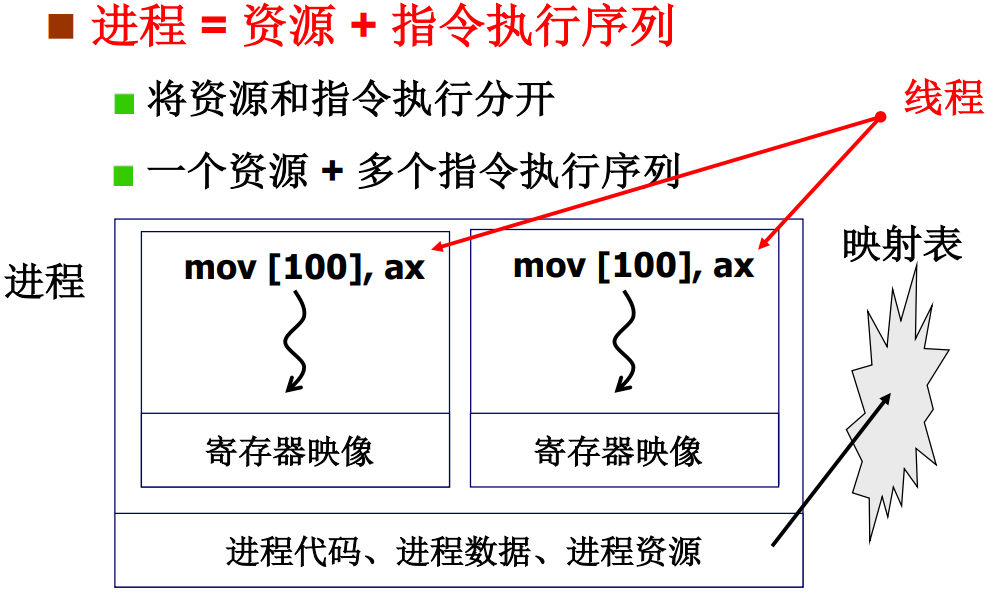

- 线程保留了并发的优点，避免了进程切换的代价。
- 实质就是映射表不变而PC（程序计数器）指针变


### 多个执行序列+一个地址空间很实用

- 一个网页浏览器：
  - 一个线程用来从服务器接收数据
  - 一个线程用来显示文本
  - 一个线程用来处理图片（如解压缩）
  - 一个线程用来显示图片
- 这些线程共享资源
  - 接受数据放在100处，显示时要读
  - 所有的文本，图片都显示在一个屏幕上


### 开始实现一个浏览器

```c
void WebExplorer()
{
	char URL[] = "http://cms.hit.edu.cn";
	char buffer[1000];		//申请一段缓冲区，
	pthread_create(...,GetData,URL,buffer);		//创建线程，执行GetData函数
	pthread_create(...,Show,buffer);			//创建线程，执行show函数
}
void GetData(char *URL,char *p){...};			//从服务器下载数据包
void Show(char *p){...};						//从缓冲区读取数据并显示到显示器
```

总体的框架是启动多个线程，每个线程交替执行。


### create/yield

- 核心是Yield（进程切换函数）
  - 能切换了就知道切换时需要是个什么样子
- Create就是要制造出第一次切换时应该的样子


### 两个执行程序共用一个栈


- 在调用函数时会把函数结束的第一条指令压栈，这就是104->204->304->404
- 函数结束的‘}’会从栈中弹出地址继续往下执行。
- 两个执行程序共用一个栈，如上面那样，会出错。第三步结束本该跳转到104执行，结果从栈中弹出的404


### 进程使用各自的栈

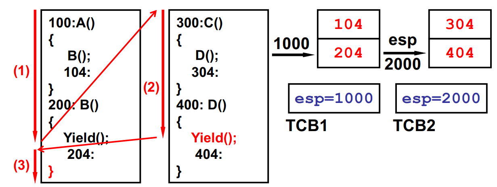

```c
//红色的Yield,第二步执行完切换到204的位置继续执行
void Yield(){
	TCB2.esp = esp;			//用TCB2保存线程2的信息，TCB2保存线程2当前esp寄存器的地址，即线程2下一步要执行的地址
	esp = TCB1.esp;			//切换到线程1的地址栈
	//jmp 204;				//应该去掉
}							//执行这个右括号是就弹出204执行

//执行到上面红色'}'，会弹出104开始执行
```


TCB简介

操作系统中一个线程对应着一个TCB（Thread Control Block），叫做线程控制模块，控制着线程的运行和调度。

相当于每个任务的信息都保存在这个结构中，这样在任务切换时，这个任务的信息就可以保存在任务上下文中。

TCB组成

1. threadID：线程的唯一标识。
2. status：线程的运行状态
3. register：线程关于CPU中寄存器的情况
4. PC程序计数器：线程执行的下一条指令的地址
5. 优先级：线程在操作系统调度的时候的优先级
6. 线程的专属存储区：用于线程切换时存放现场保护信息，和与该线程相关的统计信息等;
7. 堆栈指针（SP），在线程运行时，经常会进行过程调用，而过程的调用通常会出现多重嵌套的情况，这样，就必须将每次过程调用中所使用的局部变量以及返回地址保存起来。为此，应为每个线程设置一个堆栈，用它来保存局部变量和返回地址。相应地，在TCB中，也须设置两个指向堆栈的指针:指向用户自已堆栈的指针和指向核心栈的指针。前者是指当线程运行在用户态时，使用用户自己的用户栈来保存局部变量和返回地址，后者是指当线程运行在核心态时使用系统的核心栈。
8. 用户栈：线程执行的用户方法栈，用来保存线程当前执行的用户方法的信息
9. 内核栈：线程执行的内核方法栈，用来保存线程当前执行的内核方法信息。


### 两个线程的样子：两个TCB，两个栈，切换的PC在栈中


ThreadCreate的核心就是用程序做出这三样东西:

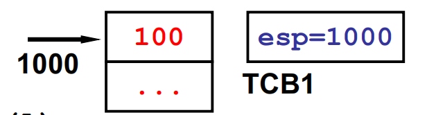

```c
void ThreadCreate(A)
{
	TCB *tcb = malloc();		//申请一段内存作为TCB
	*stack = malloc();			//申请一段内存作为栈区
	*stack = A;	//100			//在栈中压入程序的初始地址
	tcb.esp = stack;			//栈和TCB关联
}
```


### 将所有东西组合在一起


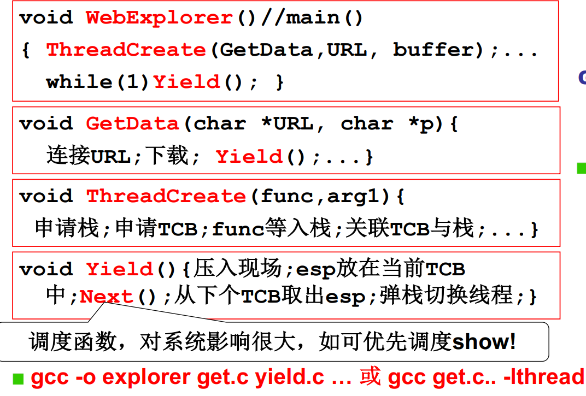

ThreadCreate首先创建了多个进程的用户栈和TCB，把起始地址都放在栈中，然后把TCB和栈进行关联。

在程序执行的过程中调用Yield，首先保存当前esp，然后切换栈，再弹栈切换线程继续执行。


### 用户级线程的优缺点？


## 内核级线程

内核，就是计算机学科意义上的操作系统，直接与硬件交互，提供CPU时间片管理、中断、内存管理、IO管理等等；总之一句话，内核就是操作系统中的一个子程序（提供最基础的功能），提供对软件层面的抽象（例如对进程、文件系统、同步、内存、网络协议等对象的操作和权限控制）和对硬件访问的抽象（例如磁盘的IO，显示，网卡（网络通信）等）。在内核调用IO时，由于调用IO时间较长，这段时间CPU空间，可以切换到其他进程执行。

- 进程切换就是在内核级线程的基础上再额外切换一些资源，比如映射表。 因为每个进程占用的资源不一样，要切换进程必须要切换对应的资源，而**切换资源必须要进入内核态进行处理。**

- 多核系统想要充分发挥其功能，必须支持核心级线程。
- 并发：对于单核CPU：同时出发，交替执行。
- 并行：对于多核CPU：同时出发，同时进行。


### 内核级线程与用户级线程的不同

- ThreadCreate是系统调用，内核管理TCB，内核负责切换线程
- 如何让切换成型？---内核栈，TCB
  - 用户栈还要用，执行的代码仍然在用户态，还要进行函数调用
  - 内核级线程的栈区是一套一套的。一套中包含用户栈和内核栈。
  - 实现两套栈（进行内核级线程的切换需要切换的两个线程的栈）是核心级线程的核心。
  - TCB关联内核栈，根据TCB切换一套栈，内核栈要切，用户栈也要切


### 用户栈和内核栈之间的关联


程序在执行时先是在用户栈跳转，一旦遇到中断（INT指令），计算机硬件的寄存器通过这个线程就找到了这个线程对应的内核栈，压入用户态执行的栈:  堆栈段寄存器SS（Stack Segment）和堆栈指针寄存器SP（Stack Pointer），SS存放栈顶段地址，SP存放栈顶偏移地址，跳转都是SP移动。还要压CS和PC。

- SS，SP是指用户态执行时，已执行部分的一些变量的值，后续执行需要知道之前变量的数值。
- CS（代码段基址），PC是存放用户栈的代码段的，表示后续返回执行时需要知道从代码的那个位置开始执行。
- 用户态切换时人为控制的，而内核线程的切换是硬件本身自带的特性，需要改变物理线路来回切换线程。
- 内核栈的五个寄存器作为指针指向用户栈。


### 用例子说明用户态和内核态的切换

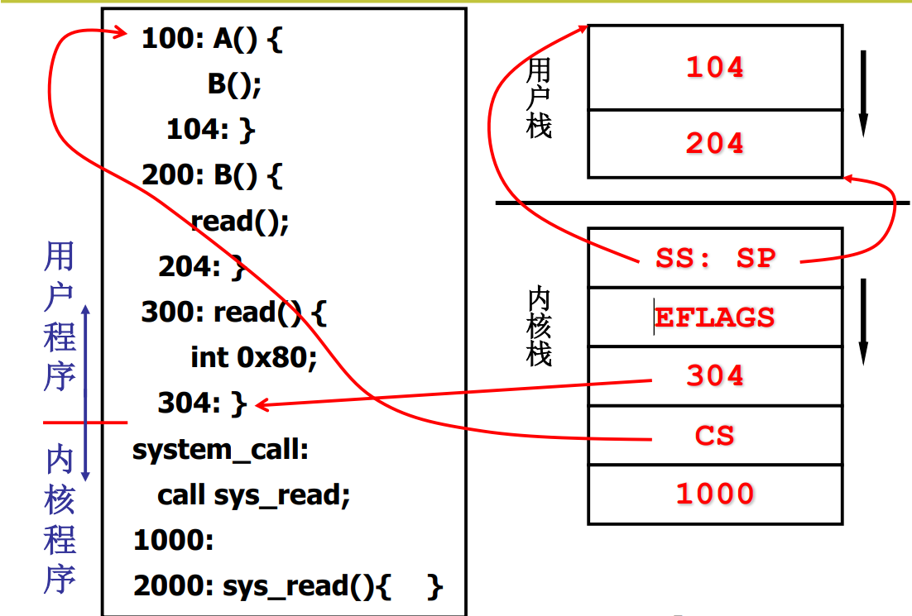

程序从函数A开始执行，

- 调用函数B时把104压入栈中，在函数B中调用read函数，把204压入栈中。然后函数read函数中遇到中断，把对应的五个寄存器压入栈中，SS存放栈顶段寄存器，SP指向段内偏移，即用户态接下来要跳转的地址。中断完要跳转的地址304存放在PC寄存器中。
- 然后开始执行1000,在内核中继续往下执行sys_read();


### 开始内核中的切换：switch_to

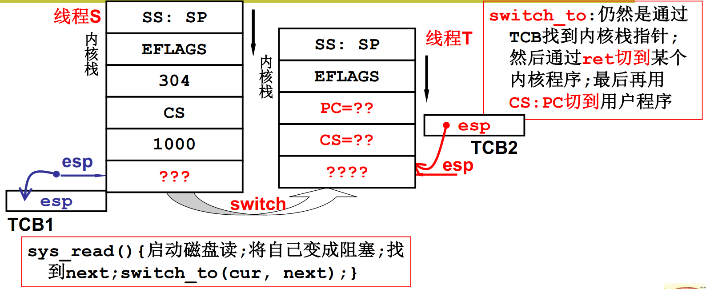

switch_to:用当前的S线程的TCB，把当前S的栈顶地址esp存下来，存下来之后，进入到next下一个线程T，这时要把T线程的TCB中的栈顶地址拿出来赋给esp寄存器，这样才能把T线程的栈利用起来。


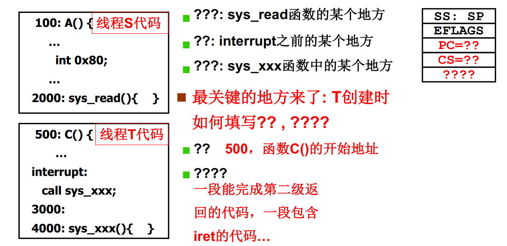

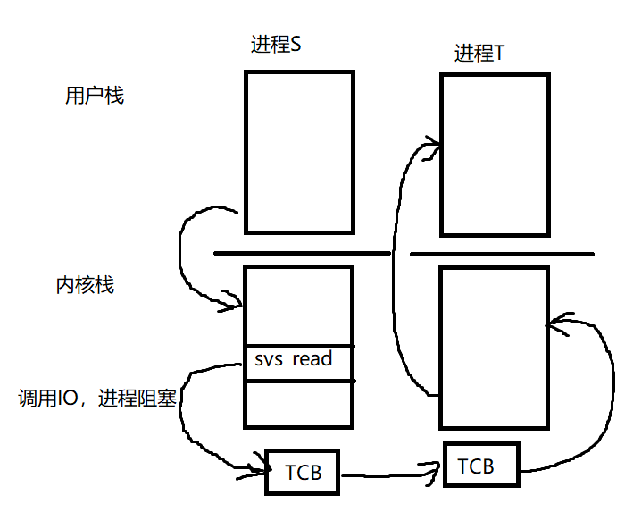

整个过程就是，在进程S用户态时遇到中断，进入内核态，在执行时遇到调用io的情况，内核级线程阻塞。内核级线程切换（switch_to），切换到进程T的内核级线程运行，在这段线程中遇到iret（中断返回），跳转到用户态执行。


### 内核线程switch_to切换的五段论

从下往上，从左往右。


### ThreadCreate

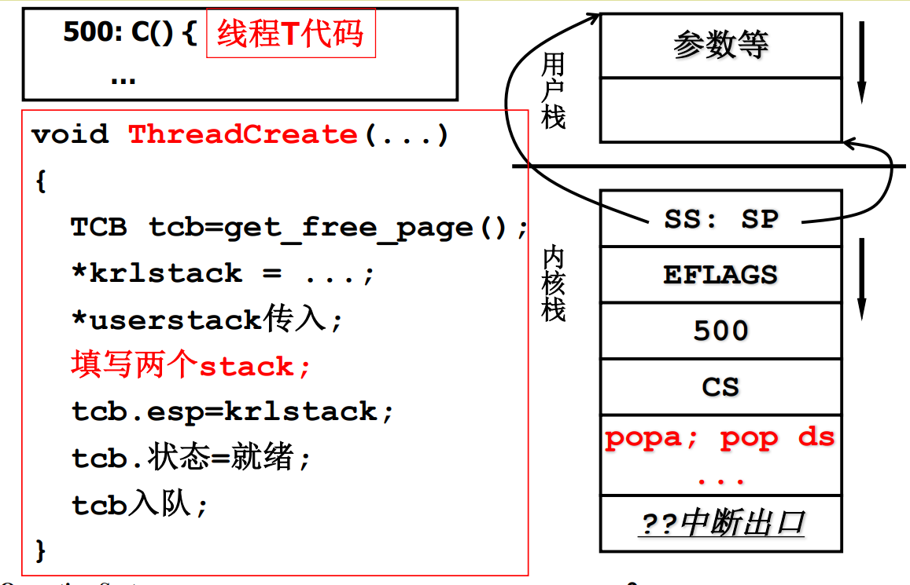

```c
void TreadCreate(...)
{
	TCB tcb = get_free_page();		//先申请一段内存作为内核栈		
	*krlstack = ...;				//初始化内核栈
	*userstack传入;
	填写两个stack;
	tcb.esp=krlstack;				//tcb关联内核栈
	tcb.状态=就绪;
	tcb入队;
}
```


### 用户级线程和内核级线程对比

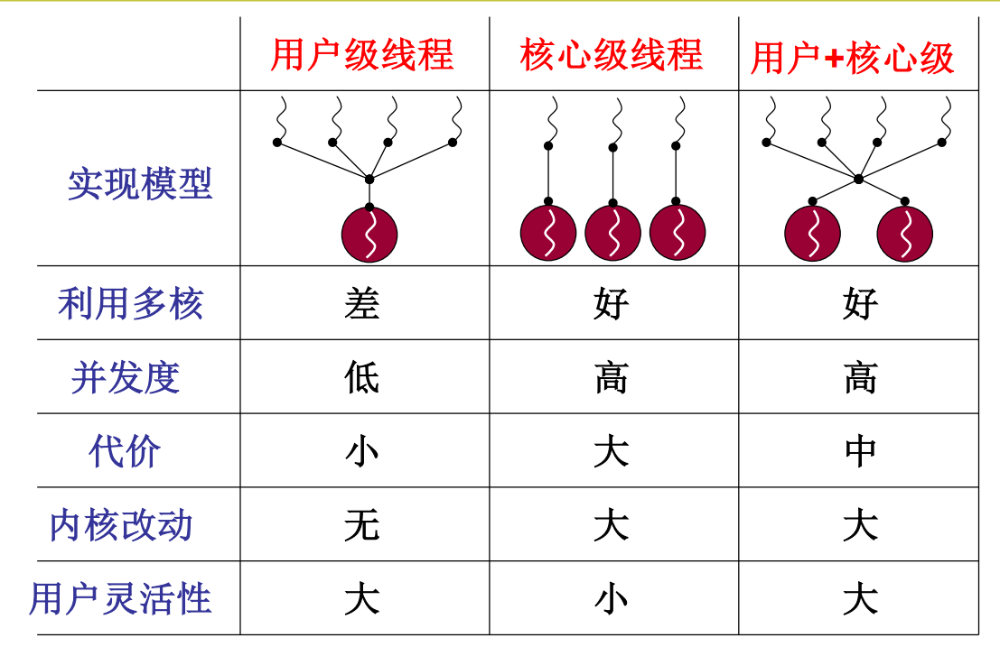


## 内核级线程的代码实现（不懂）

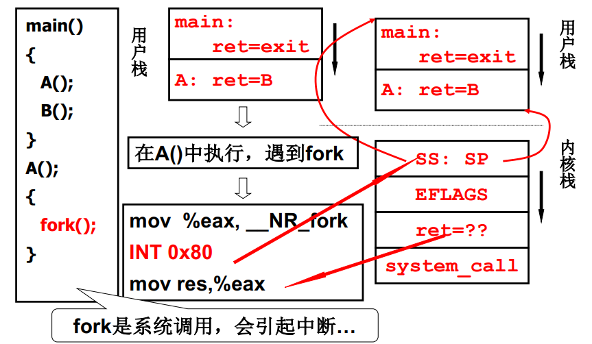

内核栈在中断引起的时候创建。

**中断入口：**在执行INT指令时，CPU找到当前的内核栈，压入当前的SS和SP（在INT指针执行时还没进入内核，执行完成后才进入内核），当前的SS和SP指向的是用户栈，还把当前的CS和IP压进来。然后执行INT 0x80的中断处理函数system_call。

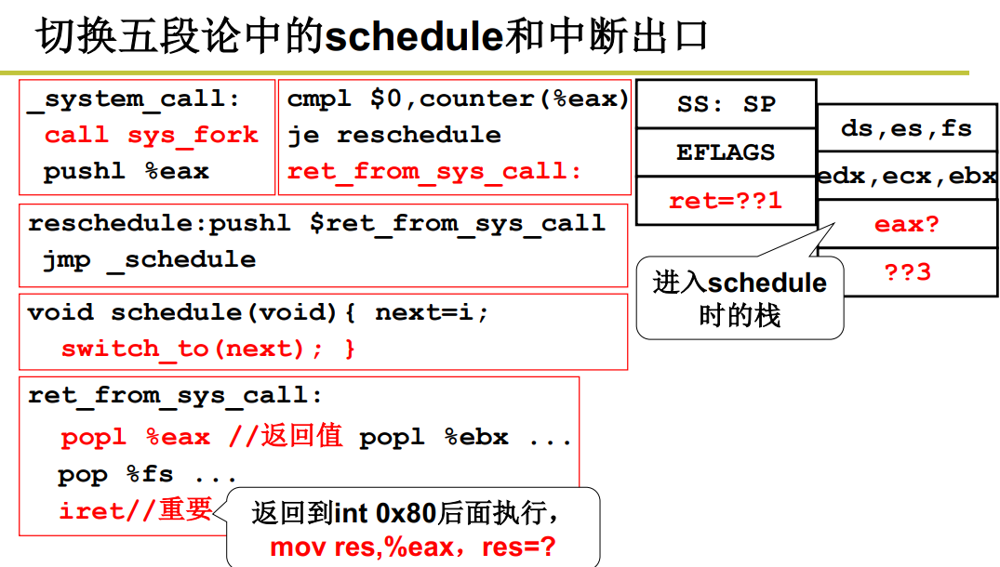

system_call也要压栈，把用户态的一堆东西压栈，把刚才用户态的执行现场在内核态保存起来。

```assembly
_system_call:
	push %ds..%fs
	push %edx...		;把用户态的执行现场在内核态保存起来
	call sys_fork		;进入内核中具体处理sys_fork,在执行sys_fork时可能会引起切换
	pushl %eax			
	movl _current,%eax	;把current（当前进程）赋给eax
	cmpl $0,state(%eax)	;看PCB中的state是不是等于0
	jne reschedule		;jne表示不相等，即上条语句不等于0，reschedule引发完成内核栈的切换
	cmpl $0,counter(%eax)	;看当前进程的时间片
	je reschedule			;时间片用光了，也要进行切换
	ret_from_sys_call:		;在切换完成后会跳回这个函数，系统调用返回
	
reschedule:
	pushl $ret_from_sys_call
	jmp _schedule		;执行C函数
```


**中断出口：**执行完reschedule之后，第五步就是执行ret_from_sys_call，此时已经是线程2，把该线程之前压入栈中的数据依次弹出。


TSS全称为task state segment,是指在操作系统进程管理的过程中，进程切换时的任务现场信息。

1.原来的TSS段是通过一个TR来查找的（类似于一个指针存贮着任务信息的地址）

2.当进行核心线程切换的时候，会将TR指向第二个线程描述符

3.第2步中，将TR切换到新的线程段，所以将此时的线程信息填入到CPU中

PCB和tss工作方式不一样。pcb用栈存信息，用的是精简指令如pop等。tss需要cpu拥有tr这个寄存器结构，tr指示当前task正在使用的相关信息表，用一条复杂指令在task切换时完成换表。


[linux0.11中switch_to理解_jena_wy的博客-CSDN博客_linux switch_to](https://blog.csdn.net/wyyy2088511/article/details/119357473)

可以知道ljmp将跳转到选择子指定的地方，大致过程是，ljmp判断选择子为TSS类型，于是就告诉硬件要切换任务，硬件首先它要将当前的PC,esp,eax等现场信息保存在当前自己的TSS段描述符中,然后再将目标TSS段描述符中的pc,esp,eax的值拷贝至对应的寄存器中.当这些过程全部做完以后内核就实现了内核的切换


接下来的目标就是做好TSS，要做好TSS，首先得有线程控制块TCB,还需要有内核栈，然后再把TSS做好，做好之后就能切换。


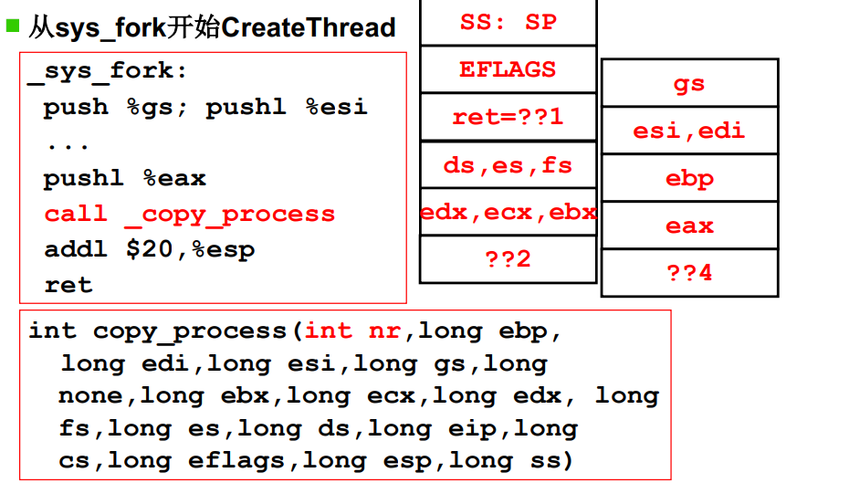

`_sys_fork`是五段论中的第一段，中断入口。进入`_sys_fork`之后要执行 `_copy_process`函数。内核栈的内容全部作为copy_process的参数，这样就能从父进程创建一个子进程。


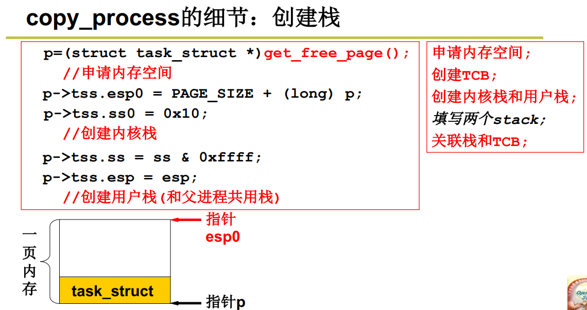


eip是INT指令执行完的下一句话


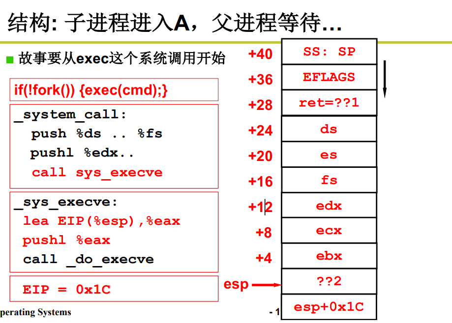


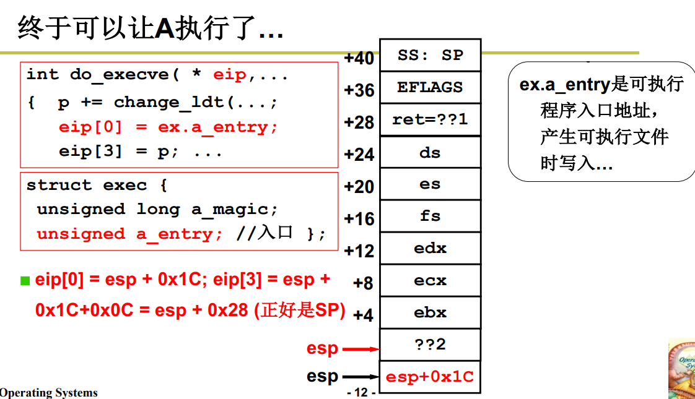


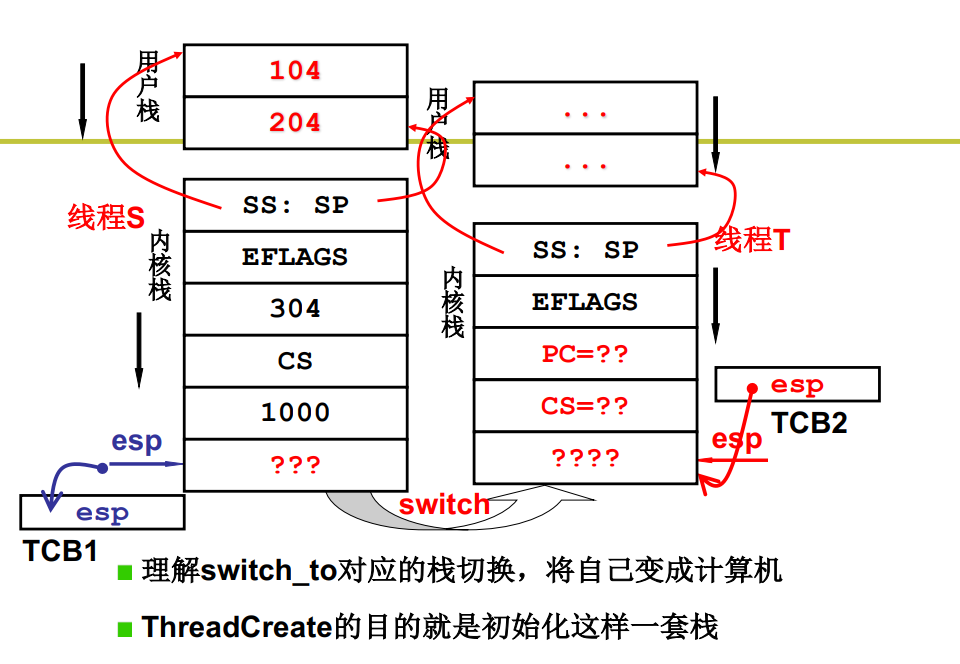


## CPU调度策略


### 设计调度算法的目标：时间短

- 尽快结束任务：周转时间（从任务进入到任务结束）短
- 用户操作尽快响应：响应时间（从操作发生到响应）短
- 系统内耗时间少：吞吐量（完成的任务量） 大

总原则：系统专注于任务执行，又能合理调配任务


如何做到合理？需要折中，需要综合...

- 吞吐量和响应时间之间有矛盾
  - 响应时间小-->切换次数多-->系统内耗大-->吞吐量小
- 前台任务和后台任务的关注点不同
  - 前台任务关注响应时间，后台任务关注周转时间
- 


### 各种调度算法


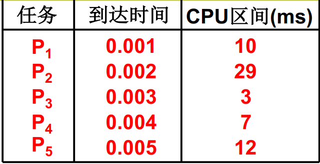

先来先服务（FCFS）：按到达时间排序，先到的先执行。平均周转时间会长

P1-->P2-->P3-->P4-->P5


短作业优先（SJF）：假设所有任务同时到达,CPU执行时间短的优先。平均周转时间最短

P3-->P4-->P1-->P5-->P2


按时间片来轮转调度（RR）：


### 响应时间和周转时间同时存在，怎么办

- 一个调度算法让多种类型的任务同时都满意，怎么办？
- 直观想法：定义前台任务和后台任务两队列，前台RR，后台SJF，只有前台任务没有时才调度后台任务


如果一直有前台任务，可能会有后天任务一直无法执行。

- 解决办法：后台任务优先级动态升高，但后台任务（用SJF调度）一旦执行，前台的响应时间可能会变长
- 前后台任务都用时间片，但又退化为RR，后台任务的SJF该如何体现，前台任务如何照顾


还有其他问题：


## 一个实际的schedule函数

首先是找到所有就绪态任务的最大counter，大于零则切过去.否则更新所有任务的counter，即右移一位再加priority。然后进入下一次的找最大counter大于零则切否则更新counter，所以说那些没在就绪态的counter就一直在更新，数学证明出等的时间越长counter越大，等他们变成就绪态了，由于counter大，也就可以优先切过去了。

```c
void Schedule(void)
{
	while(1)
	{
		c = -1; next = 0;i = NR_TASKS;
		p = &task[NR_TASKS];
		while(--i)
		{
			if((*p->state == TASK_RUNNING&&(*p)-> counter > c))
				c = (*p) ->counter,next = i;
		}	//找到队列中就绪态最大的counter
		if(c) break;	//跳出循环执行该进程
        //1.当不存在就绪态进程后，c=-1，执行for循环
        //2.for循环，使就绪态进程（counter=0）=priority，而阻塞态进程counter>priority
        //3.当阻塞态 就绪后，将会立即获得高优先级
		for(p = &LAST_TASK;p>&FIRST_TASK;--p)
			(*p)->counter = ((*p)->counter>>1)+(*p)->priority;
	}
	switch_to(next);
}
```

counter表示优先级，优先级越高，数字越大。counter表示的是进程进入就绪态时间。

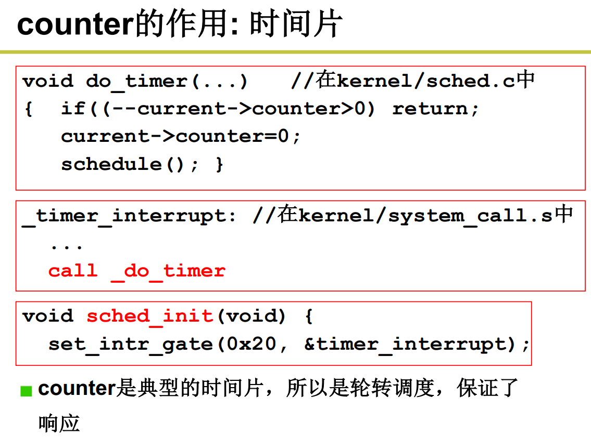

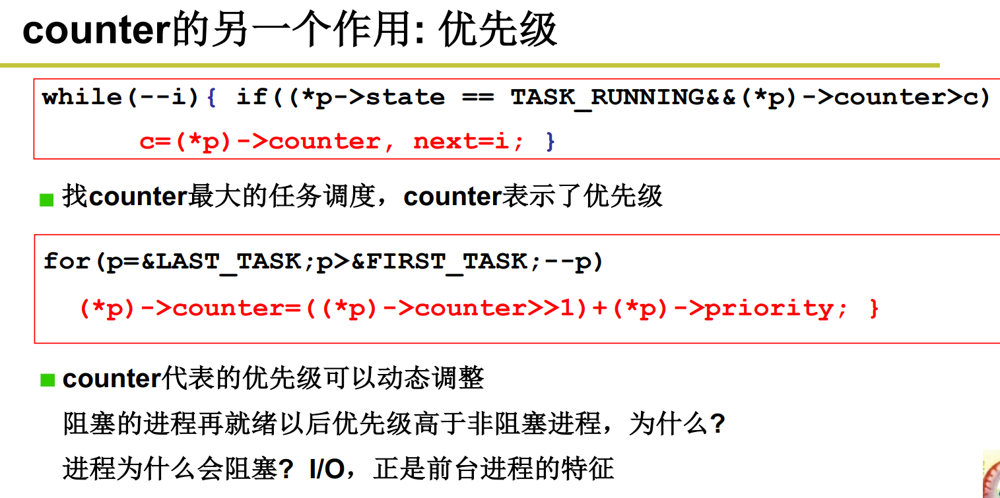


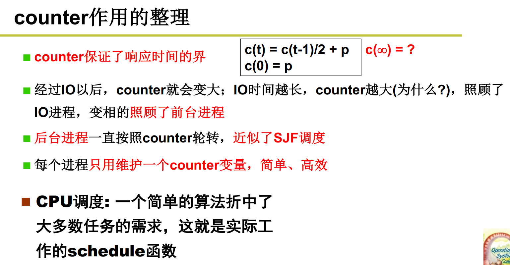


## 进程同步与信号量

目的：让多进程之间的合作变得合理有序

单生产者单消费者用信号：

有一个缓冲区，缓冲区满的时候生产者睡眠，消费者工作，消费者工作完之后缓冲区有空闲，唤醒生产者。

当生产者不工作，缓冲区为空时，消费者睡眠。


（多）生产者（多）消费者用信号量：

有一个缓冲区，缓冲区满的时候生产者睡眠，当有第二个生产者工作时，该生产者也睡眠，用信号量sem记录睡眠的生产者的数量，消费者工作，消费者工作完之后查看sem,如果有睡眠的生产者，唤醒该生产者。当生产者不工作，缓冲区为空时，消费者睡眠。生产者可以当作进程。


进程同步：需要让“进程走走停停”来保证多进程合作的合理有序。用wakeup函数和sleep函数来通知进程的走走停停。


```c
//申请缓冲区
#define BUFFER_SIZE 10		//BUFFER_SIZE是缓冲区的大小。
typedef struct{...} item;
item buffer[BUFFER_SIZE];
int in = out = counter = 0;		//counter表示的是缓冲区中有效内容单元的个数

//生产者进程
while(true){
	while(counter == BUFFER_SIZE)		//缓存区满，生产者要停
    {
        sleep();
        ...
    }
	
	buffer[in] = item;
	in = (in + 1)%BUFFER_SIZE;
	counter++;
    if(counter == 1)
        wakeup(消费者);
}

//消费者进程
while(true){
	while(counter == 0)		//缓存区空，消费者要停
    {
        sleep();
        ...
    }
		
	item = buffer[out];
	out = (out + 1)%BUFFER_SIZE;
	counter--;
    if(counter == BUFFER_SIZE-1)		//只发信号还不能解决全部问题
        wakeup(生产者);
}
```

只发信号不能解决全部问题：

如果出现了这样的进程调度情况:在缓存区满时进来两个生产者进程,然后又进来一个消费者进程,这时会怎么样?缓存区满时进来生产者进程 P,counter==BUFFER_SIZE条件成立,P会进入阻塞态等待信号empty。又进来一个生产者进程 P2, counter == BUFFER.SIZE条件仍然成立,P也会进入阻塞态等待信号 empty。现在又进来一个消费者进程C,C消费了一个内容单元 (item), counter--,判断条件 counter == BUFFER.SIZE-1,条件成立,C会发生信号 empty唤醒进程P,到目前为止,进程间的同步关系是正确的。现在C进程再循环执行一次又用掉了一个内容单元(item),执行 counter--,判断条件 counter == BUFFER._SIZE-1,由于此时counter = BUFFER._SIZE-2,判断条件不成立,所以P不能被唤醒,仍然处于阻塞态等待信号 empty。按照语义,现在有了一个空闲单元,却有一个生产者进程被阻塞需等待空闲单元的到来，显然不正确。


### 从信号到信号量

不能只是等待信号（睡眠）和发信号（唤醒）。还应该记录一些信息。

- 能记录有“2个进程等待”就行了，引入一个变量sem记录信号量

1. 缓冲区满，P1执行，P1sleep，记录下1个进程等待。   sem = -1; 
2. P2执行，P2 sleep，记录下2个进程等待                         sem = -2;
3. C执行1次循环，发现2个进程等待，wakeup 1个           sem = -1;
4. C再执行1次循环，发现?个进程等待，再?                        sem = 0;
5. C再执行1次循环，怎么办?                                                 sem = 1;
6. 再来一个p3,生产者就不需要睡眠，令sem = 0表示缓冲区已满


信号量的定义：

 1965年，迪杰斯特拉（Dijkstra）提出的一种特殊整形变量，量用来记录，信号用来sleep和weakup

```c
struct semaphore
{
	int value;		//记录资源个数
	PCB *queue;		//记录等待在该信号量上的进程，是一个阻塞队列
}
P(semaphore s);		//申请资源
v(semaphore s);		//消费资源

p(semaphore s)		
{
	s.value--;
	if(s.value < 0)		//刚才是欠资源或没有资源
		sleep(s.queue);	//当前进程睡眠  
}

v(semaphore s)
{
	s.value++;
	if(s.value <= 0)	//表示还有进程在睡眠
		wakeup(s.queue);	//唤醒睡眠的进程
}


//用信号量解生产者-消费者问题

//用文件定义共享缓冲区
int fd = open("buffer.txt");
write(fd,0,sizeof(int));	//写in
write(fd,0,sizeof(int));	//写out

//信号量的定义和初始化
semaphore full = 0;				//full表示生产出内容单元的数量
semaphore empty = BUFFER_SIZE;		//用empty表示缓冲区是否满
semaphore mutex = 1;		//共享缓冲区可否使用的标识

//生产者
Producer(item){
    P(empty);		//先判断有没有空闲的缓冲区，没有就睡眠
    P(mutex);		//有空闲，将mutex置为0，阻止其他进程进入共享缓冲区
    读入in;将item写入到in的位置上;
    v(mutex);		//将mutex置为1，将共享缓冲区开放
    V(full);		//由于进行一次生产，缓冲区内容单元+1
}

//消费者
Consumer(){
    P(full);		//先判断缓冲区有没有内容单元
    P(mutex);		//将mutex置为0，阻止其他进程进入共享缓冲区
    读入out;将文件中的out位置读出到item;打印item;
    v(mutex);		//将mutex置为1，将共享缓冲区开放
    V(empty);		////由于进行一次消费，缓冲区空闲位置+1
}
```


## 信号量临界区保护


```c
//接上一节
empty = -1;			//假如初始的empty的初始值等于-1

//有两个生产者，由于生产者的睡眠是在s.value之后，所以一个生产者的P操作没有结束，而另一个生产者的P操作工作时，就会出现empty出错的问题

//生产者P1
register = empty;
register = register - 1;
empty = register;

//生产者P2
register = empty;
register = register - 1;
empty = register;

//一个可能执行的调度
P1.register = empty;			//P1.register = -1
P1.register = P1.register - 1;	//P1.register = -2;	
P2.register = empty;		//P2.register = -1;正确情况下应该等于-2，在P1的P操作没有执行完，empty没有返回时，P2对empty进行操作
P2.register = P2.register - 1;		//P2.register = -2;
empty = P1.register;			//empty = -2;
empty = p2.register;			//empty = -2;

//解决办法
//在写共享变量empty时阻止其他进程访问empty，就是操作系统的PV原子操作，

//生产者P1
先检查并给empty上锁
P1.register = empty;
P1.register = P1.register - 1;
//生产者P2
检查empty时发现有锁，不执行
empty = P1.register;		//P1继续执行
给empty开锁
//生产者P2
先检查并给empty上锁
P2.register = empty;
P2.register = P2.register - 1;
empty = P2.register;
给empty开锁
```


### 临界区

一次只允许一个进程进入的该进程的那一段代码。临界区一定成对或成组的出现。

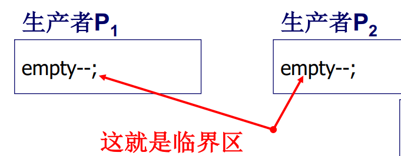

读写信号量的代码一定是临界区。


临界区代码保护的原则：

- 基本原则:互斥进入:如果一个进程在临界区中执行，则其他进程不允许进入
  - 这些进程间的约束关系称为互斥(mutual exclusion)
  - 这保证了是临界区
- 好的临界区保护原则
  - 有空让进:若干进程要求进入空闲临界区时，应尽快使一进程进入临界区
  - 有限等待:从进程发出进入请求到允许进入，不能无限等待


问题来了，怎么控制进程进入临界区

### 一个不好的方法：轮转法

用一个变量turn来让两个进程交替执行

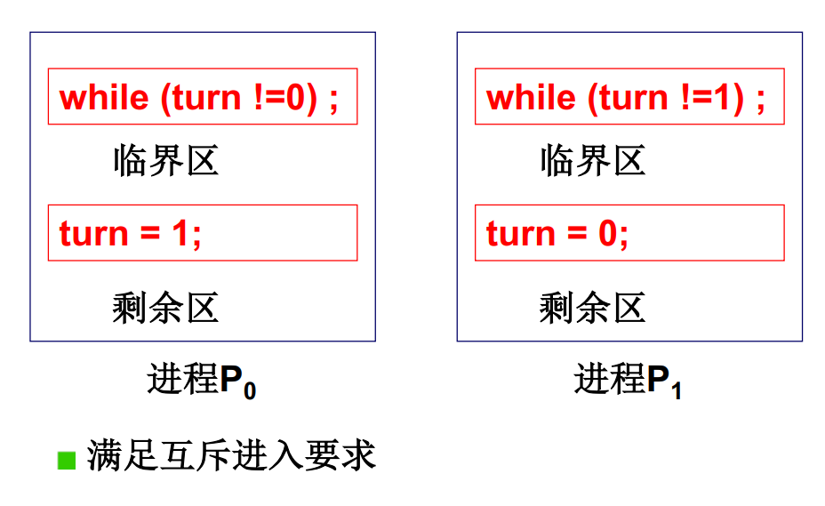

turn不能等于1的同时又等于0，但是当p0进入临界区后，p1不进去临界区，那p0就不能再进入临界区了。**不满足有空让进**


### 改进的方法：标记法

通过标记指明是否有进程进入临界区，且当前临界区是否有锁。

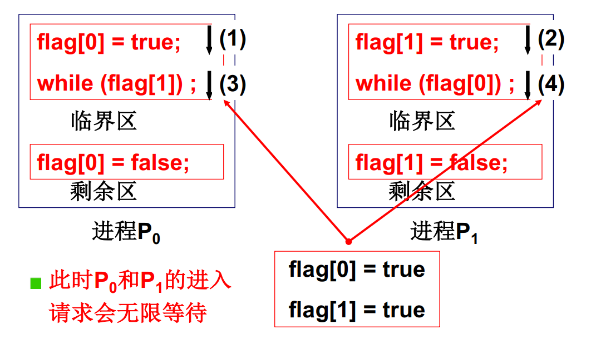

由图可知，当进程P1刚修改完临界区，P2就修改临界区，**会造成两个进程无限等待**。


### Peterson算法，结合轮转法和标记法

两个进程进行切换

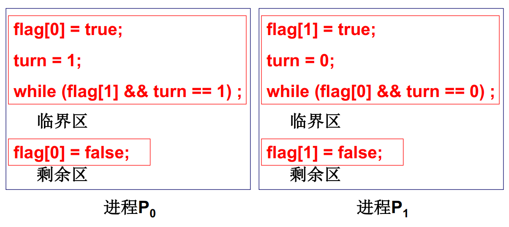

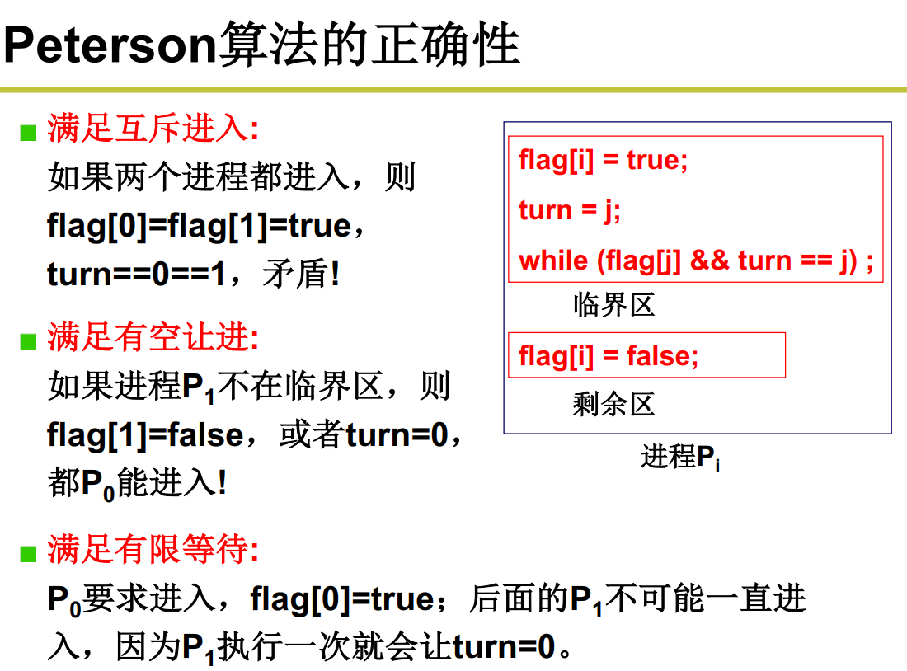


### 多进程切换-面包店算法(纯软件，算法复杂)

- 仍然是标记和轮转的结合
  - 如何轮转：每个进程都获得一个序号，
  - 如何标记：进程离开时序号为0，不为0的序号即标记
  - 面包店：每个进入商店的客户都获得一个号码（当前号中最大的+1），号码最小的先得到服务；号码相同时，名字靠前的先服务。

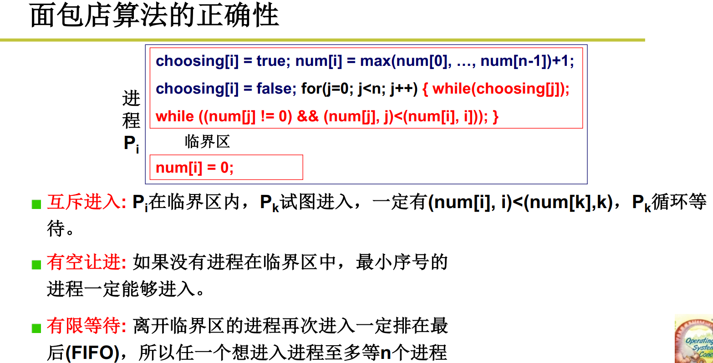


### 多进程操作的第二种方法

开关中断

一个进程在临界区的时候，另一个进程只有经过调度才能进入相同临界区。所以一个进程在临界区时阻止调度就可以保护当前信号量。

进程切换时，时钟中断让时间片-1，当前进程的时间片用完了，进程切换。所以只要阻止时钟中断，进程也就不会切换。


```c
//单CPU
cli();	//关中断
临界区
sli();	//开中断

//多核时，每个cpu都有一个中断，会冲突
```


### 多进程操作的第三种方法

临界区保护的硬件原子指令法

```c
boolean TestAndSet(boolean &x)
{//硬件原子指令，一次性执行完毕
	boolean rv = x;
	x = true;
	return rv;
}

while(TestAndSet(&lock));		//lock的初值时false时，return false跳出循环，lock设为true阻止其他进程进入临界区
临界区
lock = false;		//临界区执行完毕，lock改为false,允许其他进程进入临界区
剩余区
```


### 总结：

进程同步，用临界区保护信号量（三种方法），信号量在执行过程中语义正确，根据语义可以实现进程在适当的时候阻塞，适当的时候执行，然后用信号量实现同步。


## 死锁处理

多个进程由于相互等待对方持有的资源而造成的谁都无法执行的情况叫死锁。


### 死锁的成因

- 资源互斥使用，一旦占有别人无法使用
- 进程占有了一些资源，又不释放，再去申请其他资源
- 各自占有的资源和相互申请的资源形成了环路等待

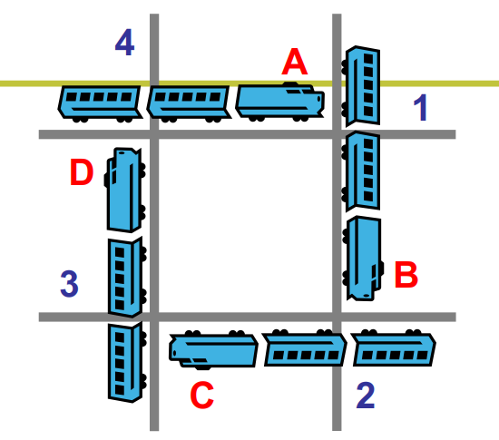

### 死锁的必要条件

- 互斥使用
  - 资源的固有特性，如道口
- 不可抢占
  - 资源只能自愿放弃，如车开走以后
- 请求和保持
  - 进程必须占有资源再去申请
- 循环等待
  - 在资源分配图中存在一个环路


### 死锁处理方法概述

- 死锁预防：破环死锁出现的条件
  - 在进程执行前，一次性申请所有需要的资源，不会占有资源再去申请其他资源
    - 缺点1：需要与之未来，编程困难
    - 缺点2：许多资源分配后很长时间后才使用，资源利用率低
  - 对资源类型进行排序，资源申请必须按序进行，不会出现环路等待
    - 缺点：仍然造成资源浪费

- 死锁避免：检测每个资源请求，如果造成死锁就拒绝
  - 如果系统中的所有进程存在一个可完成的执行序列P1,...Pn,则称系统处于安全状态

- 死锁检测+恢复
  - 检测到死锁出现时，让一些进程回滚，让出资源

- 死锁忽略
  - 就好像没有出现死锁一样


### 死锁避免的银行家算法

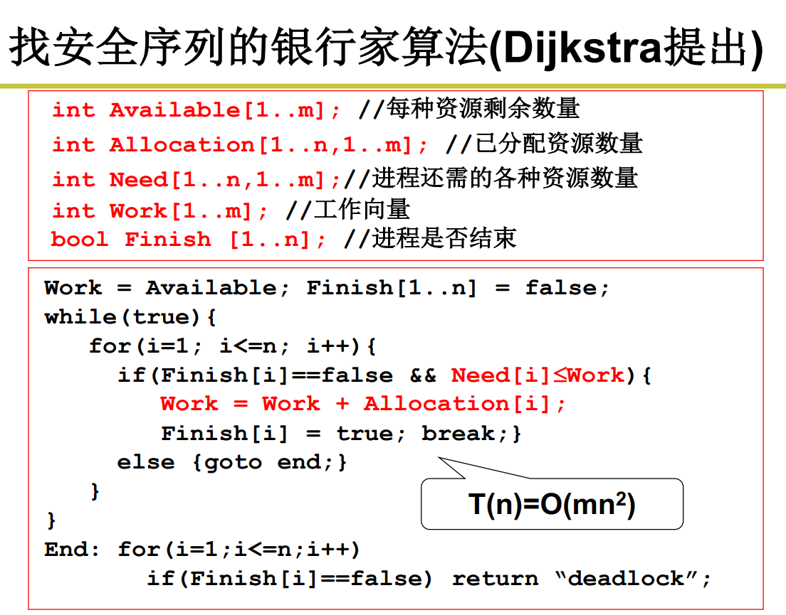

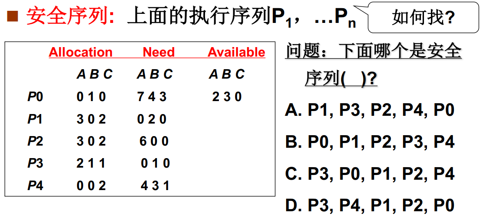

Allocation表示进程占用的资源，Need表示进程需要的资源，Available表示当前系统中剩余的资源。

如P0占用0个A资源，1个B资源，0个C资源。需要7个A资源，4个B资源，3个C资源才能执行。当前系统中还剩余2个A资源，3个B资源，0个C资源。

进程只有得到需要的资源才能执行，执行结束后，进程占用的资源和需要且得到的资源都释放。

安全序列为P1,P3,P2,P4,P0


### 死锁检测+恢复：发现问题再处理

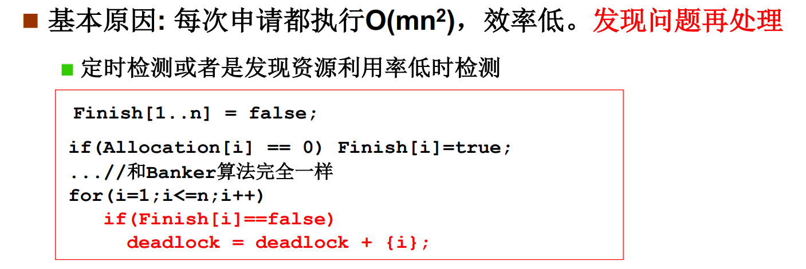

算法效率较高，但是在产生死锁，检测完成后让冲突的进程回滚的难度很大。


### 死锁忽略

许多通用的操作系统，如PC机上安装的windows和Linux。都采用死锁忽略的方法。原因：

- 死锁忽略的处理代价最小
- 这种机器上出现死锁的概率比其他机器低
- 死锁可以用重启解决，PC重启造成的影响小。


## 内存使用与分段


内存使用：将程序放在内存中，PC指向开始地址

### 重定位

在程序编译形成可执行程序时，程序中指定的地址都是从0开始的相对地址，这个地址通常被成为逻辑地址。当程序载入到物理内存时，可能使用任意一段空闲物理内存，此时为保证程序的顺序执行，就需要进行程序重定位，即将程序中的逻辑地址对应到实际使用的物理内存地址。

嵌入式系统可以在编译时重定位。

内存重定位后的地址 = 使用的物理内存的起始地址（基地址） + 逻辑偏移地址。


重定位最合适的时机——运行时重定位

在运行每条指令时才完成重定位，每执行一条指令都要从逻辑地址算出物理地址：地址翻译。

每个进程的基地址都放在PCB中，执行指令时第一步从PCB中取出这个基地址，然后地址翻译。

CS:IP的本质就是 基地址：偏移地址

CS：代码段寄存器 IP：指令指针寄存器


整理：首先将一个程序编译结束，这时每条指令都有自己的逻辑地址。要想让这个程序执行起来，需要创建进程，需要创建PCB，要做的工作就是在内存中找到一段空闲的内存，得到这段空闲内存的起始地址作为基地址存入PCB中，把编译好的程序载入这段空闲内存中，让PC(程序计数器)置好初始地址开始执行。每条指令执行时都要进行地址翻译，找到了这条指令实际使用的物理内存地址，程序就执行起来了。


### 引入分段

程序是由若干部分（段）组成，每个段分别放入内存，每个段各有各自的特点、用途：代码段只读，代码/数据段不会动态增长，数据段可写。堆栈段可以增长。 

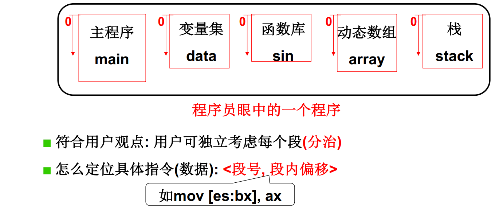

程序中每一部分指令的偏移量都是从0开始的。


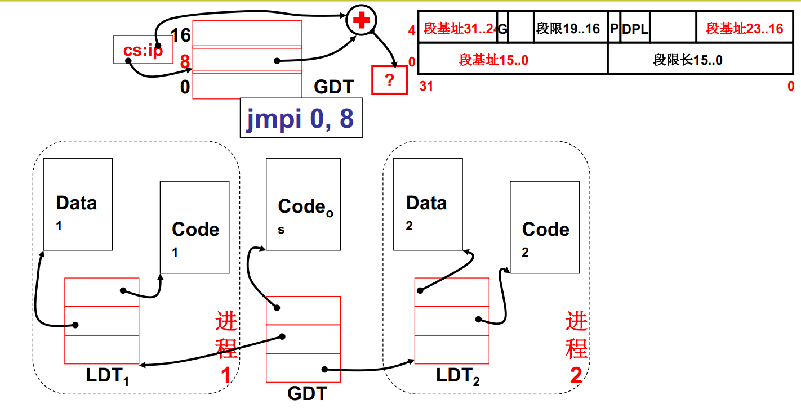

操作系统的段表叫做GDT表，进程存储基址的段表叫做LDT表.进程切换时，LDT表跟着切换，在执行指令执行时根据LDT进行地址翻译。

### 引入分段后再看程序执行的过程：

程序在编译时已经将程序分为多个段：代码段，数据段...等等。每个段在内存中找到空闲的地方，把每个段的基址放在LDT表里面，LDT表初始化好之后赋给PCB，然后PC指针设成初始地址开始取指执行。每执行一条指令时都查LDT表，根据表中的段基址进行地址翻译，找到了这条指令实际使用的物理内存地址，然后执行这条指令相应的操作。


## 内存分区与分页


固定分区（不可取）

- 等分，操作系统初始化时将内存等分为k个分区


可变分区

- 首先适配O(1),在最先适配的空闲分区分配
- 最佳适配 ：在空闲分区空间大小最接近的分区分配
- 最差适配：在空闲分区空间大小差距最大的空间分配


### 引入分页

解决内存分区导致的内存效率问题

可变分区在经过不断的分区释放分区释放之后，会留下很多很小的分区，这就是内存碎片。在造成总的空间空间大于程序要申请的空间，但是不能分配。

解决办法：将空闲分区合并，需要移动一个段（复制内容）：内存紧缩。但是内存紧缩需要花费大量时间。不太行


将内存分页，针对每个段内存请求，每个段打散成多个页，系统一页一页的分配内存给这个段。每一页的内存都比较小（mem_map的一页内存是4K），就算有一页没有用完，也是浪费很少的空间。


先得到一个逻辑地址[0x2240]，由于一个系统的每个页面尺寸是4K(0x1000H),要得到页号就是向右移12位。页号为2，在页表中查找该页号对应的页框号， 从而找到这条指令存放的物理地址。


## 多级页表和块表

为了提高内存空间利用率，页就应该小，但是页小了页表就大了。

页表会很大，页表放置就成了问题...

- 页面尺寸通常为4K，而地址是32位的，就有$2^{20}$个页面才能索引完全部页面
- $2^{20}$个页表项都得放在程序运行时占用的内存中，如果一个页表项占4b的空间，就需要4M内存；系统中并发10个进程，就需要40M内存
- 实际上大部分逻辑地址（32位：总空间[0,4G]）根本不会用到


第一次尝试，只存放用到的页


用到的逻辑页才有页表项，但是页表中的页号不连续，就需要比较、查找，查找过程中CPU就会通过总线访问内存， 程序执行时间就会变长。就算使用二分查找算法优化也不行。

所以页表中的页号必须连续，32位地址空间+4k页面+页号必须连续——>一共有$2^{20}$个页表项（32位除以4k）——>会造成大页表占用内存，造成浪费


第二种尝试：多级页表，即页目录表（章）+页表（节）

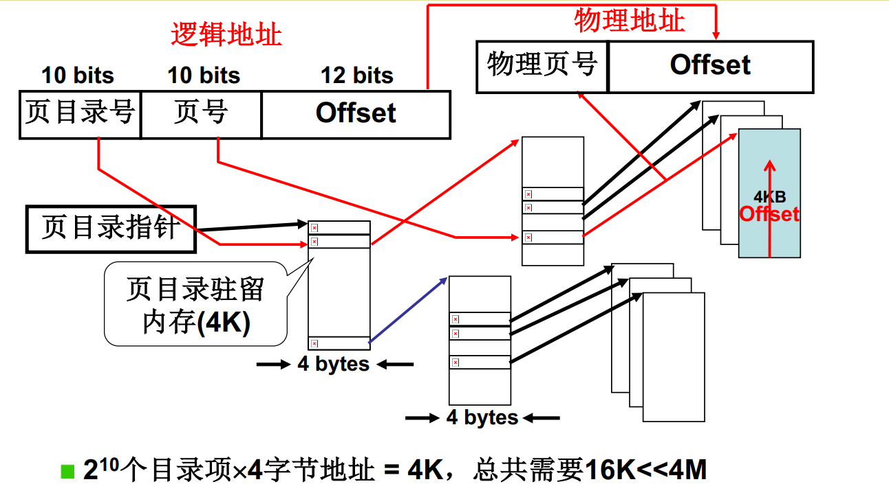

在32位地址空间中，10位表示页目录号即$2^{10}$个页目录，10位表示页表项即$2^{10}$个页表项，12位表示页每页有4K的空间。

一个页目录指向$2^{10}$个页表项，每个页表项指向$2^{10}*2^{12} = 1024*4*1024 = 4MB$的空间。在实际的程序运行过程中，程序只需要查找指令所在的页目录以及页目录对应的页表，所以页目录索引表占用的空间就是$2^{10}*4 = 4k$，一个页表号占4个字节,用到的三条页目录各自还需要存储一个页表，每个4K,所以一共需要16k的空间用来索引指令所在的物理地址。远小于4M。


多级页表增加了访存的次数，尤其是64位系统。多级页表每增加一级，内存的节省会更多，但是内存的访问次数会增加。

TLB（快表）是一组相联快速存储，是寄存器。通过设计电路，根据页号一次比对直接找到物理地址。

快表查不到再去多级页表查

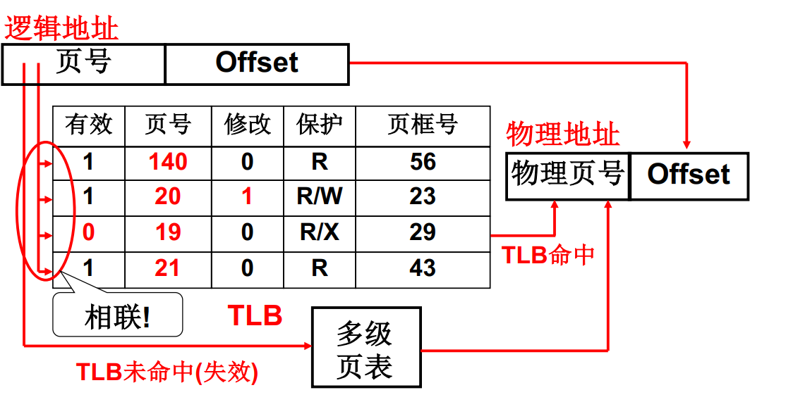

- TLB命中时效率会很高，未命中时效率降低。
- 要想真正实现“近似访存一次”，TLB的命中率应该很高
- TLB越大越好，但TLB很贵，通常只有[64,1024]
- 而且TLB不是固定不变的，还需要一定的置换策略。


## 段页结合的实际内存管理

程序员希望用段，物理内存希望用页。

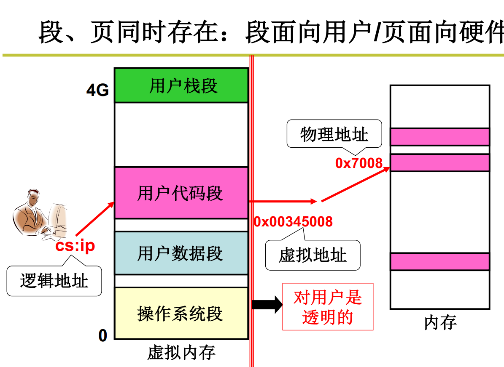

- 程序员编写的程序在编译过程中会被分成几个段。在虚拟内存中分割出一些分区，将程序的各个段“放入”，分区分割算法可以使用前面论述过的适配算法。由于虚拟内存并没有对应真实存储单元，所以这里并不是真的放入，而是建立映射关系，假装放入。
- 建立表段记录程序各段和虚拟分区之间的映射关系。
- 将虚拟内存分割成页，选择物理内存中的空闲页框，将虚拟内存中的“页内容”放到物理页框中。由于虚拟内存是不存放实例内容的假内存，所以这里的页内容实际上是曾静假装放入虚拟内存的程序段内容。
- 因此,基于虚拟内存的段页结合效果是将程序段分割成页以后载入物理页框中,但是这个载入是通过虚拟内存才完成的。一旦经过了虚拟内存,从用户出发看到的视图是程序段被放到一个连续“内存”区域上,即用户看到的是分段效果。在背后,操作系统再将这个“内存”区域按照分页方式真正放到物理内存里,实现了分页机制。 


### 段、页同时存在时的重定位（地址翻译）


经过两层地址翻译：

第一层地址翻译是基于段的地址翻译，支持分段。首先通过段表找到一个地址，是一个虚拟地址。

第二层地址翻译是基于页的地址翻译，支持分页。从虚拟地址算出页号，根据页号得到物理地址的页框号，根据页框号加页内偏移得到真正的物理地址。


## 内存换入

虚拟内存就是操作系统给进程提供的一个规整的、总长度总为4GB(32位操作系统)的地址空间,用户可以随意访问这个空间中的任何一个地址。但是由于实际的物理内存可能比4GB要小,所以4GB的虚拟内存不可能全部映射到物理内存上，这就会产生如图7.1所示的换入/换出场景,首先访问左图中阴影部分的那段虚存区域,虚存区域和物理内存建立了关联,现在又要访问右图阴影部分的那段虚存区域,由于当前剩余物理内存空间不足,需要首先将物理内存中的某些关联释放掉(换出),在物理内存中腾出的地方上和右图中的虚存区域建立关联(换入)。

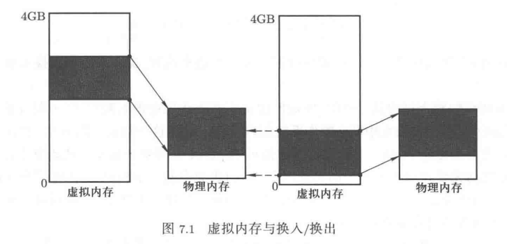

### 内存换入从缺页开始

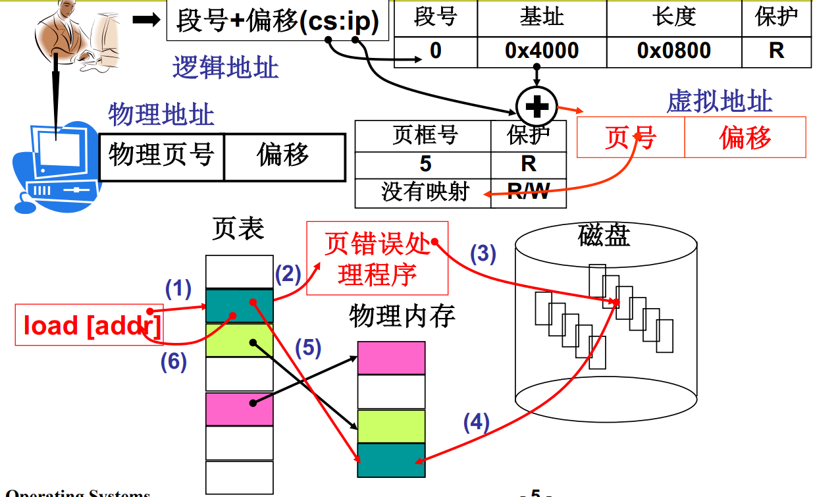

一个程序访问线性地址，发现缺页，因为这一页虚拟内存区域还没有和物理内存建立关联。内存换入的核心就是在缺少虚拟页的时候请求调页，操作系统实现换入就是请求调页。

对应图中的步骤

1. 请求调页的整个过程从 MMU发现虚拟页面在页表项中的有效位为0时开始，
2. 这个时候MMU会向CPU 发出缺页中断。
3. 操作系统的内存换入就从这个缺页中断开始,在这个中断处理中操作系统会去磁盘(仓库)上找到这个虚拟页(商品)
4. 并将这个虚拟页从磁盘上读进来。当然在读进来之前先要找到一个空闲的物理内存页框(店面中的一个柜台),再将那个虚拟页读到空闲页框以后(将商品放在柜台上),
5. 虚拟页面就和物理页框建立关联了,再更新页表来记下这个映射关系(告诉售货员商品放在哪里了)。


## 内存换出

由于物理内存是有限的，且相比虚拟内存而言要小得多，因此我们不能一直换入页面。从磁盘换入虚拟页面时，需要在物理内存中找到一个空闲页框，但这个空闲内存页框不一定总能找到。所以更符合实例的做法应该是，如果能找到物理内存页框就直接读入虚拟页，否则就要进行内存换出。由此可知，内存换入和换出必须配合在一起才能实现虚拟内存。


页面换出要解决的基本问题就是选择哪个页面进行淘汰。


### FIFO页面置换


### MIN页面置换


MIN页面置换，需要预知将来，但计算机不能预知未来。


### LRU页面置换

least recent used 最近最少使用


### LRU实现


1. 这里的关键是维护时机的问题。

2. 如果不缺页，程序应该是直接通过MMU访问物理地址，内核没有机会进行时间戳或者栈的维护。

3. 只有在缺页中断的时候内核才有机会接触处理页换出。

4. 任何在不缺页的时候的数据结构维护都会带来巨大开销


### LRU近似实现

将时间计数变为是和否

- 每个页加一个引用位
  - 每个访问一页时，硬件自动设置该位
  - 缺页时选择淘汰页：扫描该位，是1时清0，并继续扫描；是0时淘汰该页

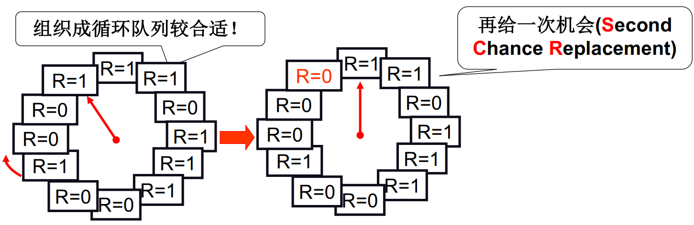

SCR算法又被称为CLOCK算法


### Clock算法的分析与改造

如果缺页很少的话，R就全等于1，指针扫描一圈后淘汰当前页，将调入页插入到当前位置，指针前移一位。这样就退化位FIFO算法。原因：记录了太长的历史信息,没法表达最近。解决办法：再加一个扫描指针来清楚R位，让R位从1置成0。快指针页的R位置为0，慢指针查看R位发现R位为0时，表示该页在最近一段时间没有被使用，就选择淘汰该页。

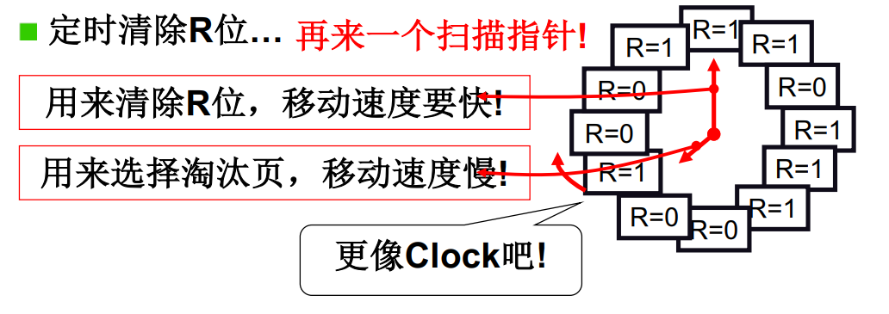


   **系统颠簸的根本原因**就是给进程分配的物理页框数量太少,少到无法覆盖当前进程执行时的“局部”,导致换出去的页面又立刻会被程序访问,需要换入;当然将需要的页面换入又造成某个即将被再次访问页面换出,如此不断往复….、系统颠簸就开始了。

解决系统颠簸也并不难,只要计算出进程当前执行需要覆盖的局部是多大,操作系统保证分配该进程的物理页框数量大于其局部即可,如果系统的空闲内存不足,就将某些进程挂起,将其换出到磁盘上,腾出地方来保证分配给每个进程的物理页框个数足够覆盖其局部。

显然这里的关键问题是如何估计其当前局部有多大。工作集模型(working set model)就是解决这个问题的数学方法。工作集的核心时统计进程在最近一个历史窗口△中访问了哪些页，这些页形成的集合就被称为工作集。

显然,工作集模型的关键在于恰当地设定△,如果△太大,工作集会覆盖多个局部,造成内存的浪费;如果△太小,工作集又可能覆盖不住局部,造成系统颠簸。在实际系统中,△通常是要随着某些系统参数而自适应调整的,例如,如果发现最近一段时间系统整体缺页率偏高,则应该将△增大,因为缺页增多很可能是由于没有很好地覆盖局部而造成的;反之,将△调小,这样就可以腾出一些内存空间,让更多的进程进入内存,提高并发度。


### 内存换入换出总结

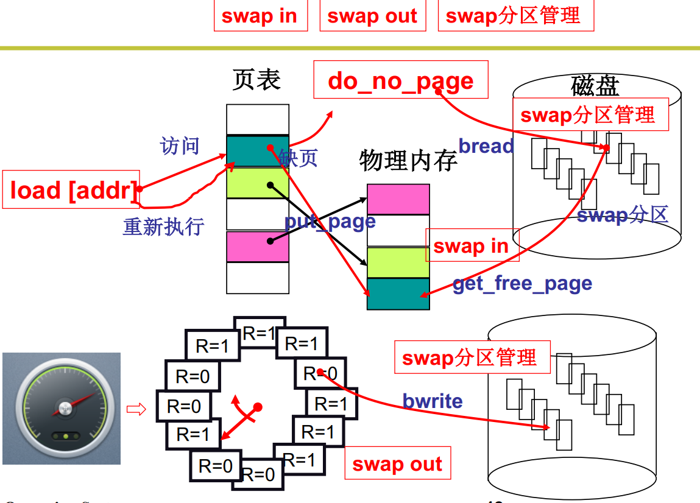

1. 请求调页的整个过程从 MMU发现虚拟页面在页表项中的有效位为0时开始，
2. 这个时候MMU会向CPU 发出缺页中断。
3. 操作系统的内存换入就从这个缺页中断开始,在这个中断处理中操作系统会去磁盘(仓库)上找到这个虚拟页(商品)
4. 并将这个虚拟页从磁盘上读进来。当然在读进来之前先要找到一个空闲的物理内存页框(店面中的一个柜台),再将那个虚拟页读到空闲页框以后(将商品放在柜台上),
5. 这时空闲物理内存页框可能不足，就需要进行swap分区内存换出，用Clock淘汰一个页面，得到一个空闲内存，再从swap分区进行内存换入。
6. 虚拟页面就和物理页框建立关联了,再更新页表来记下这个映射关系(告诉售货员商品放在哪里了)。


### 内存管理总结

内存的换入换出是实现虚拟内存的核心，实现虚拟内存又是为了实现段页，实现段页就是实现操作系统管理内存的思想，管理内存是为了实现程序能够载入，程序能够执行起来，程序执行起来就是进程。


## 外设管理

核心：一是从文件读写到设备命令，二是从设备驱动再回到文件读写。

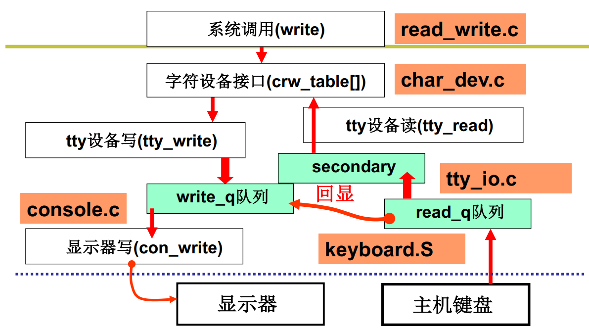


计算机外设的工作原理,即CPU对外设的使用主要由如下两条主线构成:第一条主线是从CPU开始,CPU发送命令给外设,最终表现为CPU执行指令“out ax,端口号”;第二条主线是从外设开始,外设在完成工作后或出现状态变化时通过中断通知CPU,CPU通过中断处理程序完成后续工作。**主要就是三件事，形成文件视图，发出out指令，形成中断处理。**

第一条主线的主题词是“发出命令”,第二条主线的主题词是“中断处理”,两条主线统一在图中。

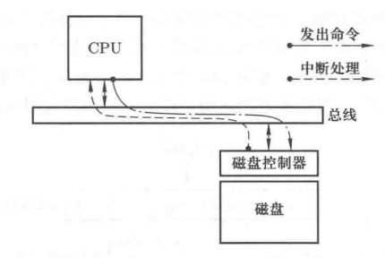

每一个外设都有一个设备控制器，比如显示器有一个显卡，cpu让外设工作起来就是给外设的设备控制器的寄存器中写内容，控制器就会根据寄存器里面的内容实际的来操控外设，对外设的操控结束后，外设会向CPU发送中断，然后CPU处理中断。


### 一段操作外设的程序

```c
int fd = open("/dev/xxx");
for(int i = 0;i < 10;i++)
{
	write(fd,i,sizeof(int));
}
close(fd);
```

（1）不论什么设备都是open,read,write,close操作系统为用户提供统一的接口。

（2）不同的设备对应不同的设备文件(/dev/xxx),根据设备文件找到控制器的地址、内容格式等等


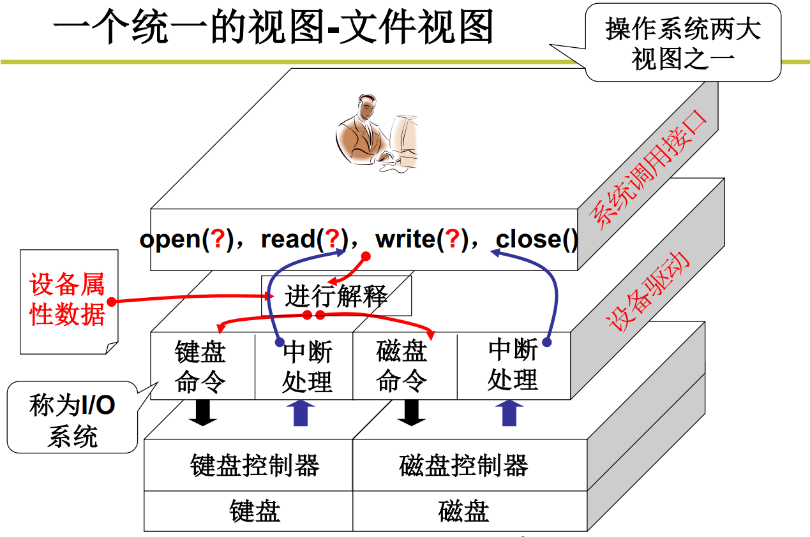


### 从文件读写到设备命令：显示器驱动

`printf("Host Name:%s,name");`

printf库展开的部分，先创建缓存buf将格式化输出都写到那里，然后再write(1,buf,...)

 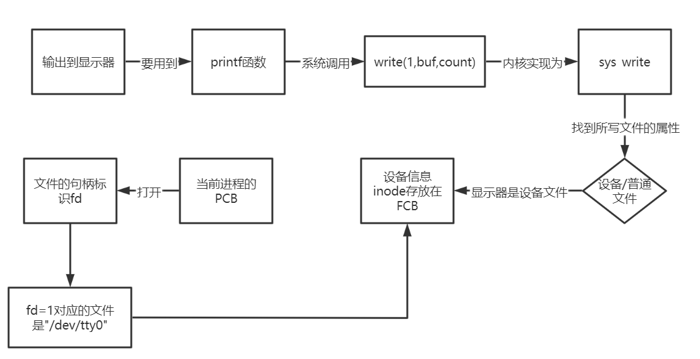

 要想输出字符串到显示器上，需要使用printf函数，printf是一个库函数，该库函数会将%d,%c等内容统一处理为字符串，然后以该字符串所在的内存地址buf和字符串长度count为参数调用系统调用write(1,buf,count)。write的内核实现是sys_write中断，所以printf的下一步就是sys_write。而sys_write首先要找到所写文件的属性，判断是设备文件还是普通文件。因为显示器是设备文件，sys_write要根据设备文件中存放的**设备属性**信息转到相应的操作命令。设备信息存放在文件本身的FCB中。

```c
在Linux/fs/read_write.c中
//fd文件描述符（数组下标）->filp是进程的文件描述符表（数组） filp[fd] 就指向file（文件表）文件表的f_inode字段指向该文件的inode节点，包含文件的元数据
int sys_write(unsigned int fd,char *buf,int count)
{
	struct file* file;
	file = current->filp[fd];		//current表示当前进程
	inode = file->f_inode;			//file的目的就是得到inode，显示器信息应该就在这里
}
```

为找到“文件”FCB,首先要做的工作就是从当前进程 PCB中找到打开文件的句柄标识，即fd。

`current->filp`中存放了当前进程打开的文件，如果一个文件不是当前进程打开的，那么就一定是其父进程打开后再由子进程继承来的，这是UNIX类操作系统执行fork的结果。

```c
//进程创建的代码片段（复制父进程文件句柄）
int copy_process()
{
	*p = *current;
	for(i = 0;i < NR_OPEN;i++)
		if((f=p->filp[i])) f->f_count++;
	.......	
}
```

因为每个进程都可能用到标准输出,所以每个进程都会打开这个文件。既然所有进程都要打开这个设备文件,操作系统初始化时的1号进程会首次打开这个设备文件,然后其他进程继承这个文件句柄。在系统启动后创建1号进程的地方,即在init函数中调用open来打开一个名为“/dev/tty0”的文件,由于这是该进程打开的第一个文件,所以对应的文件句柄fd =0,接下来调用了两次dup,使得fd = 1, fd = 2也都指向了“/dev/tty0”的 FCB,所以fd = 1的文件对应标准输出。

```c
//系统初始化代码片段（打开tty设备）
void main(void) {if(!fork()) init();}
void init(void)
{
	open("/dev/tty0",O_RDWR,0);		//打开设备文件
	dup(0);		//复制文件句柄
	dup(0);
	execve("/bin/sh",argv,envp);
	......
}
```

对于显示器而言,这个fd = 1,然后根据这个fd可以找到文件 FCB,即代码中的inode。现在显示器对应的设备文件已经找到了,就是文件“/dev/tty0”,其属性信息也已经存放在sys_write函数中的inode变量中了,sys_write就可以继续工作了。

```c
//sys_write代码片段（根据文件属性进行分支）
int sys_write(unsigned int fd,char *buf,int cnt)
{
	if(S_ISCHR(inode->i_mode))		//根据inode中的信息判断该文件对应的设备是否是一个字符设备
		return rw_char(WRITE,inode->i_zone[0],buf,cnt);//显示器是一个字符设备，执行rw_char函数
	......
}
```

```c
//字符设备处理代码
//rw_cahr中以主设备号(MAJOR(dev))为索引从一个函数表crw_table中查找和中断设备对应的读写函数rw_ttyx,然后调用这个函数
int rw_char(int rw,int dev,char *buf,int cnt)
{
	crw_ptr call_addr = crw_table[MAJOR(dev)];
	call_addr(rw,dev,buf,cnt);
static crw_ptr crw_table[] = {.....,rw_ttyx,...};
//函数rw.ttyx 中根据是设备读操作还是设备写操作继续分支。显示器和键盘合在一起构成了终端设备tty，显示器只写,键盘只读。此处是显示器,所以对应写操作,将调用函数 tty.write(minor,buf)。

static int rw_ttyx(int rw,unsigned minor,char *buf,int count)
{
    return ((rw==READ))?tty_read(minor,buf):tty_write(minor,buf);
}
	.........
}

```

根据文件的属性,即 inode 中的信息,经过大量分支以后,从写文件 write最终到达真正操作显示器的 tty.write。

```c
//tty-write 核心代码(将显示字符放到缓冲队列)
int tty_write(unsigned channel , char *buf ,int nr)
{
    struct tty_struct *tty;
    tty = channel+tty_table;
    sleepif.full(&tty->write_q);//在结构体tty_struct中找到队列tty_write_q
    char c，*b=buf ;
    //输出到显示器就是输出到write_q队列中，缓冲队列
    while(nr>0 && !FULL(tty->write_q))
    {
        c = get fs-byte(b);
        if(c=='r')
        {
            PUTCH(13,tty->write_q);
            continue;
        }
        if(OLCUC(tty)) c = toupper(c);
        PUTCH(c,tty->write_q);
        b++; nr--;
    }/ /输出完成或写队列满
    tty->write(tty);		//将队列内容写到显示器上
}

```

tty_write用到了缓冲机制。缓冲是指两个速度存在差异的设备之间通过缓冲队列来弥补这种差异的一种方式,具体而言,就是高速设备将数据存到缓冲队列中,然后高速设备去做其他事,低速设备在合适的时候从缓冲队列中取走内容进行输出,这样高速设备不必一直同步等待低速设备,提高了系统的整体效率。在这里,高速设备就是CPU,低速设备就是显示器。缓冲机制是操作系统在外设管理时经常使用的基本机制。

```c
//tty结构体的初始化为
struct tty_struct tty_table[] = {{con_write,{0,0,0,0," " },{0,0 ,o,0, " "},{},..};
//由此可知，tty_write调用的函数时con_write

void con_write(struct tty_struct *tty)
{
    GETCH(tty->writeq, c);
    if(c>31 && c<127)
    {
        __asm__( "movb attr，%%ah"
        "movw %%ax,%1" ::" a"(c), " m”(*(short*)pos) : "ax");
        pos+=2;
    }
}
//con_write核心代码是一段嵌入式汇编代码,具体完成的工作是:
    mov c， al		//将要输出的字符放在寄存器AX的低八位
    mov attr，ah		//将显示属性attr放在寄存器AX的高8位
    mov ax，[pos]	//将AX输出到地址pos处，pos就是开机以后光标当前所在的显存位置
//显示器输出工作最终到了"out"指令，这里"out"指令和"mov"指令没有区别

```

pos就是开机以后当前光标所在的显存位置

```c
//pos （光标位置)的初始化代码
void con_init(void)
{
	gotoxy(ORIGX,ORIG_Y);
}
static inline void gotoxy(x， y)
{
	pos= origin+y*videosizerow +(x<<1);	//origin是显存在内存中的初始位置
}
//在系统启动的setup.s时利用BIOS中断将当前光标的行、列位置取出来放到了0x90001，0x90000处
#define ORIGX(*(unsigned char*)0x90000)//初始光标列号
#define ORIGY (*(unsigned char*)0x90001)//初始光标行号

```


### 总结

到了这里，printf → write → sys_write → rw_char → rw_ttyx → tty_write → write_q →con_write →“mov ax,[pos]”,这条从printf到“mov ax,[pos]”的文件视图路线就完整了。

printf调用的是write系统调用，引起sys_write系统中断，判断设备信息，显示器是字符设备，调用rw_char;显示器是只写设备，调用tty_write;利用缓冲机制把字符先保存在缓冲队列write_q中，然后使用con_write函数用mov指令输出到显示器。


### 从设备驱动到文件读写：键盘

键盘按下会产生0x21号中断，所以整个故事从0x21号中断处理函数开始。

```c
//键盘中断初始化代码
void con.init(void) { set_trap_gate(Ox21，&keyboard_interrupt);}
keyboardinterrupt :
    inb $ox60 , %al		//从端口0x60读扫描码
    call key_table( , %eax ,4)	//根据扫描码调用不同的处理函数来处理各个案件
    ......
    push $0
    call do_tty_interrupt

```


```c
key_table:
	.long none,do_self,do_self,do_self		//对应扫描码 00~03
	.long do_self,...,func,scroll,cursor	//绝大多数按键（如字母键、数字键等）都用do_self函数处理
	
```


```assembly
do_self:
    lea alt_map,%ebx
    testb $0x20,mode		//检测alt键是否同时按下
    jne 1f
    lea shift_map,%ebx
    testb $0x03,mode		//检测shift键是否同时按下
    jne 1f
    lea key_map，%ebx		//找到映射表，如a的key_map映射为a，而shift_map映射为A
//映射表
#if defined(KBD_US)
key_map: .byte 0,27 .ascii "1234567890-="...
shift_map: .byte 0,27 .ascii "!@#$%^&*()_+"...
#elif defined(KBD_GR)
    
//继续执行do_self,从1f开始，ebx放的是map起始地址 ,eax是对应的扫描码
1:  movb (%ebx，%eax), %al	//以扫描码为索引，将按键对应的 ASCII码放入al
	orb %al,%al				//没有对应的ASCII码
	je none
	testb $0x4c,mode		//看caps是否点亮
	je 2f 
	cmpb $'a,%al'	jb 2f
	cmpb $'},%al'   ja 2f
	subb $32,%al			//变大写
2:	testb $??,mode			//处理其他模式，如ctrl同时按下
3:	andl $0xff,%eax
	call put_queue
none:ret

```


```assembly
put_queue:					//把得到的ASCII码放到队列里面	
    movl _table_list，%edx		//得到队列	
    movl head(%edx) , %ecx		//得到read_q的head字段
1:
    movb %al , buf(%edx,%ecx)	//将ASCII码放在队列head字段	
   
struct tty_queue *table_list[] ={
        &ttytable[0].read_q;
        &tty-table[0].write_q;
    };
```


### 回显

按下键盘时，可显示的字符通常还要回显。

```c
void do_tty_interrupt(int tty)
{ copy to_cooked(tty_table+tty); }
//copy .to_cooked具体要做的工作就是从read_q队列中取出字符(GETCH(tty->readq,c))并将该字符放在 tty->secondary队列中(PUTCH(c,tty->secondary))，同时唤醒等待这个队列上的进程(wake_up(&tty->secondary.proclist))。

void copy_to_cooked(struct tty_struct *tty)
{
	GETCH(tty->read_q,c);
	if(L_ECHO(tty))
	{
		PUTCH(c,tty->write_q);
		tty_write(tty);		//立即显示到屏幕上
	}
	PUTCH(c,tty->secondary);	//完成copy_to_cooked
	...
	wake_up(&tty->secondary.proc_list);
}

```


现在继续分析从设备出发的那条线,对于键盘,用户发起的文件操作是scanf，而 scanf调用的是sys_read(0,buf,count),其中 fd=0表示标准输入。找到设备文件的FCB 以后可以发现这个设备文件仍然是""/dev/tty0",根据 printf 的文件视图路线不难类推,通过一系列分支后最后会执行tty.read (代码如下)。而 tty.read 的核心就是要和键盘中断处理程序中的 wake.up 接上,所以这里面有句非常重要的语句: sleep__if_empty(&tty->secondary)。

```c
//tty_read核心代码
//一旦tty->secondary中有内容了，即键盘中断处理程序中将按键的ASCII码放进去以后,tty_read,实际上就是用户的scanf继续执行,会将tty->secondary中的字符逐个取出来(GETCH(tty->secondary,c)）复制到用户内存buf 中(put_fs_byte(c,b++))。

int tty_read(unsigned channel，char * buf,int nr)
{
    sleep_if_empty(&tty->secondary);
    do {
        GETCH(tty->secondary,c);	//将tty->secondary中的字符逐个取出
        tty->secondary.data--;
        put_fs_byte(c,b++);			//复制到用户内存buf中
    } while (nr>0 && !EMPTY(tty->secondary)) ;
    ......
}
//到现在,按键对应的ASCII字符已经被逐个放到用户缓存区 buf中了,从设备开始的路线最后回到了文件操作scanf。
```

实际上这构成了从设备中断出发又回到文件视图的一个基本结构:

- 进程通过文件读接口"read”发起一个设备读动作,接下来该进程会在文件视图路线中阻塞,因为这个时候设备还没有将进程要读的东西准备好。
- 设备开始工作,工作完成以后会中断CPU,操作系统在设备中断处理时,会将设备上的内容放入到内存缓冲区中,并唤醒阻塞等待的进程,醒来的那个进程从缓冲区取出内容进行处理。
- 文件操作是由用户发起的,即用户启动了一个进程调用“read”来发起设备读操作;
-  设备中断是由设备动作发起的,由操作系统的中断处理函数负责处理,两条线之间通过上述同步机制连接在一起。


现在, keyboard_interrupt →inb 0x60, al → do_self → read_q →copy_to_cooked → secondary→wake_up → tty_read → rw_ttyx → rw_char → sys_read → read → scanf,这条从键盘中断到“inb $0x60,%al”,最后到scanf 的路线也完整了。


## 文件系统

虽然是文件系统,但归根结底是对磁盘的驱动。具体来说,在磁盘驱动过程中发现直接使用磁盘很烦琐,因此引人了五层抽象机制:(1)从扇区到磁盘块的抽象,(2)从单个盘块请求到多个进程的磁盘请求队列,(3)从磁盘请求到高速缓存,(4)从盘块集合到文件的抽象,(5)从多个文件到构建文件系统。

### 认识磁盘

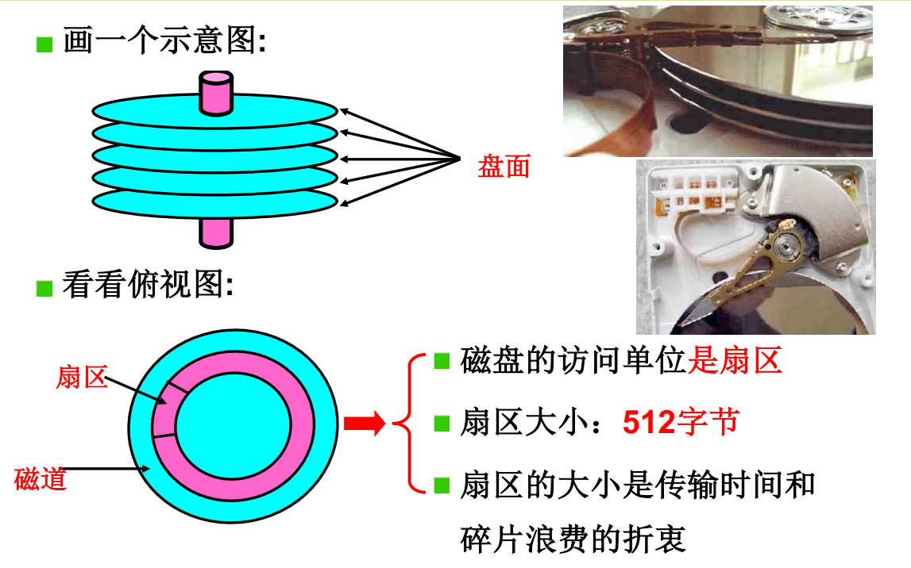

磁盘读写的具体过程：

- 寻道：磁头移动到指定磁道
- 旋转：旋转磁盘，把要读写的扇区移动到磁头下面。
- 数据传输：开始读写，内存读取，磁生电，把电信号传递给内存缓冲区；向磁盘写，电生磁，从内存缓冲区传递电信号，电生磁写到磁盘上。


### 第一层抽象：从扇区到磁盘块请求

操作系统在磁盘读写的过程中，最浪费时间的操作是寻道和旋转磁盘，因为是物理运动，时间慢。

因为数据传输时间和寻道/旋转时间相比要小得多,所以寻道、旋转一次读写k个扇区的策略比只读写1个扇区的策略,其磁盘读写速度的提高接近于k倍。所以抽象出磁盘块以后,磁盘读写速度会有非常显著的提高。当然,以磁盘块作为磁盘读写的基本单位也有缺点,那就是会造成磁盘空间的浪费。这是显然的,以1MB作为单位进行磁盘分配,一个文件平均会造成0.5 MB的空间浪费,即该文件的最后一个盘块即使没有用满也不能分配给其他的文件使用了。


### 第二层抽象：多个进程产生的磁盘请求队列

经过该层抽象以后,操作系统要处理磁盘读写完成如下工作:(1)从队列中选择一个磁盘请求;(2)取出请求读写的盘块号，(3)根据盘块号计算出C、H、S，(4)用out语句向磁盘控制器发出具体指令。在这些步骤中,第(2)～(4)步前面已经论述过,此处主要论述步骤(1),即如何从多个请求中选择出一个合适的请求来分配资源,这是典型的调度算法,所以第二层抽象的核心就是磁盘调度算法。


电梯调度算法：首先向某个方向（比如柱面号小的方向）进行扫描，处理经过的所有磁盘请求（不回弹），直到这个方向不再磁盘请求时磁头迅速复位到另一个方向的最大请求位置，然后再沿着同样方向（柱面号小的方向）进行扫描，处理经过的所有磁盘请求，如此反复。


### 第三层抽象：从磁盘请求到高速缓存

```c
//磁盘读写时的数据要经过用户态内存、内核态内存以及磁盘扇区三个地方,很可能发生这样的情况:用户要从磁盘上读100 B的内容,由于磁盘的读写单位是磁盘块,所以虽然用户要读100 B,但真正读入的数据内容很可能要大于100 B。以前面给出的代码为例,一个磁盘块的大小是2个扇区,即 1024 B,所以每次读入的磁盘数据大小是1024 B。用户在处理完100B后,遵循程序的局部性,很可能会处理下100 B,这时就没必要再去读磁盘了,因为刚才读入的1024B仍然保留在如图9.10所示的内核态内存中。
//这样的机制会大幅减少磁盘读写次数,从而大幅提高磁盘的使用效率。这个机制就是本节要论述的核心内容——磁盘高速缓存,现实中的绝大多数操作系统都支持磁盘高速缓存。

```

磁盘高速缓存是磁盘管理的又一层抽象,即操作系统将磁盘数据“变成”一系列位于内核态内存中的缓存区内容。具体来说,从用户角度出发，磁盘读写变成了高速缓存读写，用户向高速缓存发出读写请求,如果用户请求的数据在高速缓存中,操作系统会直接将信息返回;如果不在,才发出磁盘请求去读写磁盘。当然操作系统的这些处理对用户而言是透明的,所以在用户的眼里,操作磁盘变成了操作高速缓存,这就是我们所说的第三层抽象。

设计磁盘高速缓存的核心就是要建立两个数据结构: 用一个散列表组织有内容的缓存块,再用一个空闲链接组织那些空闲的缓存块。散列表提供一种机制来快速查找一个磁盘块数据是否在高速缓存中。

如果发现高速缓存中没有用户请求的磁盘块,此时应该去读写物理磁盘,这就要求在高速缓存中取出一个空闲缓存块,用来缓存从磁盘块中读出的数据,而组织空闲缓存块通常使用的数据结构就是空闲链表。


### 第四层抽象：引出文件

操作系统完成了从磁盘块到字符流的映射。

实现文件抽象的关键就在于能根据字符流的位置找到对应的盘块号，即建立字符流和盘块号之间的映射关系。这种映射关系就是字符流在磁盘上的存放位置，描述了一个文件全部字符流的存放位置就是这个映射表。


#### 顺序存储结构

对于顺序存储结构,完成这个映射核心信息是文件名、起始块号、文件长度,这些信息可以用一个核心数据结构——文件控制块(FCB)来组织和保存。

顺序存储结构是一种字符流存储方案,这种方案有其优点:访问任何一个字符流位置都能根据上面给出的公式快速计算出对应的磁盘块号。但这种方案也有一个很大的缺点:如果要对文件进行改写,比如要在文件的某个中间位置添加一些字符。为保证添加以后的字符流在磁盘上仍连续存放,需要将这个中间位置以后的磁盘块内容全部往后挪动,即要逐个将这些后面的磁盘块读人并写出到下一个磁盘块上,这需要大量的磁盘读写操作,非常费时。


#### 链式存储结构

链式存储结构的实现方案也很简单:文件字符流存放的磁盘块不需要连续,只要每个磁盘块中存放下一个字符流片段所在的盘块号即可。

对于链式存储结构而言,操作系统在FCB中需要存放的主要映射信息仍然是第一个磁盘块的盘块号,利用这个信息可以找到文件的第一个磁盘块,再利用每个磁盘块中存放的下一个盘块号,可以找到第二个磁盘块,以此类推,可以计算出文件中任何字符流位置所对应的盘块号。

链式存储结构修改快，但是查找慢。


#### 索引存储结构

索引存储结构:索引节点(就是文件的FCB,因为是索引结构,所以通常被称作**索引节点, index node,简称 inode**)中存放了直接数据块号、索引块号以及间接索引块号三个部分。

索引存储结构下的文件映射方案也容易理解,文件字符流被分割成多个逻辑块,在物理磁盘上寻找一些空闲物理盘块(无须连续),将这些逻辑块的内容存放进去,再找一个磁盘块作为索引块,其中按序存放各个逻辑块对应的物理磁盘块号。


显然对于文件读操作的效率而言,索引存储结构是顺序存储结构和链式存储结构的折中。另外,索引存储结构下字符流不用在物理磁盘上连续存放,所以文件的动态修改也不困难,无须像顺序存储结构那样大量移动物理盘块。因此索引存储结构针对文件读操作和文件写操作都具有不错的性能。


#### 多级索引


(1)首先是索引存储结构,所以能较好地支持文件读操作和写操作。(2)如果文件比较小,比如小于6个盘块,可以利用inode(在读写文件时这个数据结构通常是已经读入到内存中)中存储的直接数据块信息找到逻辑盘块对应的物理盘块号,读写速度很快。(3)对于中等大小的文件,只要读入一阶索引块以后就能映射出物理盘块号,速度也不慢。(4)通过多阶间接索引,可以映射尺寸很大的文件。而且即使文件尺寸很大,索引的阶数也不会很大,这是因为文件尺寸和索引阶数是一个指数关系,所以对于很大尺寸的文件存取也不太慢。


### 第五层抽象：将整个磁盘抽象成一个文件系统

操作系统给上层用户展现出一棵目录树,一棵既可以静态读写又可以动态修改的目录树,通过操纵这棵目录树来让计算机为用户做各种各样的事情。

目录内容中存放文件的名字和FCB地址。


## 文件使用磁盘的实现


打开文件是文件名到文件inode的映射

```c
//在fs/read_write.c中
int sys_write(int fd, const char* buf , int count)		//fd:文件描述符;buf:内存缓冲区;count:读写字符的数量
{ 
	struct file *file = current->filp[fd];
	struct m_inode *inode = file->inode;		//读取FCB中的inode,inode是映射表
	if(s_ISREG(inode->i_mode) )
		return file_write(inode, file, buf, count);
}

```


```c
int file_write (struct m_inode *inode, struct file *filp, char *buf, int count)
{
	off_t pos;
	if(filp->f_flags&o_APPEND)		//如果是追加
		pos=inode->i_size; 			//pos是字符流的读写位置。指针放在文件末尾
	else 
		pos=filp->f_pos ;		//f_pos是file里面的文件读写指针
//用file知道文件流读写的字符区间，从哪到哪
    while (i<count) 
    {
    block=create_block (inode, pos/BLOCK_SIZE);//算出对应的块!
    bh=bread (inode->i_dev, block);				//放入“电梯”队列!
    int c=pos%BLOCK_SIZE; 
    char *p=c+bh->b_data ;
    bh->b_dirt=1 ; c=BLOCK_SIZE-C; pos+=C;
    ... while(c-->0) *(p++)=get fs byte (buf++);
    brelse (bh);
    }//一块一块拷贝用户字符，并且释放写出!
filp->f pos=pos; 
}//修改pos,使之总是对!
```


```
struct d_inode{
	unsigned short i_mode;
	.....
	unsigned short i_zone[9];	//表示的是在FCB中的索引项
}
```


```c
//creat_block算盘块，文件抽象的核心
while(i<count)
{
	block = creat_block(inode,pos/BLOCK_SIZE);		//create=1的_bmap,没有映射时创建映射
	bh = bread(inode -> i_dev,block);
	
int _bmap(m_inode *inode,int block,int create)
{
	if(block<7){		//(0-6):直接数据块，直接索引
		if(create&&!inode->i_zone[block])
		{
			inode->i_zone[block]=new_block(inode->i_dev);	//直接读取索引块
			inode->i_ctime=CURRENT_TIME;
			inode->i_dirt=1;
		}
		return inode->i_zone[block];
	}
	block-=7;		//多级索引，第7块存储在一重间接的指向的第0块，以此类推
	if(block<512)	//一个索引块也需要用盘快存储，一个盘块1024个字节，一个索引项2个字节，一个索引块能存储512个索引项。
	{
		bh=bread(inode->i_dev,inode->i_zone[7]);	//先把索引块读进来再找
		return (bh->b_data)[block];
	}
	....
}
```

