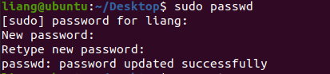
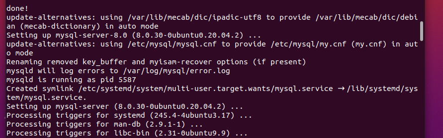
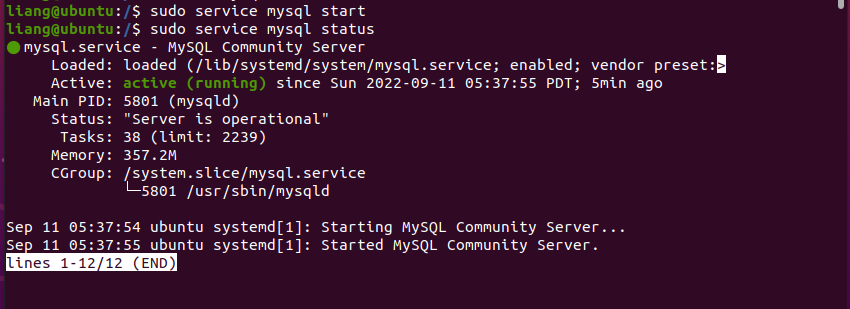
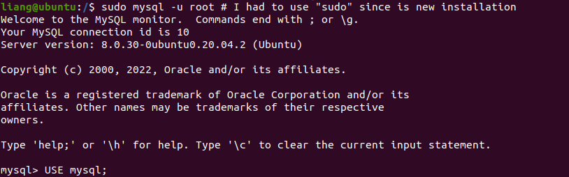
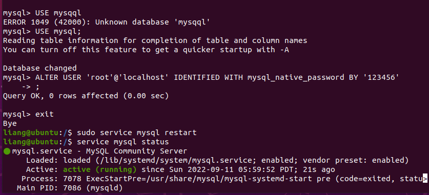
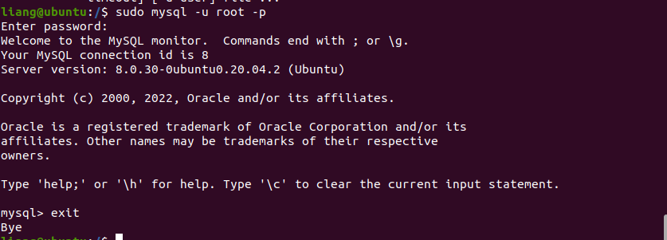

# mysql踩坑指南


## 安装VM

https://blog.csdn.net/m0_51545690/article/details/123213579


## Ubuntu20.04镜像

[Ubuntu系统下载（清华大学开源软件镜像站）（ubuntu-20.04.1-desktop-amd64.iso）_-借我杀死庸碌的情怀-的博客-CSDN博客_ubuntu20.04下载](https://blog.csdn.net/weixin_45912291/article/details/108900602)

## 安装Ubuntu20.04

[(2条消息) 虚拟机VMware安装ubuntu教程（ubuntu-20.04.1-desktop-amd64.iso）_-借我杀死庸碌的情怀-的博客-CSDN博客_ubuntu-20.04-desktop-amd64.iso](https://blog.csdn.net/weixin_45912291/article/details/108901106)


## 安装后设置root密码

sudo passwd



## 安装mysql8.0

```
sudo apt-get update
sudo apt-get install mysql-server

```

见到这样，安装完成。



```
sudo service mysql start     //启动mysql
sudo service mysql status	//查看mysql状态

```



`Ctrl+Z`退出命令

这时候，使用命令mysql -uroot -p进入mysql报错，`ERROR 1698 (28000): Access denied for user 'root'@'localhost'`

参考网站：https://www.codenong.com/39281594/


先使用 `sudo mysql -u root *# I had to use"sudo" since is new installation`进入mysql控制台



接下来：

```
USE mysql;
ALTER USER 'root'@'localhost' IDENTIFIED WITH mysql_native_password BY 'admin';
//这里的" admin"是您的新密码，您可以更改它。
exit
$ sudo service mysql restart
```



在此使用命令 `sudo mysql -u root -p`成功进入控制台




## ERROR 2002

ERROR 2002 (HY000): Can't connect to local MySQL server through socket '/var/run/mysqld/mysqld.sock' (13)

https://cyburdial.net/how-to-fix-error-error-2002-hy000-cant-connect-to-local-mysql-server-through-socket-var-run-mysqld-mysqld-s/


## 远程数据库连不上

[MySQL 开启远程连接_xianhenyuan的博客-CSDN博客_mysql 开放远程访问](https://blog.csdn.net/xianhenyuan/article/details/91826675)